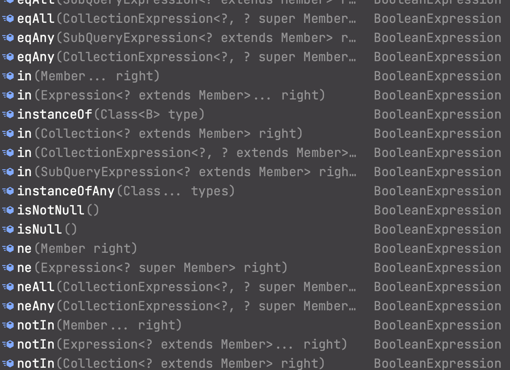

[실전! Querydsl 대시보드 - 인프런 | 강의 (inflearn.com)](https://www.inflearn.com/course/querydsl-%EC%8B%A4%EC%A0%84/dashboard)

# 02 기본 문법

시작하기 앞서)

Querydsl 을 사용하기 위해서는 `JPAQueryFactory` 를 가 필요한데,  필드에 그냥 등록하고 사용해도 된다. 동시성 문제에 대한 걱정은 할 필요가 없는게, 어차피 `EntitiyManager` 를 주입 받으므로 동시성 문제는 사실상 `EntitiyManager` 가 관리한다.

```java
    JPAQueryFactory queryFactory;

    @BeforeEach
    public void before() {
        queryFactory = new JPAQueryFactory(em); //동시성  문제를 안전하게 처리하도록 ㅜ현되어있따.ㅜㅜ

    }
```

테스트 코드에선 그냥 이렇게 사용했다.

<br>

## 02-1 JPQL vs Querydsl

```java
import static study.querydsl.entity.QMember.*;


@Test
void startJPQL() {
    Member findMember = em.createQuery("select m from Member m where m.username = :username", Member.class)
            .setParameter("username", "member1")
            .getSingleResult();

    Assertions.assertThat(findMember.getUsername()).isEqualTo("member1");
}

@Test
void startQuerydsl() {
    //given
    //QMember m = new QMember("m");
    Member findMember = queryFactory
            .select(member) //static imort
            .from(member)
            .where(member.username.eq("member1")) //파라미터 바인딩 처리
            .fetchOne();

    //Q 타입인스턴스 생성은 가급적 static 을 사용해서 간편하게 사용하는 것을 권장
    //만약 같은 테이블을 조인할때는 alias 를 같게 사용하면 안되므로 이때는 따로 인스턴스 생성할것.
    Assertions.assertThat(findMember.getUsername()).isEqualTo("member1");
}
```

+ Querydsl 은 <u>JPQL을 생성 하기위해</u> Q타입 인스턴스 가 필요한데, 이것을 static import로 편하게 사용할 수 있다.

+ 일단 이런 단순한 메서드로도 장점이 확연히 보이는데, 일단 무엇보다 가장 좋은 점은 컴파일 시점에 오류를 확인 할 수 있다는것, 그리고 모든것을 자바로 처리할 수 있다는 것이다.

<br>

## 02-2 검색 조건 쿼리

```java
@Test
void search() {

    Member findMember = queryFactory
            .selectFrom(member)
            .where(member.username.eq("member1")
                    .and(member.age.eq(10)))
            .fetchOne();

    assertThat(findMember.getUsername()).isEqualTo("member1");
}

@Test
void searchAndParam() {

    Member findMember = queryFactory
            .selectFrom(member)
            .where(
                    member.username.eq("member1"),
                    member.age.eq(10)
            ) //and 면 그냥 쉼표로 끊을 수도 있다.
            .fetchOne();

    assertThat(findMember.getUsername()).isEqualTo("member1");
}
```

+ 검색조건은 우리가 상상할수 있는 범위에서는 다 정의 되어 있다.



<br>

## 

## 02-3 결과 조회

```java
@Test
void resultFetch() {
    //List 조회
    List<Member> fetch = queryFactory
            .selectFrom(member)
            .fetch();

    //처음한건조        
    Member member1 = queryFactory
            .selectFrom(member)
            .fetchFirst();// == limit(1).fetchOne()

    QueryResults<Member> results = queryFactory
            .selectFrom(member)
            .fetchResults();// ? deprecated 인데요 ? 헐 갓영한...
    //이미 공식적으로 deprecated 되기 전에 이미 실험적으로 캐치해버리신..

    long total = queryFactory
            .selectFrom(member)
            .fetchCount();// ? 이것도 deprecated 인데요?

   //단건 조회 -> fetchOne()

}
```

> 참고) fetchResults() 와 fetchCount() 는 현재 버전에서 deprecated다. 향후에는 미지원 할것이라 말한다. 김영한 강사님은 deprecated되기 전에 문제를 체감 하신것 같은데,
> 
> 가장 큰 문제는 fetchResult()의 경우 count문이 같이 나가는데, 스프링 데이터 JPA에서처럼 굳이 복잡한 쿼리문으로 count문이 나가게 된다. 즉 쓸데 없이 비용이 너무 커진다는 뜻이다.
> 
> 현재는 그냥 fetch()를 쓰는게 권장된다.

<br>

## 02-4 정렬

```java
/**
 * 회원 정렬 순서
 * 1. 회원 나이 내림차순 (desc)
 * 2. 회원 이름 올림차순 (asc)
 * 단 2에서 회원 이름이 없으면 마지막에 출력(nulls last)
 */
@Test
void sort() {

    em.persist(new Member(null,100));
    em.persist(new Member("member5",100));
    em.persist(new Member("member6",100));

    List<Member> result = queryFactory
            .selectFrom(member)
            .where(member.age.eq(100))
            .orderBy(member.age.desc(), member.username.asc().nullsLast())
            .fetch();

    Member member5 = result.get(0);
    Member member6 = result.get(1);
    Member memberNull = result.get(2);

    assertThat(member5.getUsername()).isEqualTo("member5");
    assertThat(member6.getUsername()).isEqualTo("member6");
    assertThat(memberNull.getUsername()).isNull();
}
```

+ `nullsLast()` 는 Null 이면 마지막에 위치하도록 하는것이다. 물론 `nullsFirst()` 도 있다.
  
  <br>

## 02-5 페이징

```java
@Test
void paging1() {

    List<Member> result = queryFactory
            .selectFrom(member)
            .orderBy(member.username.desc())
            .offset(1)
            .limit(2)
            .fetch();

    assertThat(result.size()).isEqualTo(2);
}

```

+  앞에서 배웠듯이, 페이지의 인덱스는 0부터 시작한다.

<br>

## 02-6 집합

#### 집합함수

```java

 * SUM(m.age), //나이 합
 * AVG(m.age), //평균 나이
 * MAX(m.age), //최대 나이
 * MIN(m.age) //최소 나이

 @Test
void aggregation() {

    List<Tuple> result = queryFactory
            .select(
                    member.count(),
                    member.age.sum(),
                    member.age.avg(),
                    member.age.max(),
                    member.age.min()
            )
            .from(member)
            .fetch();
    //튜플을 쓴 이유는 데이터 타입이 다 달라서

    Tuple tuple = result.get(0);
    assertThat(tuple.get( member.count())).isEqualTo(4);
    assertThat(tuple.get( member.age.sum())).isEqualTo(100);
    assertThat(tuple.get( member.age.avg())).isEqualTo(25);
    assertThat(tuple.get( member.age.max())).isEqualTo(40);
    assertThat(tuple.get( member.age.min())).isEqualTo(10);
}
```


#### GroupBy

```java
/**
 * 팀 이름과 각팀의 평균연령을 구해라
 */
@Test
void group() {
    List<Tuple> result = queryFactory
            .select(team.name, member.age.avg())
            .from(member)
            .join(member.team, team)
            .groupBy(team.name)
        //  .having(~~~ ) 을 붙일 수도 있다.
            .fetch();

    Tuple teamA = result.get(0);
    Tuple teamB = result.get(1);

    assertThat(teamA.get(team.name)).isEqualTo("teamA");
    assertThat(teamA.get(member.age.avg())).isEqualTo(15);
    assertThat(teamB.get(team.name)).isEqualTo("teamB");
    assertThat(teamB.get(member.age.avg())).isEqualTo(35);

}
```

<br>

## 02-7 조인

**기본 원칙**

`join(조인 대상, 별칭으로 사용할 Q타입)` 


#### 기본 조인

```java

/**
 * 팀 A에 소속된 모든 회원
 */

@Test
void join() {

    List<Member> result = queryFactory
            .selectFrom(member)
            .join(member.team, team)
            .where(team.name.eq("teamA"))
            .fetch();


    assertThat(result)
            .extracting("username")
            .containsExactly("member1","member2");

}
```

#### 

#### 세타조인

: 연관관계가 없는 필드로 조인

```java
/**
 * 세타조인
 * 회원의 이름이 팀 이름과 같은 회원 조회
 */
@Test
void theta_join() {
    em.persist(new Member("teamA"));
    em.persist(new Member("teamB"));

    List<Member> result = queryFactory
            .selectFrom(member)
            .from(member, team)
            .where(member.username.eq(team.name))
            .fetch();

    assertThat(result)
            .extracting("username")
            .containsExactly("teamA","teamB");

}
```

+ 멤버 네임과 팀네임간에 어떠한 연관관계가 있겠는가 이른바 `어거지 조인`

+ from 절에 여러 엔티티를 선택한다


#### 조인 - on 절 활용 1. 조인 대상 필터링

```java
/**
 * 예) 회원과 팀을 조인하면서, 팀이름이 teamA인 팀만 조인, 회원은 모두 조회
 * JPQL : select m, t from Member m left join m.team t on t.name = 'teamA'
 */
@Test
void join_on_filtering() {

    List<Tuple> result = queryFactory
            .select(member, team)
            .from(member)
            .join(member.team, team).on(team.name.eq("teamA"))
            //inner join의 경우 on 이나 where써서 푸나 결과는 똑같다. where절이 눈에 더 익으므로 where을 더많이 쓴다.
            //하지만 left Join을 쓸경우 where는 쓰지 못하고 on만 사용가능하다.
            .fetch();

    for (Tuple tuple : result) {
        System.out.println("tuple = " + tuple);
    }
}
```

> 매우 간단하지만 나름 알아야할것은, inner join의 경우, On절이나 Where 절을 사용해서 필터링하는 것은 결국 같은 행동이다. 이때는 where절을 사용하는것이 좀 더 직관적이다.
> 
> 또, 만약 Outer Join을 할 경우 where절은 사용할 수없다.


#### 조인 - on 절 활용 2. 연관관계가 없는 엔티티 외부 조인

```java
/**
 * 연관과계 없은 엔티티 외부 조인
 * JPQL: SELECT m, t FROM Member m LEFT JOIN Team t on m.username = t.name
 * SQL: SELECT m.*, t.* FROM Member m LEFT JOIN Team t ON m.username = t.name
 */

@Test
void join_on_no_relation() {

    em.persist(new Member("teamA"));
    em.persist(new Member("teamB"));
    em.persist(new Member("teamC"));

    List<Tuple> result = queryFactory
            .select(member, team)
            .from(member)
            .leftJoin(team).on(member.username.eq(team.name))
            .fetch();

    for (Tuple tuple : result) {
        System.out.println("tuple = " + tuple);
    }
}
```

+ 주의 할 점은 leftJoin() 부분에 엔티티 하나만 들어 가는다는 것.


#### 조인-페치 조인

```java

 @PersistenceUnit
 EntityManagerFactory emf;

@Test
void fetchJoinUse() {
    em.flush();
    em.clear();

    Member findmember = queryFactory
            .selectFrom(member)
            .join(member.team,team).fetchJoin()
            .where(member.username.eq("member1"))
            .join(member)
            .fetchOne();

    boolean loaded = emf.getPersistenceUnitUtil().isLoaded(findmember.getTeam());

    assertThat(loaded).as("페치 조인 미적용").isTrue();

}
```

<br>

## 02-8 서브쿼리

#### Where 절 In 서브 쿼리

```java
@Test
void subQueryIn() {
    QMember memberSub = new QMember("memberSub");

    List<Member> result = queryFactory
            .selectFrom(member)
            .where(member.age.in(
                    //JPAExpressions. -> Static import
                    select(memberSub.age)
                            .from(memberSub)
                            .where(memberSub.age.gt(10))
            ))
            .fetch();

    assertThat(result).extracting("age")
            .containsExactly(20,30,40);

}
```

+ JPAExpressions 로 서브쿼리를 나타낼 수 있다. -> 심지어 이 마저도 static import 하면 되기 떄문에 지금 자바 코드로 완전히 sql 짜듯이 짜고 있다...


#### Select 절에 subquery

```java
@Test
void selectSubQuery() {
    QMember memberSub = new QMember("memberSub");

    List<Tuple> fetch = queryFactory
            .select(member.username,
                    select(memberSub.age.avg())
                            .from(memberSub))
            .from(member)
            .fetch();

    for (Tuple tuple : fetch) {
        System.out.println("tuple = " + tuple);
    }
}
```


> 결론부터 말하면 from절에서는 서브 쿼리를 쓸 수 없다.
> 
> 서브쿼리 정말 많이 쓴다. 많이 쓸 수 밖에 없는게 편하다. 나조차도 많이 썼다. 근데 from절에 서브 쿼리를 많이 썼던것 같다. 하지만 이때 대부분의 목적은 사실, 화면에서 요구하는 모양을 db에서 미리 맞추려고 예쁘게하려고 많이 썼던것 같다. 그렇게 바람직하진 않다. 모양은 프레젠테이션 계층에서 다루는게 바람직하다. DB는 딱 데이터 얻고 저장하고 이게핵심이다.

<br>

## 02-9 Case 문

```java
@Test
void basicCase() {

    List<String> result = queryFactory
            .select(member.age
                    .when(10).then("열살")
                    .when(20).then("스무살")
                    .otherwise("기타"))
            .from(member)
            .fetch();

    for (String s : result) {
        System.out.println("s = " + s);
    }

}


@Test
void complexCase() {

    List<String> result = queryFactory
            .select(new CaseBuilder()
                    .when(member.age.between(0, 20)).then("0~21살")
                    .when(member.age.between(21, 30)).then("21~30살")
                    .otherwise("기타")
            )
            .from(member)
            .fetch();
    for (String s : result) {
        System.out.println("s = " + s);
    }
}//이거 까지 DB 에서 해야하는가 에대한 가는 고민을 해야한다.
//지금 이행위는 화면에 맞추기 위한 작업인데 db 에서 이런것 까지 해야할 까
```

+ 복잡한 Case문은 CaseBuilder 를 이용해서 표현한다. 근데 이때도 생각해야할 것이, 데이터를 가공하는게 DB에서 하는 게 바람직한가에 대한 의문을 가져야한다.


## 02-10 기타

#### 상수 필요할 땐?

```java
@Test
void constatnt() {
    List<Tuple> result = queryFactory
            .select(member.username, Expressions.constant("A"))
            .from(member)
            .fetch();

    for (Tuple tuple : result) {
        System.out.println("tuple = " + tuple);
    }

}
```


#### concat

```java
@Test
void concat() {

    List<String> result = queryFactory
            .select(member.username.concat("_").concat(member.age.stringValue())) //타입 맞춰주기 생각보다 쓸일 있음. (stringValue)
            .from(member)
            .where(member.username.eq("member1"))
            .fetch();

    for (String s : result) {

        System.out.println("s = " + s);
    }
}
```

+ concat을 할때는 타입을 신경 써야한다. 이때, `string.value()` 를 쓰면 유용하게 쓸수 있다. 특히 `ENUM`!!
