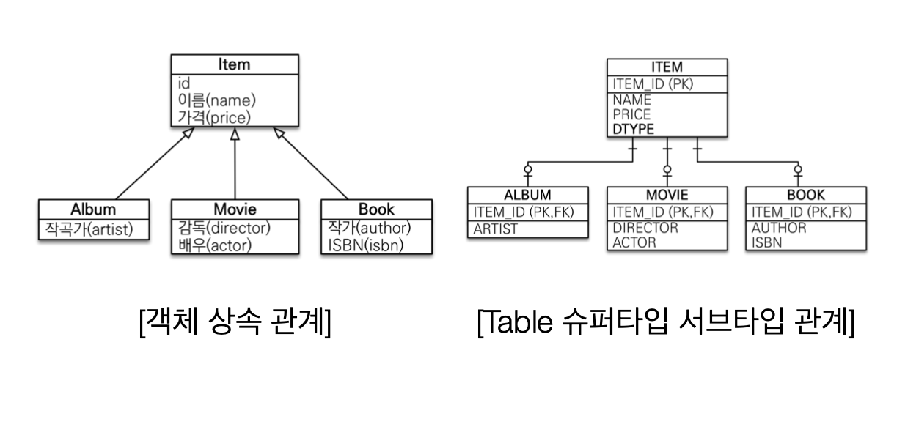
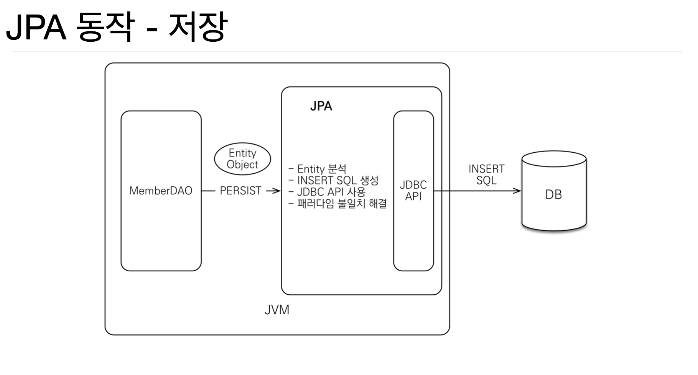

[인프런 김영한님 강의 - 자바 ORM 표준 JPA 프로그래밍 -기본편](https://www.inflearn.com/course/ORM-JPA-Basic)

# 01. JPA 소개 - JPA란 무엇인가.

## 1-1 SQL 중심의 개발의 문제점

+ 객체 CRUD SQL 쿼리문을 직접 작성해야한다.

+ SQL에 의존적인 개발을 하게된다.

+ 만에 하나 객체에 필드가 불가피하게 하나 추가 되야하는 상황이라면?
  
  + 쿼리문에 필드를 하나씩 전부 추가해야한다.

<br>

## 1-2 객체와 관계형 DB 간의 패러다임 불일치 문제

+ 객체를 데이터로 저장하는 방법에는 여러가지 있지만 RDB가 가장 많이 쓰임.

+ 하지만 객체와 관계형 데이터베이스 간에는 구조적 차이가 있음. 

+ 예시)
  
  
  
  + 상속관계에 있는 객체(Album)를 저장을 하는 상황을 가정하면 위의 테이블 구조에서는 Insert문이 필연적으로 두번들어간다. 조회를 해야한다면 ? 
  
  + 지옥같은 `join`의 지옥행 열차에 탑승하게 된다. (이미 한번 열차를 탄적이 있기에 ..)

+ 이걸 자바의 컬렉션을 이용해 저장과 조회하는 상황을 생각해보자.
  
  ```java
  list.add(album); //저장
  
  Album album = list.get(albumId); //조회
  Item item = list.get(albumId);  //다형성을 활용할 수도 있다.
  ```
  
  + 뒤에 알게 되겠지만 JPA가 마치 이렇게 동작하는 것처럼 보인다.

+ **연관관계**
  
  + 객체는 참조를 사용하여 연관관계를 나타내고, 관계형 데이터베이스는 외래키를 사용한다.

+ **신뢰성 문제**
  
  + 어떤 객체를 조회하는 메서드가 있다고 할때, SQL 의존적으로 설계했을 떄 이 메서드가 과연 내가 원하는 필드까지 조회하게끔 동작하고 있을지 의심스러운 상황이 발생할 수 있다.(join이 안되어있을 수 있다.)
  
  + 즉, 신뢰성의 문제가 생기는 것이다. 

+ 비교의 문제
  
  + mybatis 예시
    
    ```java
    String memberId = "100";
    Member member1 = memberDAO.getMember(memberId);
    Member member2 = memberDAO.getMember(memberId);
    member1 == member2; //다르다.
    
    class MemberDAO {
        public Member getMember(String memberId) {
            String sql = "SELECT * FROM MEMBER WHERE MEMBER_ID = ?";
            ...
            //JDBC API, SQL 실행
            return new Member(...);
        }
    }
    ```
    
    + 같은 id로 조회메서드 해서 찾은 객체는 서로 다르다..
  
  + 자바 컬렉션에서의 상황
    
    ```java
    String memberId = "100";
    Member member1 = list.get(memberId);
    Member member2 = list.get(memberId);
    member1 == member2; //같다.
    ```
    
    + 당연히 같은 참조값을 가지고 있으므로 같다고 판별한다.

+ **객체를 자바 컬렉션에 저장하듯이 DB에 저장하고 조회 할 수 없을까:?**

<br>

## 1-4 JPA

+  Java Persistence API

+ 자바 진영의 **ORM** 기술 표준이다.

### 1-4-1 ORM이란 무엇인가?

+ Object-relational-Mappint(객체 관계 매핑)

+ 객체는 객체대로, DB는 DB대로 설계하여 ORM 프레임이 중간에서 매핑을 담당한다.

+ 대부분의 언어에 존재한다.

### 1-4-2 JPA 동작방식 -저장 (예시)



### 1-4-3 JPA 발전과정

+ 기존 EJB 라는 ORM 기술이 존재했으나 기술적난이도가 너무 어렵고 실용성이 떨어져서 외면 받고 있었음.

+ 불편함을 느낀 한 인물이 하이버네이트라는 오픈 소스 ORM 을 만듦

+ 자바에서 이를 인터페이스로 구체화하고 정립시킴 

<br>

### 1-4-4 JPA는 표준 명세이다.

+ JPA 는 인터페이스의 모음이다.

+ 이를 구현한 구현체는 3가지로 Hibernate, EclipseLink, DataNucleus 가 있다.

<br>

### 1-4-5 왜 JPA를 사용해야하는가?

1. **생산성 향상**: 쿼리문을 직접 만지지 않고 메서드로 만 정의 하면 되기 때문에 생산성이 향상된다.

2. **유지보수의 용이성** : 위에서 말한 필드가 하나 추가 되는 상황이 있을때, 객체에 필드만 하나 추가함으로써 불필요한 보수공사를 하지 않아도 된다.

3. **패러다임 불일치 해결** : 위의 상속 관련 코드에서 단순히 persist로 저장을 하면 JPA가 알아서 insert문을 생성하기 때문에 이를 따로 생각하지 않아도 된다.

4. **성능 최적화**: 1차캐시, 쓰기지연, 지연로딩 등 (뒤에서 알아보자.)
