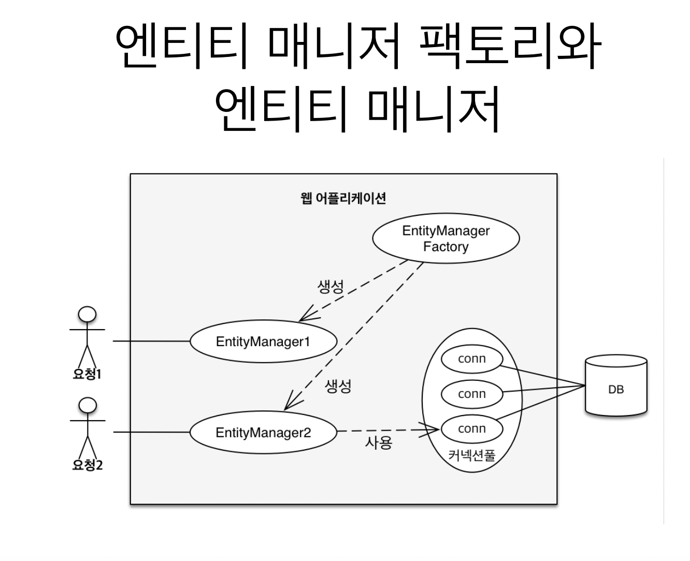
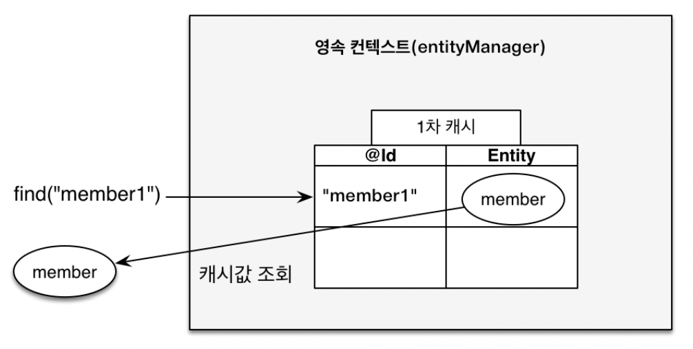
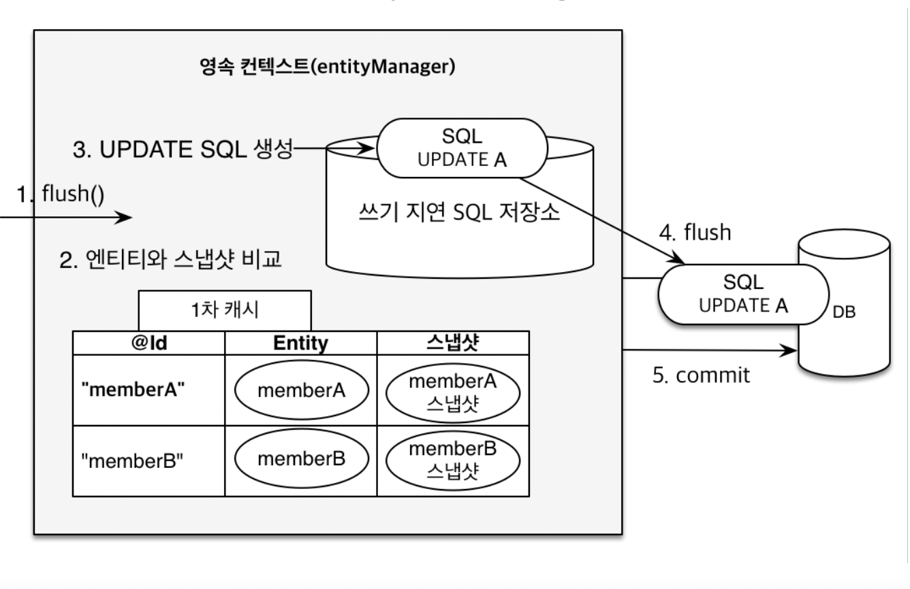

[인프런 김영한님 강의 - 자바 ORM 표준 JPA 프로그래밍 -기본편](https://www.inflearn.com/course/ORM-JPA-Basic)

# 2. 영속성 관리

## 2-1 영속성 컨텍스트

+ Entity Manget 작동방식
  
  

+ EntityManager Factory 는 하나를 공유하고 Entitiy Manager는 공유하지 않는다.

+ Entitiy Manager를 통해서 영속성 컨텍스트에 접근 할 수 있다.

### 영속성 컨텍스트란 무엇인가?

+ JPA를 이해하는데 가장 중요한 용어

+ 논리적인 개념으로 눈에 보이지 않는다.

+ "**엔티티를 영구 저장하는 환경**"

### 엔티티의 생명주기

+ 비영속 : 영속성 컨텍스트와 관련없는 새로운 상태
  
  + 새로운 객체를 생성하고 em으로 persist하지않음 -> 영속성 컨텍스트와는 아무 관계없음.

+ 영속 : 영속성 컨텍스트에 의해 **관리** 되는상태
  
  + 새로운 객체를 생성하고 em으로 persist함 -> 영속성 컨텍스트에 의해 관리됨 (1차캐시에 존재.)

+ 준영속 : 영속성 컨텍스트에 저장되었다가 분리된 상태
  
  + `em.detach(객체)`

+ 삭제 : 삭제된 상태
  
  + `em.remove(객체)`

### 영속성 컨텍스트의 이점

+ 1차캐시

+ 동일성 보장

+ 트랜잭션을 지원하는 쓰기지연(transactional write-behind)

+ 변경 감지 (Dirty Checking)

+ 지연 로딩 (Lazy Loading)

<br>

## 2-2 영속성 컨텍스트의 1차 캐시

`em.persisit(객체)`를 하면 영속성 컨텍스트에서 어떤 일이 일어날까?

```java
Member member = new Member();
member.setId("member1");
member.setUsername("회원1");

//1차 캐시에 저장됨
em.persist(member);

//1차 캐시에서 조회
Member findMember = em.find(Member.class, "member1");
```

이때의 영속성 컨텍스트 내부는 



+ 1차캐시에 키값은 id로 하는 구조에 담기게 된다. 이때 `em.find()`를 하면 1차캐시에서 먼저 조회를하고, 없다면 DB에서 조회하는 과정을 거치게된다.

+ 사실 1차 캐시를 이용하는 것이 성능적으로 크게 향상되는 이득은 없다. 그리고 위의 상황 처럼 이득을 보는 상황이 그렇게 많지 않을 것이다

<br>

## 2-3 영속성 엔티티의 동일성 보장

+ 1장에서 SQL의존적으로 설계시 객체간의 동일성문제가 발생하는 경우를 보았다. 영속성 컨텍스트의 1차 캐시를 이용하면 동일성을 보장할 수 있다.
  
  ```java
  Member a = em.find(Member.class, "member1"); //DB를 조회하여 1차 캐시에 등록
  Member b = em.find(Member.class, "member1"); //1차캐시를 조회
  System.out.println(a == b); //동일성 비교 true
  ```

<br>

## 2-4 트랜잭션을 지원하는 쓰기 지연

코드로 알아보자

```java
public class JpaMain {
    public static void main(String[] args) {
        EntityManagerFactory emf = Persistence.createEntityManagerFactory("hello");
        EntityManager em = emf.createEntityManager();

        EntityTransaction tx = em.getTransaction();
        tx.begin();

        try {
            Member member1 = new Member(189L,"A");
            Member member2 = new Member(149L,"B");
            em.persist(member1);
            em.persist(member2);
            System.out.println("=====================");
            tx.commit();
        } catch (Exception e) {
            tx.rollback();
        } finally {
            em.close();
        }
        emf.close();
    }
}
```

+ 위의 코드를 실행하면 이런 결과를 얻는다
  
  `=====================
  Hibernate: 
     /* insert hellojpa.Member
  
         */ insert 
         into
             Member
             (name, id) 
         values
             (?, ?)
  
  Hibernate: 
     /* insert hellojpa.Member
  
         */ insert 
         into
             Member
             (name, id) 
         values
             (?,`
  
  + 분명히 `===========`를 출력하는 코드가 `persist()` 보다 밑에 있는데 먼저 출력 됐다.

+ 즉, JPA는 SQL을 모아서 한꺼번에 처리한다? 언제? 트랜잭션 커밋시점에. 
  
  + 쿼리문은 영속 컨텍스트내부의 `쓰기지연 SQL 저장소`에 임시적으로 보관된다.

<br>

## 2-5 변경 감지(Dirty Checking)

+ 활용편에서 가장 이상했던 부분이 엔티티를 업데이트 할 때 였다. 아무 메서드 없이 그냥 영속상태인 엔티티의 필드를 변경 하는 것만으로 업데이트 쿼리문이 날아 갔다. 이게 어떻게 된 일일까?
  
  

+ 영속성 컨텍스트의 1차캐시에 추가 될때 그 당시의 값을 스냅샷으로 저장 해놓는다.

+ 스냅샷과 비교해서 변경된 사항이 있으면 Update 쿼리문을 생성한다.


## 2-6 em.flush()

em의 flush 메소드를 호출하면 영속성 컨텍스트의 변경 내용 데이터베이스에 반영한다.

또, 변경감지의 시작점이 된다. (위의 사진 참고)

+ 영속성 컨텍스를 flush 하는 방법
  
  + `em.flush()` 
  
  + 트랜잭션 커밋 -플러쉬 자동 호출
  
  + JPQL 쿼리 실행 - 플러쉬 자동 호출

> flush는 영속성 컨텍스트를 비우거나 하는게 아니다! 변경내용을 데이터베이스에 동기화 되는것이다.
