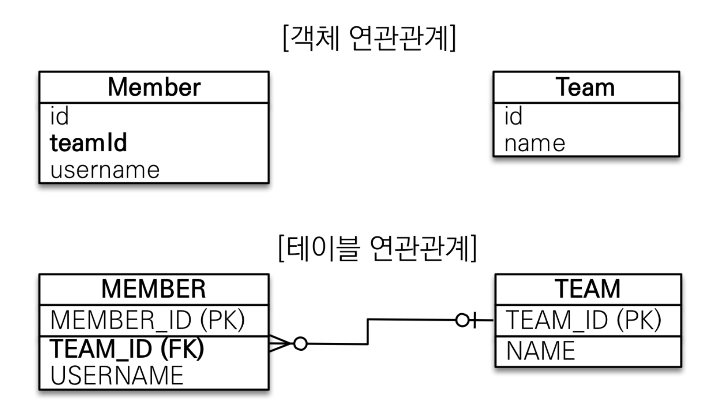
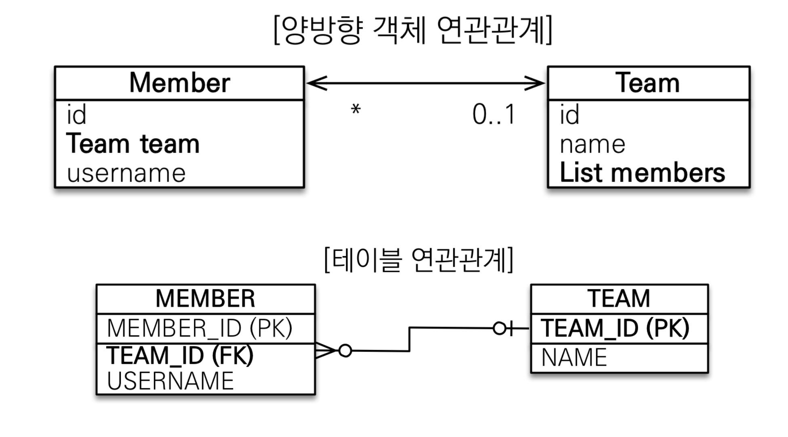

# 4. 연관관계 매핑 기초

+ 이번장에서 꼭 이해하고 넘어야하는 용어들 : 방향(Direction) , 다중성 (Multiplicity), 연관관계의 주인 (Owner)

## 4-1 연관 관계는 무엇이고 왜필요한가?

+ DB에서 테이블 간의 관계는 PK와 FK로 표시할 수 있다. 객체에서는 ? 
  
  참조를 통해 이를 나타낼 수 있다. 만약 테이블 중심의 설계를 하면 관계를 맺는 객체는 각테이블들의 id값으로 떡칠 될것이다. 여기까진 괜찮다. 그런데 조회를 하려하거나 인서트를 하려는 순간 부터 머리가 아파오기 시작할 것이다.


> `객체지향 설계의 목표는 자율적인 객체들의 협력 공동체를 만드는 것이다` 

+ 사진으로 비교하기
  
  + 연관관계가 없는 경우
    
     
  
  + 연관관계가 있는 경우
    
    
  
  + 앞선 장에서 객체와 테이블의 간격을 설명했다. 이상적인그림은 객체는 객체지향 설계를 유지하고 테이블은 테이블의 설계형식을 유지하는 것이다. 지금부터 그방법을 알아보자.

<br>

## 4-2 단방향 연관관계

```java
public class Member {

    @Id @GeneratedValue
    @Column(name = "MEMBER_ID")
    private Long  id;

    @Column(name ="USERNAME")
    private String username;
//    @Column(name = "TEAM_ID")
//    private Long teamId;

    @ManyToOne
    @JoinColumn(name = "TEAM_ID") //조인 되는 컬럼명의 이름을 지정해줘야한다. Name을 지정하지않으면, field의이름_부모 테이블의 PK컬럼의 이름이 자동으로 부여된다.
    private Team team; //일반적으로 부모테이블의 기본값이랑 동일하게 맞춰준다.
```

+ `@ManyToOne `
  
  + 다대일 관계 중 `다`에 속하는 엔티티에 해당한다.

+ `@JoinColum` 
  
  + 컬럼명을 지정해주는 어노테이션이다. 없으면 알아서 이름을 붙여 지정한다.
  
  + 이때 default는 상대 엔티티의 필드명 + 컬럼명의 이름이다.
  
  + 관습적으로 임의로 관계를 맺는 컬럼명을 그대로 적어준다.

+ 단방향이라는 것은 참조를 한곳에서 하는 것을 의미한다. 위의 사진에서 화살표의 방향 확인.

+ 이렇게 하면 관계를 맺는게 끝난다. !? 실제 생성되는 쿼리를 확인 해보자.
  
  ```sql
  create table Member (
         MEMBER_ID bigint not null,
          USERNAME varchar(255),
          TEAM_ID bigint,
          primary key (MEMBER_ID)
      )
  
  ---------------------------------
    alter table Member 
         add constraint FKl7wsny760hjy6x19kqnduasbm 
         foreign key (TEAM_ID) 
         references Team
  ----------------------------------
  insert 
          into
              Member
              (TEAM_ID, USERNAME, MEMBER_ID) 
          values
              (?, ?, ?)
  ----------------------------------
  select
          member0_.MEMBER_ID as MEMBER_I1_0_0_,
          member0_.TEAM_ID as TEAM_ID3_0_0_,
          member0_.USERNAME as USERNAME2_0_0_,
          team1_.TEAM_ID as TEAM_ID1_1_1_,
          team1_.name as name2_1_1_ 
      from
          Member member0_ 
      left outer join
          Team team1_ 
              on member0_.TEAM_ID=team1_.TEAM_ID 
      where
          member0_.MEMBER_ID=?
  ```
  
  + 알아서 FK 제약조건을 설정하거나 , join하여 `find()`하는 것을 확인 할 수 있다. 

<br>

## 4-3 양방향 연관관계

(이게 좀 골 때리는 놈이다.)

예시)



+ 단방향 연관관계 와는 다르게 `Team` 엔티티에서도 `Memeber` 를 참조하고 있다. 이렇게 서로 참조하고 있을때 양방향 연관관계라고 부른다. 

+ 또 주목할 것은 테이블의 연관관계는 변함이 없다는 사실이다.

+ 사실 테이블은 FK가 있으므로 그자체로 양방향 관계이다. (join을 통해 서로 조회할 수 있으니깐.)


#### !중요!-- 연관관계의 주인과 mappedBy

+ 엔티티간의 양방향 관계에서 누가 테이블의 외래키를 관리할 지 정해야한다. 누구든 한놈은 외래키를 관리해야 자명하다.

+ 외래키를 관리한다는 것은 엔티티가 변화하거나 생성될때 관계를 맺는 외래키의 테이블을 업데이트 시켜줘야한다는 말임.

+ <b> 양방향 매핑 규칙 </b>
  
  + 객체의 두 관계중 하나를 연관관계의 주인으로 정한다. 
  
  + <u>연관관계의 주인만이 외래키를 관리(등록,수정) 할 수 있다.</u>
  
  + 주인이 아닌쪽은 읽기만 가능하다.
  
  + 주인이 아닌쪽에 mappedBy 속성으로 주인을 지정해줘야한다.

+ 그래서 누구를 주인으로 지정해주어야하냐?
  
  + **외래키가 있는 곳을 주인으로 정해주면 된다**
  
  ```java
  @Entity
  public class Team {
  
      @Id @GeneratedValue
      @Column(name = "TEAM_ID")
      private Long id;
      private String name;
  
      @OneToMany(mappedBy = "team") //연관관계의 주인이 아님, 읽기만가능.
      private List<Member> members = new ArrayList<>();
  }
  ```


+ 많이하는 실수
  
  + 객체지향적 설계는 두 객체 모두 값을 갖는것이다.
    
    ```java
                Team team = new Team();
                team.setName("TEAM A");
    
                em.persist(team);
    
                Member member = new Member();
                member.setUsername("member1");
    
                team.getMembers().add(member);
                member.setTeam(team);
    
                em.persist(member);
    
                em.flush();
                em.clear();
    
                Member member1 = em.find(Member.class, 1L);
    
                tx.commit();
    ```
    
    + 사실 유효한것은 `member.setTeam(team)` 이다. 왜냐면 연관관계의 주인이 member이기 때문이다. 그러나 순수 객체 상태를 고려해 team의 members list에도 add 해주는 것이 바람직하다. 
    
    + 이때 , 편의 메서드로 하나로 묶는 것이 좋다.
      
      ```java
      public void addMember(Member member){
              members.add(member);
              member.setTeam(this);
          }
      ```
      
      + 이런식으로 할 수 있다.
  
  + toString() 사용 , JSON 생성 라이브러리 사용시 무한 루프를 돌 위험이 있따.

<br>


## 4-4 당부사항

+ 양방향 관계는 간지가 나긴하지만 , 기억해야한다. 필수가 아니다. 오히려 리스크가 있다.

+ 단방향 관계로 이미 연관관계 매핑은 끝이난다.

+ 양방향 관계를 사용하는것은 반대방향으로 조회의 이득을 볼때이다. 

+ **우선 단방향으로 매핑을 끝내고 양방향은 필요할 떄 추가하자 꼭!**


