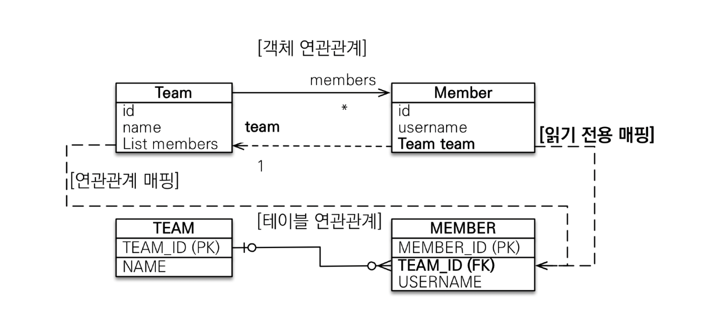
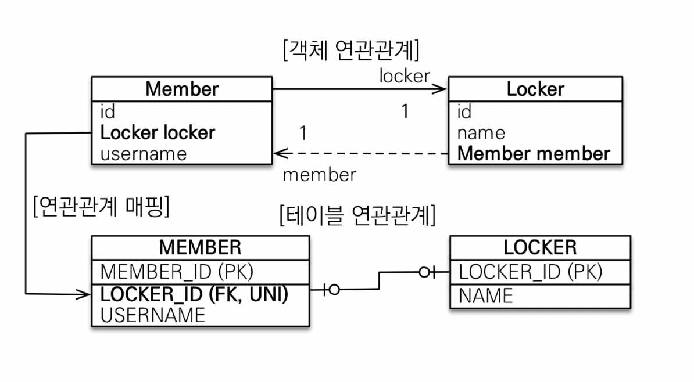
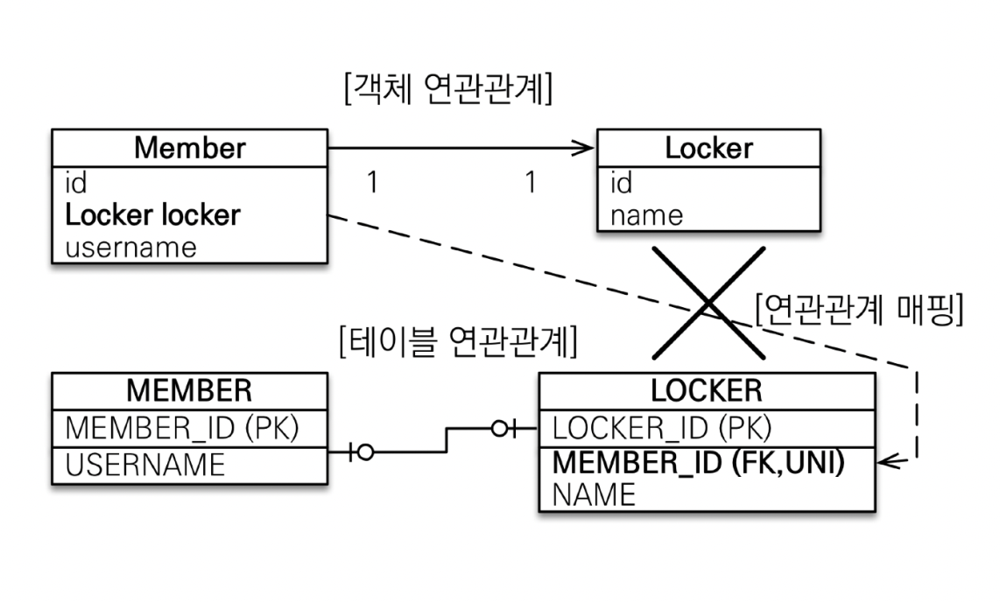
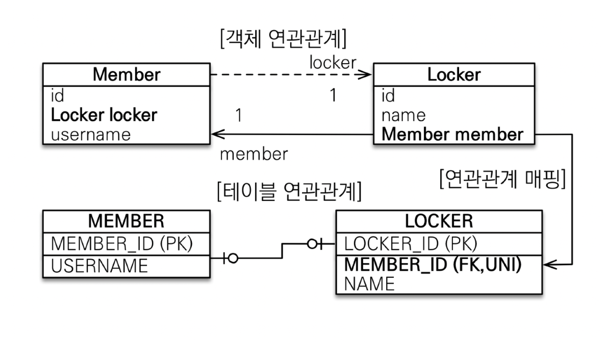
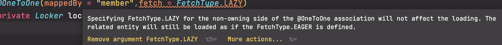
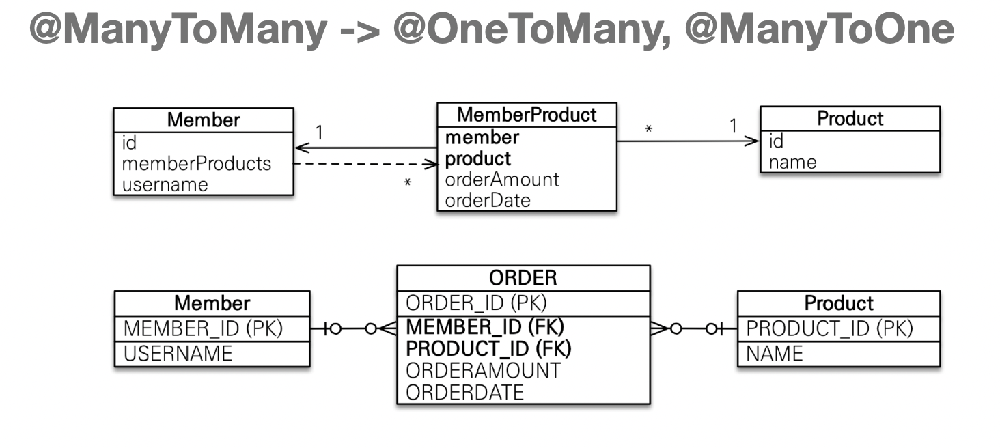

[인프런 김영한님 강의 - 자바 ORM 표준 JPA 프로그래밍 -기본편](https://www.inflearn.com/course/ORM-JPA-Basic)

# 5. 다양한 연관관계 매핑

## 5-1 다대일 (@ManyToOne) [N:1]

+ **단방향**
  
  + 앞장에서 많이 다뤘으므로 생략.
  
  + 가장 많이 사용하는 연관관계임.

+ **양방향**
  
  + 외래키가 있는 쪽이 연관관계의 주인임.
  
  + 항상 기억 연관관계의 주인의 '다' 쪽에 있어야함. 
  
  + 테이블 구조상으로 봐도 `다` 쪽에 FK가 위치하게 됨.

 

## 5-2 일대다 (@OneToMany) [1:N]

+ **단방향**
  
  
  
  + '1'쪽이 연관관계의 주인이 된다.
  
  + 그러나 테이블의 구조상 항상 `다`쪽에 외래키가 있을 수 밖에 없다.!
  
  + 즉 이 경우 반대편 테이블의 외래키를 관리하게 되는 것이다. 쿼리문이 추가적으로 들어갈 수밖에 없기 때문에 <mark>**차라리 다대일 양방향 매핑을 사용하는것이 바람직하다.**</mark>

+ 양방향
  
  
  
  + 이런 매핑은 공식적으로는 존재하지 않는다.
  
  + 꼼수를 이용해서 가능하다. `Member`의 `team`필드에 `@JoinColumn(insertable = false, updatable=false)` 를 사용해서 **읽기전용 필드로 만드는 것이다.**
  
  + 그러나 이경우도 그냥 다대일 양방향을 사용하는것 이  바람직하다..

+ 정리 
  
  + 굳이 연관관계의 주인을 1 쪽에 주는것은 무의미하다.(불가능한것은 아니다.)

 

## 5-3 일대일 (@OneToOne) [1:1]

+ 일대일 관계에서는 FK가 양쪽테이블 어디에 위치하던 상관이 없다. -> 관점의 차이만 있을뿐이다.  <u>+외래키에 데이터베이스 유니크 제약조건을 추가하여서 완성해야한다.</u>

+ 기본적으로 주 테이블과 대상테이블의 개념으로 나눌 수 있다.
1. 주 테이블에 외래키 양방향
   
   
   
   + 반대편에 mappedBy를 적용한다.
   
   + 외래키가 있는곳이 연관관계의 주인!

2. 대상 테이블에 외래키 단방향
   
   
   
   + JPA에서 지원을 하지않는다. 즉, **FK가 있는쪽이 아닌 곳을 연관관계의 주인으로 지정할 수 없다.!**

3. 대상 테이블에 외래키 양방향
   
   
   
   + 대상 테이블에 FK가 있는 구조
+ 정리
  
  + 주 테이블에 외래키가 있는 형태 (위의 1번)
    
    + JPA 매핑이 편리하다.
    
    + 객체지향 개발자가 선호하는 형태이다.
    
    + 장점: 주테이블만 조회해도 대상테이블에 데이터가 있는지 확인이 가능하다.
    
    + 단점: 값이 없으면 외래키에 null을 허용한다. 즉 Not null 사용불가.
  
  + 대상 테이블에 외래키가 있는 형태(위의 3)
    
    + 전통적인 데이터베이스 개발자가 선호한다.
    
    + 장점: 일대일에서 일대다 구조로 변경할떄 테이블 구조를 그대로 유지한다.
    
    + 단점 : **프록시 기능의 한계로 지연로딩을 설정해도 항상 즉시로딩 된다.**
  
  > 뭔말인가?
  > 
  > 상황 : 주테이블 - Member , 대상 테이블 -Locker 
  > 
  > Locker 테이블에 FK가 있는 경우 Member에서 Locker필드를 지연로딩으로 설정해도 항상 즉시로딩 된다. (대상 테이블에 FK가 있는 경우)
  > 
  > 이유는 JPA기본스펙의 프록시의 기능적 한계라고 한다...
  > 
  > 아래 사진을 참고하자.
  
  
  
   

## 5-4 다대다 (@ManyToMany) [N:M]

+ 관계형 데이터베이스에서는 다대다 관계를 표현할 수 없다.

+ 연결 테이블을 추가해서 일대다, 다대일 관계로 풀어내야한다.

+ `@ManyToMany` 가 있지만 그냥 넘어가자..

+ 연결 테이블을 사용해야하는이유는 단순히 두테이블의 FK만 이어주는것이 아니라 추가되는 데이터가 더 필요하기 떄문
  
  + 예) 주문 -상품의 다대다 관계의 경우 중간에 주문-상품으로 연결해야한다.
  
  + 이떄, 주문시간, 수량 등의 추가적인 데이터가있을경우 `@ManyToMany` 을 이용해서 풀어 낼수 있는 방법이 없다.

+ 해결 방안 : 연결용 엔티티를 추가한다.

+ 

