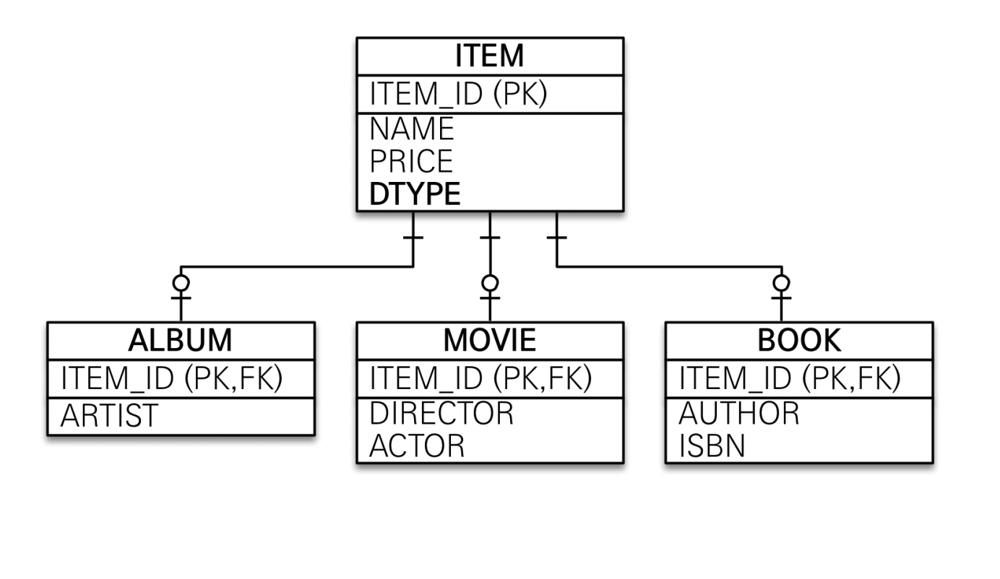
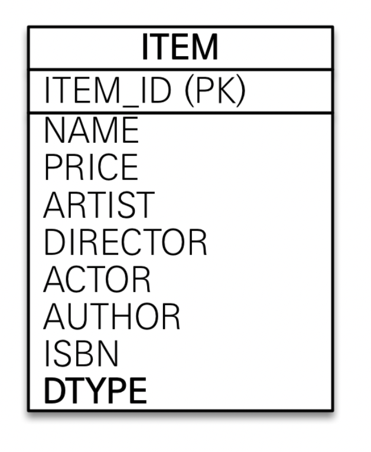
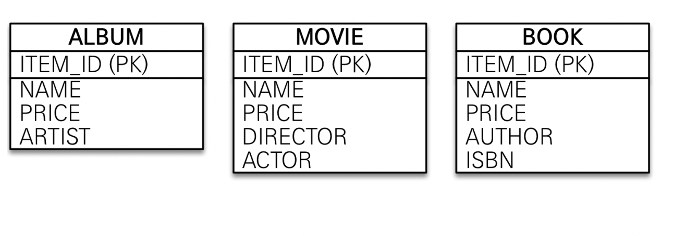

[인프런 김영한님 강의 - 자바 ORM 표준 JPA 프로그래밍 -기본편](https://www.inflearn.com/course/ORM-JPA-Basic)


# 6. 고급 매핑


## 6-1 상속관계 매핑

+ 관계형 데이터베이스에는 상속이라는 관계가 없다.

+ 3가지 전략
  
  + 공통의 테이블과 각각의 테이블로 변환 -> 조인전략 
  
  + 통합된 하나의 테이블로 변환 -> 단일 테이블 전략
  
  + 서브타입 테이블로 변환 -> 공통 x 구현된 클래스마다 테이블로 만듦

+ 어노테이션 정리
  
  + `@Inheritance(strategy= InheritanceType.JOINED)` : 위의 첫번쨰 전략
  
  + `@Inheritance(strategy= InheritanceType.SINGLE_TABLE)` : 위의 두번쨰 전략
  
  + `@Inheritance(strategy= InheritanceType.TABLE_PER_CLASS)` :위의 세번째 전략
  
  + `@DiscriminatorColum(name="DTYPE")` : 구분 컬럼명 지정. DTYPE이 default
  
  + `@DiscriminatorColum(name="DTYPE")` : 구분 컬럼명의 value값

<br>

## 6-2 조인 전략



+ 테이블의 정규화를 중점으로 하는 전략 -> 무결성을 지킬수 있을 확률이 크다.

+ 저장공간이 효율화 된다.

+ 조인을 많이 사용하여 성능 저하의 우려가 있다.

+ 쿼리가 복잡하고, 인서트문을 두번 호출하게 된다.


## 6-3 단일 테이블 전략



+ 조인이 필요없어서 성능적으로 빠르다 

+ 조회 쿼리가 단순하다.

+ 자식 엔티티가 매핑한 컬럼은 모두 Null을 허용해야한다.

+ 테이블이 비정상적으로 커질 수있다.

<br>

## 6-4 구현 클래스 마다 테이블 전략



+ 그냥 나가리 전략 한눈에봐도 비효율적인것이보인다.

+ 대신 not null 제약조건이 사용가능하다.

+ 성능이 느리다.

+ 통합해서 쿼리하기 어렵다.

<br>


## <상속관계 예시 코드>

```java
package jpashop.domain;


import javax.persistence.*;
import java.util.ArrayList;
import java.util.List;

@Entity
@Inheritance
public abstract class Item {

    @Id @GeneratedValue
    @Column(name = "ITEM_ID")
    private Long id;

    private String name;

    private int price;

    private int stockQuantity;
}
```

+ 부모의 클래스에 `@Inheritance` 를 붙인다. **default 는 싱글테이블 전략이다.**

```java
package jpashop.domain;

import javax.persistence.DiscriminatorValue;
import javax.persistence.Entity;

@Entity
@DiscriminatorValue(value = "A")
public class Album extends Item{

    private String artist;
    private String etc;

}

```


<br>

## 6-5 @MappedSuperclass

+ 공통의 매핑정보가 필요할때 사용한다.

### --예시

```java
package hellojpa;

import javax.persistence.MappedSuperclass;
import java.time.LocalDateTime;

@MappedSuperclass
public abstract class BaseEntity {


    private String createdBy;  //생성한 사람의 이름.
    private LocalDateTime createdTime; //생성일시
    private String lastModifiedBy;  //수정한 사람의 이름.
    private LocalDateTime lastModfiedTime; //수정 일

    //getter , setter
}
```

+ 이렇게하면 끝이다 필요한 곳에서 상속받으면 된다.

+ 직접사용하지않으므로 추상클래스가 권장된다.

+ 단독으로 조회 되지않는다.

+ 단순 엔티티가 공통으로 사용하는 매핑 정보를 모으는 역할을 한다.

> 참고 : `@Entity` 클래스는 엔티티나 `@MappedSupeclass`로 지정한 클래스만 상속이 가능하다.
