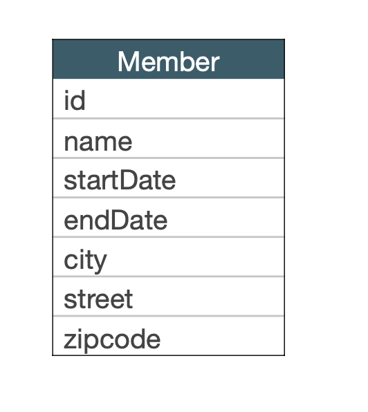
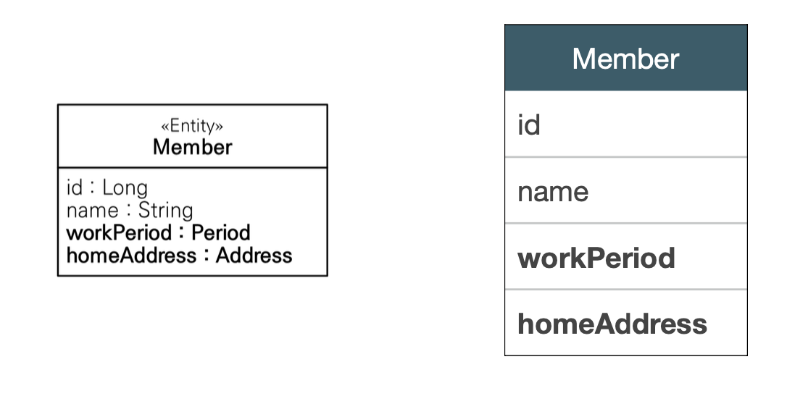

[인프런 김영한님 강의 - 자바 ORM 표준 JPA 프로그래밍 -기본편](https://www.inflearn.com/course/ORM-JPA-Basic)

# 08. 값 타입

+ 값 타입이란 
  
  + int , Intger,String 처럼 단순히 값으로 사용하는 자바 기본타입이나 객체를 말함
  
  + 반대 개념으로 엔티티 타입이 있음.

## 08-1 기본값 타입

+ 자바 기본타입,래퍼클래스 , String 등이 해당됨

+ 값 타입은 공유하면 안됨 ex) 회원 이름 변경시 다른 회원의 이름이 변경되거나 하는일 

<br>

## 08-2 임베디드 타입 (복합 값 타입)

+ 새로운 값 타입을 정의함.

+ 주로 기본 값들을 한곳에 모아두기 때문에 복합 값 타입이라고도 함.

ex)

----->

+ `@Embeddable` : 값 타입을 정의하는 곳에 표시한다.

+ `@Embedded` : 값 타입을 사용하는 곳에 표시한다.

+ 이떄 기본 생성자는 필수 이다.

+ 임베디드 타입을 사용한다고 해서 테이블의 구조가 변하는 것이 아니다.

+ <u>잘 설계한 ORM 애플리케이션은 매핑한 테이블의 수보다 클래
  스의 수가 더 많음</u>

+ 한 엔티티에서 같은 임베디드 타입을 사용할 경우 `@AttributeOverrides`를 사용하여 컬럼명을 재정의 해줄 수 있다.

<br>

## 08-3 값 타입과 불변 객체

> 값 타입은 단순하고 안전하게 다룰 수 있어야한다!

+ 값 타입은 절대 실제 인스턴스 값을 참조하는 것과 같이 공유해선 안된다.

```java
           Address ad = new Address("city", "여기", "zip");

            Member member = new Member();
            member.setUsername("아오");
            member.setHomeaddress(ad);
            em.persist(member);

            Address copy = new Address(ad.getCity(),ad.getStreet(), ad.getZipcode());

            Member member2 = new Member();
            member2.setUsername("아오2");
            member2.setHomeaddress(copy);
            em.persist(member2);

            member.getHomeaddress().setCity("newCity");

            tx.commit();
```

+ 위와 같이 복사를 하는게 부작용을 피할 수 있는 길이다.

### 한계

+ 객체 타입은 참조 값을 직접 대입 하는 것을 막을 방법이 없다. 
+ 즉 복사를 하는것이 바람직하나 공유 참조 자체를 막을 방법이 없다. 

### 대안

+ 불변객체(Immutable object)로 만들면 된다.

+ 생성자로만 값을 세팅하고, 수정자를 만들지 않으면 된다.

+ 자바의 Integer, String이 그 예다.

+ 즉, 임베디드 타입은 아예 불변객체로 만들자!

+ 만약 수정이 필요하면 새로 값을 생성해서 갈아 끼우는 식으로 가야함.

<br>

## 08-4 값 타입 비교

+ 객체 타입의 값 타입은 equals 메서드를 정의하는게 좋다.

+ 이때, 되도록 이면 getter메서드를 이용해서 만들자.

+ 프록시객체는 필드에 직접 접근이 불가능 하기 때문이다.

<br>

## 08-5 값 타입 컬렉션

+ 값 타입을 한개이상 저장할 때 사용한다.

```java
    @ElementCollection
    @CollectionTable(name = "FAVORITE_FOOD",joinColumns =
        @JoinColumn(name = "MEMBER_ID")
    )
    @Column(name = "FOOD_NAME")
    private Set<String> favoriteFoods = new HashSet<>();
```

+ 데이터 베이스는 컬렉션을 저장 할 수 없기 때문에 별도의 테이블이 필요하다.

+ 여기서 컬럼명은 CollectionTable에 쓰이는 컬럼명이다.
  
  + 최종적으로 `FAVORITE_FOOD` 테이블에 `MEMBER_ID` 컬럼과  `FOOD_NAME` 컬럼이 생성된다.

+ 참고로 값 타입 컬렉션은 앞에서 배운 영속성 전이(Cascade) + 고아객체 기능을 필수로 가진다. 즉, 생명주기를 주 엔티티와 같이한다. 

### 값 타입 컬렉션의 제약사항

+ 식별자 개념이 없다.

+ 값을 변경하면 추적이 어렵다. -> 안되지않을까

+ 값 타입 컬렉션에 변경 사항이 발생하면, 주인 엔티티와 연관된 모든 데이터를 삭제하고, 값 타입 컬렉션에 있는 현재 값을 모두 다시 저장한다.

+ 모든 컬럼을 묶어서 기본키 구성해야한다.(복합키) : null 안되고, 중복저장 되면 안된다.

### 대안

+ 실무에서는 여차하면 일대다 관계를 고려한다. 즉, 엔티티로 감싸고, 여기에 값타입을 쓴다는 의미.

```java
@Entity
public class AddressEntity {

    @Id @GeneratedValue
    private Long id;

    private Address address;

}
```

+ 이런식으로 엔티티에서 값타입을 사용하고, Member쪽에서 일대대 관계 매핑을 해버리면 끝난다. 그러면 `AddressEntity` 테이블에 식별자와 `Address` 임베디드타입, `MemberId` (Fk) 를 컬럼으로 갖게 되겠지.

### 정리

+ 값 타입은 정말 단순한 상황에서만 사용해야 한다. 특히 값 타입을 컬렉션으로 쓸때 는 특히 더욱
+ 엔티티를 값타입으로 만들지 않게 주의한다.
+ 식별자가 필요하고, 지속적으로 값을 추적(단독으로 조회),변경 해야한다면 엔티티로 만들어야한다.
+ 설문조사, 고객 취향(셀렉트 박스) 이런것들이 들어가면 되지 않을까 딱히 의미는 크게 없는
+ (추가) 값 타입 한개는 지연 로딩이 아니다. join이 필요하지 않기때문이다. 그렇지만 값타입 컬렉션은 다른 테이블에서 FK값으로 join으로 하기 때문에 기본전략이 지연로딩이다!
