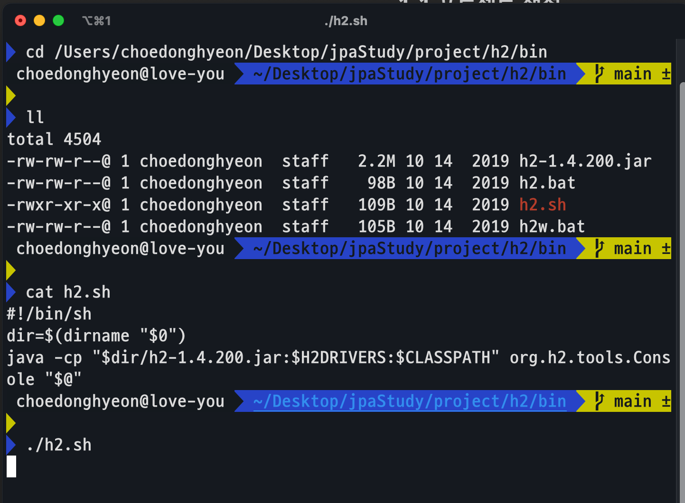

[인프런 김영한님 - 스프링부트와 JPA 활용1]([스프링 MVC 1편 - 백엔드 웹 개발 핵심 기술 - 인프런 | 강의](https://www.inflearn.com/course/%EC%8A%A4%ED%94%84%EB%A7%81-mvc-1)

# 1.프로젝트 환경 설정

## 1-1 프로젝트 생성

+ https://start.spring.io/)
  
  + Gradle
  
  + groupId : jpabook
  
  + artifactId : jpashop

+ Dependency 설정
  
  + WEB, Lombok, Thymeleaf, JPA, Validation, h2

## 1-2 devtools 라이브러리 추가

+ html 수정을 용이하게 하기위한 라이브러리 추가

```java
implementation 'org.springframework.boot:spring-boot-devtools'
```

+ build -> Recompile 로 서버 재시작없이 가능

## 1-3 H2 데이터 베이스 설치

+ h2 설치 후 콘솔로 실행




## 1-4 application.yaml 생성

+ 기존 applicaton.properites 대신 으로 사용

```yaml
spring:
  datasource:
    url: jdbc:h2:tcp://localhost/~/jpashop
    username: sa
    password:
    driver-class-name: org.h2.Driver

  jpa:
    hibernate:
      ddl-auto: create
    properties:
      hibernate:
#        show_sql: true
        format_sql: true

logging:
  level:
    org.hibernate.SQL: debug
    org.hibernate.type: trace
```

+ `ddl-auto: create` : 애플리케이션 실행시점에 테이블 drop하고 다시 생성

+ `show_sql` : System.out에 하이버네이트 실행 SQL 남김

+ `org.hibernate.SQL` : logget로 하이버네이트 실행 SQL 남김

> 테스트 생략

## 1-5 쿼리 파리미터 남기기

+ `org.hibernate.orm.jdbc.bind: trace` (스프링 부트 3.x hibernate 6.x)

+ 외부 라이브러리
  
  + https://github.com/gavlyukovskiy/spring-boot-data-source-decorator

   외부라이브러리 사용 예시

```log
2023-04-04 20:16:26.841  INFO 75178 --- [           main] p6spy                                    : #1680606986841 | took 0ms | statement | connection 3| url jdbc:h2:tcp://localhost/~/jpashop
insert into member (username, id) values (?, ?)
insert into member (username, id) values ('memberA', 1);
2023-04-04 20:16:26.844  INFO 75178 --- [           main] p6spy                                    : #1680606986844 | took 1ms | commit | connection 3| url jdbc:h2:tcp://localhost/~/jpashop
```
