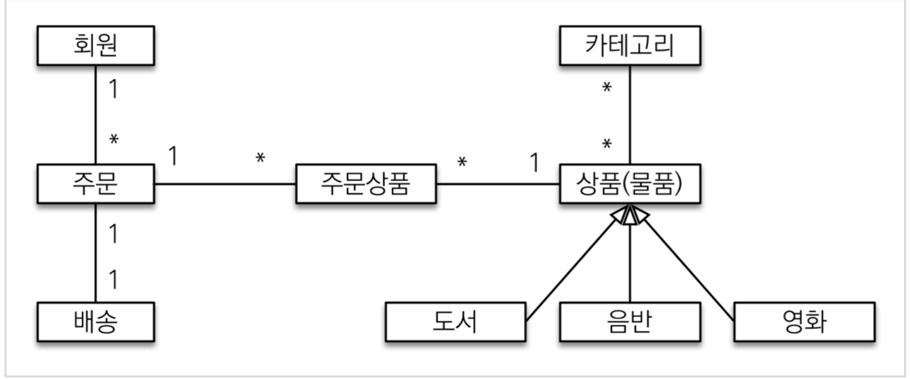
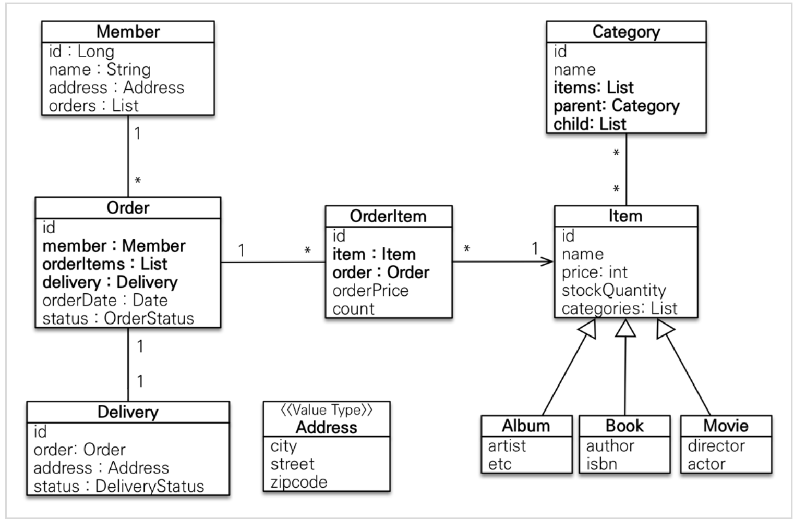
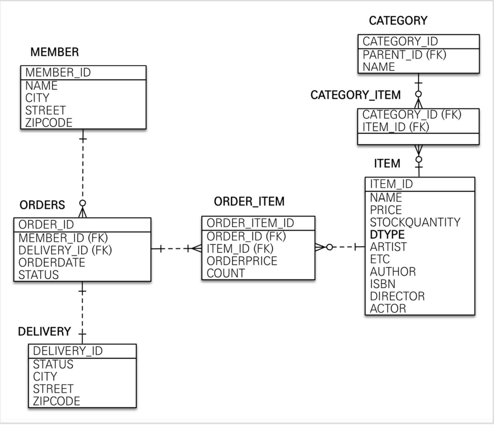

[인프런 김영한님 - 스프링부트와 JPA 활용1]([스프링 MVC 1편 - 백엔드 웹 개발 핵심 기술 - 인프런 | 강의](https://www.inflearn.com/course/%EC%8A%A4%ED%94%84%EB%A7%81-mvc-1)

# 2.도메인 분석 설계

## 2-1 요구사항 분석

+ 회원 기능 
  
  + 회원 등록
  
  + 회원 조회

+ 상품 기능
  
  + 상품 등록
  
  + 상품 수정
  
  + 상품 조회

+ 주문 기능
  
  + 상품 주문
  
  + 주문 내역 조회
  
  + 주문 취소

+ 기타
  
  + 상품은 재고관리가 필요하다
  
  + 상품의 종류는 도서 음반 영화가 있다.
  
  + 상품을 카테고리로 구분할 수 있다(상품하나에 여러개의 카테고리가 포함될 수 있다.)
  
  + 상품 주문시 배송 정보를 입력할 수 있다.

## 2-2 설계 (도메인,엔티티,테이블)

### 2-2-1 도메인 설계



+ 회원은 여러 상품을 주문 할수 있다. 주문과 상품은 다대다 관계가 되므로 주문상품이라는 엔티티로 다대다 관계를 박살냈다. 

+ 상품은 도서 음반 영화로 구분되므로 상품이라는 공통속성을 이용하여 <b>상속구조</b>로 표현했다.

### 2-2-2 엔티티 설계




+ Address 는 값 타입(임베디드 타입)이다.

+ 회원 엔티티를 잘보면 주문리스트를 가지고 있는데, 통념적으로는 회원이 주문을 하므로 회원쪽에 주문을 참조하는 게 당연하지만 실제 세계와 객체 세계는 다르다.
  
  + 실무에서는 주문이 회원을 참조하는것으로 충분하다.

> JPA 기본강의를 듣지 않고 활용편부터 듣는 것이기 때문에 모든것이 낯설다.,,그나마 db설계를 해봤기 때문에 기본적인 참조관계나 정규화만 가지고 최대한 이해해보자.. 나중에 기본강의에서 모든 것을 이해할 것이다.

### 2-2-3 테이블 설계




+ ITEM 테이블을 보면 엔티티에서 앨범,도서 ,영화 타입으로 나누어져 있었는데 DTYPE 컬럼으로 구분하며 한 테이블안에 다 들어있는 모습을 확인 할 수 있다.

+ (참고) ERD 상에서는 대문자+ '_' (언더스코어) 스타일을 사용했는데 실제 코드에서는 소문자  +언더스코어로 할 것이다. (이부분은 둘중 하나를 선택하면 된다. 회사 규정에 따라)

> <b>외래키가 있는 곳을 연관관계의 주인으로 정해야한다.</b>
> 
> 예를들어 자동차와 바퀴와의 관계에서 자동차를 연간관계의 주인으로 지정하면 안된다. 외래키가 있는 바퀴를 연관관계의 주인으로 정하여야한다. 
> 
> --연관관계의 주인이란 말을 아직 잘모르겠다...

## 2-3 개발 시작.

+ 멤버 엔티티
  
  ```java
  @Entity
  @Getter @Setter
  public class Member {
  
      @Id @GeneratedValue
      @Column(name= "member_id")
      private Long id;
  
      private String name;
  
      @Embedded
      private Address address;
  
      @OneToMany(mappedBy = "member")
      private List<Order> orders = new ArrayList<>();
  
  }
  ```
  
  + id에 컬럼명을 따로 지정해준다. 이렇게 해주는 이유는 엔티티는 `Member`라는 타입이 있기떄문에 쉽게 구분이가능하지만 테이블상에서 컬럼명이 `id` 라고 만 지정 되어있으면 구분이 쉽지않다. 그래서 관례상 `테이블명 + id`를 많이 사용한다.

+ 주문 엔티티
  
  ```java
  @Entity
  @Table(name="orders")
  @Getter @Setter
  public class Order {
  
      @Id @GeneratedValue
      @Column(name = "order_id")
      private Long id;
  
      @ManyToOne(fetch = FetchType.LAZY)
      @JoinColumn(name = "member_id") //FK이름
      private Member member;
  
      @OneToMany(mappedBy = "order", cascade = CascadeType.ALL)
      private List<OrderItem> orderItems = new ArrayList<>();
  
      @OneToOne(fetch = FetchType.LAZY,cascade = CascadeType.ALL)
      @JoinColumn(name = "delivery_id")
      private Delivery delivery;
  
      private LocalDateTime orderDate;
  
      private OrderStatus status;//주문상태 [ORDER, CANCEL]
  
      //연관관계 메서드 //
      public void setMember(Member member) {
          this.member = member;
          member.getOrders().add(this);
      }
  
      public void addOrderItem(OrderItem orderItem) {
          orderItems.add(orderItem);
          orderItem.setOrder(this);
      }
  
      public void setDelivery(Delivery delivery) {
          this.delivery = delivery;
          delivery.setOrder(this);
      }
  }
  ```

+ 주문 상품 엔티티
  
  ```java
  @Entity
  @Getter @Setter
  public class OrderItem {
  
      @Id @GeneratedValue
      @Column(name = "order_item_id")
      private Long id;
  
      @ManyToOne(fetch = FetchType.LAZY)
      @JoinColumn(name="item_id")
      private Item item;
  
      @ManyToOne(fetch = FetchType.LAZY)
      @JoinColumn(name = "order_id")
      private Order order;
  
      private int orderPrcie; //주문 가격
      private int count;  //주문 수량
  }
  ```

+ 상품엔티티
  
  ```java
  package jpabook.jpashop.domain.item;
 
  
  @Entity
  @Inheritance(strategy = InheritanceType.SINGLE_TABLE) //상속 전략
  @DiscriminatorColumn(name = "dtype")
  @Getter
  @Setter
  public abstract class Item {
  
     @Id
     @GeneratedValue
     @Column(name = "item_id")
     private Long id;
  
     private String name;
     private int price;
     private int stockQuantity;
  
     @ManyToMany(mappedBy = "items")
     private List<Category> categories = new ArrayList<>();
  }
  ```

+ 배송엔티티
  
  ```java
  package jpabook.jpashop.domain;
  
  
  @Entity
  @Getter @Setter
  public class Delivery {
  

      @Id @GeneratedValue
      @Column(name = "delivery_id")
      private Long id;
    
      @OneToOne(mappedBy = "delivery",fetch = FetchType.LAZY)
      private Order order;
    
      @Embedded
      private Address address;
    
      @Enumerated(EnumType.STRING) //ordinal 쓰면 안됨 1 2 3 4 이런식으로 들어가기 때문에 만약 중간에 상태가 하나 추가된다? 망
      private DeliveryStatus deliveryStatus; //READY, COMP
  }
    ```
  


+ 카테고리 엔티티

  ```java
  package jpabook.jpashop.domain;


  @Entity
  @Getter @Setter
  public class Category {

      @Id @GeneratedValue
      @Column(name = "category_id")
      private Long id;

      private String name;

      @ManyToMany
      @JoinTable(name = "categoty_item",
              joinColumns = @JoinColumn(name = "category_id"),
              inverseJoinColumns = @JoinColumn(name = "item_id"))
      private List<Item> items = new ArrayList<>();

      @ManyToOne(fetch = FetchType.LAZY)
      @JoinColumn(name = "parent_id")
      private Category parent;

      @OneToMany(mappedBy = "parent")
      private List<Category> child = new ArrayList<>();

      public void addChildCategory(Category child) {
          this.child.add(child);
          child.setParent(this);
      }
  }
  ```

+ 주소 값 타입
  
  ```java
  //내장 타입?
  @Embeddable
  @Getter
  public class Address {
  
      private String city;
      private String street;
      private String zipcode;
  
      protected Address() {
      }
  
      public Address(String city, String street, String zipcode) {
          this.city = city;
          this.street = street;
          this.zipcode = zipcode;
      }
  }
  ```

## 

## 2-4 엔티티 설계 시 주의점

+ 가급적 Setter를 사용하지말자
  
  + Getter는 얼마든지 사용해도 상관이없다. 근데 Setter는 변경되는 포인트가 너무 많다.
  
  + 유지보수가 극악으로 힘들어 질 수 있다. 

+ 모든 연관관계는 지연로딩으로 설정해야한다.
  
  + 즉시로딩(EAGER)는 어떤 SQL이 실행될지 추적하기 어렵다. 특히 JPQL을 실행할 떄는 `N+1` 문제가 자주 발생한다.
  
  + 실무에서는 모든 연관관계를 지연로딩 `LAZY`로 설정해야한다.
  
  + `@XXXToONE` 관계는 defualt가 `EAGER`이므로 `LAZY`로 직접 설정해주어야함
