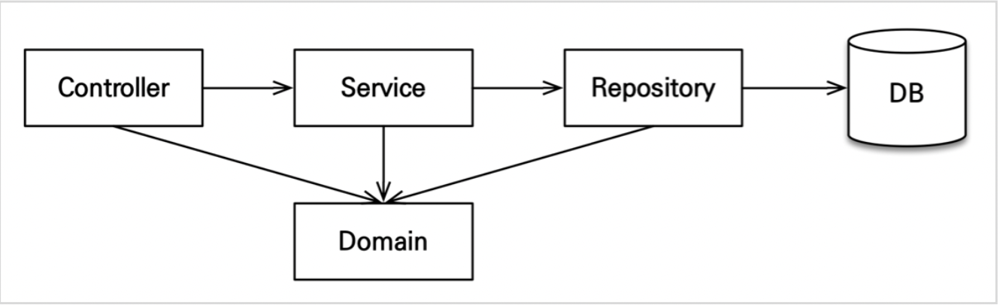

[인프런 김영한님 - 스프링부트와 JPA 활용1]([스프링 MVC 1편 - 백엔드 웹 개발 핵심 기술 - 인프런 | 강의](https://www.inflearn.com/course/%EC%8A%A4%ED%94%84%EB%A7%81-mvc-1)

# 3. 회원 도메인 개발

## 들어가기전에

+ 애플리케이션 아키텍처
  
  
  
  + Controller : web 계층
  
  + Serivce : 비즈니스 로직, 트랜잭션 처리
  
  + Repoisitory : JPA 사용 계층, 엔티티 매니저 사용
  
  + domain : 엔티티가 모여있는 계층으로 **모든 계층에서 사용한다.**

## 3-1 회원 Repository 개발

```java
@Repository
@RequiredArgsConstructor
public class MemberRepository {

    private final EntityManager em;

    public void save(Member member) {
        em.persist(member);
    }

    public Member findOne(Long id) {
        return em.find(Member.class, id);
    }

    public List<Member> findAll() {
        return em.createQuery("select m from Member m", Member.class)
                .getResultList(); //JPQL
    }

    public List<Member> findByName(String name) {
        return em.createQuery("select m from Member m where m.name = :name", Member.class)
                .setParameter("name",name)
                .getResultList();
    }
}
```

## 3-2 회원 Service 개발

```java
@Service
@Transactional(readOnly = true)
@RequiredArgsConstructor
public class MemberSerivce {

    private final MemberRepository memberRepository;

    /**
     * 회원가입
     */
    @Transactional  // -> default : readonly = false
    public Long join(Member member) {
        validateDuplicateMember(member); //중복회원 검증
        memberRepository.save(member);
        return member.getId();
    }

    private void validateDuplicateMember(Member member) {
        List<Member> findByMembers = memberRepository.findByName(member.getName());
        if(!findByMembers.isEmpty()) {
            throw new IllegalStateException("이미 존재하는 회원입니다.");
        }

    }


    //회원 전체 조회
    public List<Member> findmembers() {
        return memberRepository.findAll();
    }

    public Member findOne(Long memberId) {
        return memberRepository.findOne(memberId);
    }
}
```

+ `@Transactional(readOnly = true)`  : 데이터의 변경이 없는 읽기 전용 메서드에 사용하는데 성능향상의 목적이있다. 그러나 데이터 변경이 있는 메서드에 쓸 경우 변경이 일어나지 않으므로 주의해야한다. 따라서 변경이 일어나는 메서드의 경우 @Transactional만 명시한다. (defalt :false)(기본편 강의에서 세세하게 공부해보자!)
+ 멤버 조인시 , 이름이 같은 멤버로 가입이 불가능한 비즈니스 로직을 추가하였다. (메서드 또한 따로 뽑아놓은 것을 확인할 수 있다.)

## 3-3 회원 기능 테스트

```java
@SpringBootTest
@Transactional
class MemberSerivceTest {

    @Autowired MemberSerivce memberSerivce;
    @Autowired MemberRepository memberRepository;
    @Autowired EntityManager em;

    /**
     * given : 이렇게 주어졌을 떄
     * when : 이렇게하면
     * then : 이렇게 될것이다.
     */
    @Test
    //@Rollback(false)
    void 회원가입() {
        //given
        Member member = new Member();
        member.setName("choi");

        //when
        Long saveId = memberSerivce.join(member);
        em.flush();

        //then
        assertEquals(member, memberRepository.findOne(saveId));
    }


    @Test
    void 중복_회원_예외() {
        //given
        Member member1 = new Member();
        member1.setName("choi1");

        Member member2 = new Member();
        member2.setName("choi1");

        //when
        memberSerivce.join(member1);
        //then
        assertThrows(IllegalStateException.class,() -> memberSerivce.join(member2));
    }

}
```

+ 예제에서는 JUNIT 4를 사용했으나 나는 JUNIT5 를 사용했다.
+ 회원 가입테스트에서 엔티티 매니저를 주입받아서 `flush()`를 사용한것은  쿼리문을 확인 하고 싶기 때문임. flush를 하지않으면 쿼리문 자체도 안날라가기 때문에 확인이 쉽지않은데 flush해놓으면 쿼리문을 확인할 수 있고, `@Transactional`덕분에 Rollback이 된다.

## 3-4 테스트 케이스를 위한 환경 설정

+ 기존에 src/resources/application.yml를 테스트 할때도 읽고 있었는데 이것이아니라
  
  test/resources/appication.yml을 만들어서 테스트할 때만 읽는 설정파일을 지정할 수 있다. 이렇게하면 테스트용 메모리 db를 사용할 수 있다.

```yml
spring:
#  datasource:
#    url: jdbc:h2:tcp://localhost/~/jpashop
#    username: sa
#    password:
#    driver-class-name: org.h2.Driver
#
#  jpa:
#    hibernate:
#      ddl-auto: create
#    properties:
#      hibernate:
##        show_sql: true
#        format_sql: true

logging:
  level:
    org.hibernate.SQL: debug
    org.hibernate.type: trace
```

+ 테스트 케이스는 기본적으로 격리된환경에서 실행되어야한다. 그런면에서 메모리 DB를 사용하는 것이 좋은데 스프링 부트는 datasource 설정이 없으면 기본적으로 메모리 DB를 사용한다. driver-class 도 현재 등록된 라이브러리를 보고 알아서 찾아준다.
+ 이때 `ddl-auto`는 `create-drop`으로 동작한다.

> Item 도메인 개발은 Member와 대동소이 하기 때문에 정리를 생략하고 
> 
> 중요한 주문 개발에 집중하자!
