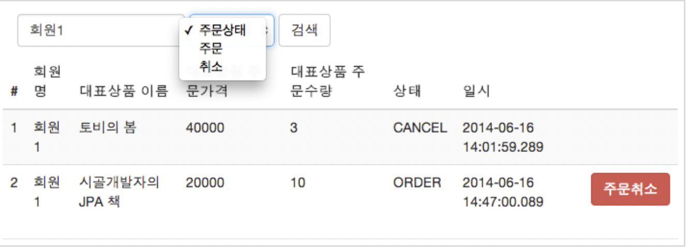

[인프런 김영한님 - 스프링부트와 JPA 활용1]([스프링 MVC 1편 - 백엔드 웹 개발 핵심 기술 - 인프런 | 강의](https://www.inflearn.com/course/%EC%8A%A4%ED%94%84%EB%A7%81-mvc-1)

>  현재 예제에서 주문 도메인은 여러 도메인과 얽혀있고, 동적쿼리등이 사용되어서 가장 중요한 도메인이다.!

# 4. 주문 도메인 개발

## 4-1. 기존 주문 엔티티(Order)에 메서드 추가

> 엔티티가 비즈니스로직을 가지고 객체지향의 특성을 적극활용 하는 것을 <u>**도메인 모델 패턴**</u>이라고한다. 반대로 엔티티에는 비즈니스 로직이 거의없고 , 서비스 계층에서 대부분의 비즈니스 로직을 처리하는 것을 **<u>트랜잭션 스크립트 패턴</u>** 이라고 한다. 

```java
@Entity
@Table(name="orders")
@Getter @Setter
@NoArgsConstructor(access = AccessLevel.PROTECTED)
public class Order {

    //...필드 생략

    //연관관계 메서드 //
    public void setMember(Member member) {
        this.member = member;
        member.getOrders().add(this);
    }

    public void addOrderItem(OrderItem orderItem) {
        orderItems.add(orderItem);
        orderItem.setOrder(this);
    }

    public void setDelivery(Delivery delivery) {
        this.delivery = delivery;
        delivery.setOrder(this);
    }

    //==생성 메서드 ==//                                                 //가변인자!
    public static Order createOrder(Member member,Delivery delivery, OrderItem... orderItems) {
        Order order = new Order();
        order.setMember(member);
        order.setDelivery(delivery);
        for (OrderItem orderItem:orderItems) {
            order.addOrderItem(orderItem);
        }
        //order.setOrderItems(List.of(orderItems)); 위의 코드를 이렇게 바꿀수도 있을것같다.

        order.setStatus(OrderStatus.ORDER);
        order.setOrderDate(LocalDateTime.now());
        return order;
    }

    //==비즈니스 로직 ==// //비즈니스 로직이 엔티티안에 있다는것에 주의!

    public void cancel() {
        if(delivery.getDeliveryStatus() == DeliveryStatus.COMP) { //이미 배송이 완료된 건이면
            throw new IllegalStateException("이미 배송완료된 상품은 취소가 불가능합니다.");
        }

        this.setStatus(OrderStatus.CANCEL);
        for (OrderItem orderItem : orderItems) {
            orderItem.cancel();
        }
    }

    //==조회 로직 == //
    /**
     * 전체 주문 가격 조회
     */
    public int getTotalPrice() {
        return orderItems.stream()
                .mapToInt(OrderItem::getTotalPrice)
                .sum() ;
        //아주 칭찬해~ 바로 스트림으로 만들어버리기~
    }
}
```

+ 생성자를 하나의 static 메서드로 뽑아서 연관관계를 처리하면서 Order를 생성하고 있다. 또한 생성자를 열어두어 new Order()로 무분별한 생성을 막게끔 `@NoArgsConstructor(access = AccessLevel.PROTECTED)` 를 사용하고 있는데 롬복으로 밑의 코드를 처리한것이다.
  
  ```java
  protected Order(){}
  ```

+ `cancel()` : 주문 취소 메서드로 배송상태가 `CANCEL`일경우 예외를 던지는 비즈니스 로직을 가지고 있다.

+ 이 예제에서는 한 상품에대해서만 주문하는 경우를 고려한다. 코드 자체는`OrderItem`을 가변인자로 받고있다.

<br>

## 4-2 주문 상품 엔티티(OrderItem) 개발

```java
@Entity
@Getter @Setter
@NoArgsConstructor(access = AccessLevel.PROTECTED)  //-> protected OrderItem() 무분별한 생성자를 막음.
public class OrderItem {

    //..필드 생략


    //==생성 메서드==//
    public static OrderItem createOrderItem(Item item,int orderPrcie,int count) {
        OrderItem orderItem = new OrderItem();
        orderItem.setItem(item);
        orderItem.setOrderPrcie(orderPrcie);
        orderItem.setCount(count);

        item.removeStock(count);
        return orderItem;
    }

    //==비즈니스 로직==//
    public void cancel() {
        getItem().addStock(count);
        //재고 수량 원복
    }

    /**
     * 주문 상품 전체 가격 조회
     */
    //==조회 로직==/
    public int getTotalPrice() {
        return getOrderPrcie() * getCount();
    }
}
```

+ `Order`와 마찬가지로 엔티티 생성 메서드를 가지고 있고, 이때 주문수량 만큼 기존 상품의 재고에서 빼주는 로직이 필요하다.

+ `cancel()` : 주문 취소시 다시 재고를 원상 복구한다.

+ `getTotalPrice()` : 주문하는 상품의 가격과 수량을 곱한 값을 반환하고, 이것을 `OrderItem`에서 사용한다.

<br>

## 4-3 주문 Repository개발

```java
@Repository
@RequiredArgsConstructor
public class OrderRepository {

    private final EntityManager em;

    public void save(Order order) {
        em.persist(order);
    }

    public Order findOne(Long id) {
        return em.find(Order.class,id);
    }

    public List<Order> findAll(OrderSearch orderSearch) {

       /* em.createQuery("select o from Order o join o.member m" +
                " where o.status = :status " +
                " and m.name like :name", Order.class)
                .setParameter("status",orderSearch.getOrderStatus())
                .setParameter("name",orderSearch.getMemberName())
                .setMaxResults(1000)//최대 1000건
                .getResultList();*/ //이건 동적 쿼리가 아니다 우리에게 지금 필요한 것은 동적쿼리이다.
        //mybatis는 동적쿼리를 매우 쉽게 생성할 수 있다.
        //xml내부에서 If문 foreach문이 가능하기떄문에... -> 실제로 써보지는 않았다.

        //JPA에서 동적쿼리를 생성하는 방법은 1.문자열로 짜집기 2.표준 스펙 Criteria 3.Query dsl
        //1,2는 쉽지 않다. 아니 , 실무적으로 거의 불가능에 가깝다.
        //3이 매우 권장되는 방법이다.


        /**
         * JPA Criteria
         */

        CriteriaBuilder cb = em.getCriteriaBuilder();
        CriteriaQuery<Order> cq = cb.createQuery(Order.class);
        Root<Order> o = cq.from(Order.class);
        Join<Order, Member> m = o.join("member", JoinType.INNER); //회원과 조인
        List<Predicate> criteria = new ArrayList<>();
        //주문 상태 검색
        if (orderSearch.getOrderStatus() != null) {
            Predicate status = cb.equal(o.get("status"),
                    orderSearch.getOrderStatus());
            criteria.add(status);
        }
        //회원 이름 검색
        if (StringUtils.hasText(orderSearch.getMemberName())) {
            Predicate name =
                    cb.like(m.<String>get("name"), "%" +
                            orderSearch.getMemberName() + "%");
            criteria.add(name);
        }
        cq.where(cb.and(criteria.toArray(new Predicate[criteria.size()])));
        TypedQuery<Order> query = em.createQuery(cq).setMaxResults(1000); //최대1000건
        return query.getResultList();
    }
}
```

+ 주의 깊게 봐야할 것은 `findAll` 메서드이다. 

목표는 이렇다.



+ 회원명과 주문상태를 매개변수로 처리하여 조회해야한다. 이때 쿼리를 동적쿼리라고 한다.

+ 우선 매개변수를 담는 객체를 정의한다. (`OrderSearch`) -> 회원명과 주문상태를 필드로 갖는다.
  
  

> **JPA에서 동적 쿼리를 처리하는법**
> 
> 1. 문자열 짜집기 
> 
> 2. JPA Criteria
> 
> 3. Query dsl
> 
> : 1,2는 위의 코드에서 볼 수 있듯이 조금,,현실성이 없다. 답은 Query dsl(라이브러리)인데 이것은 부피가 매우 크므로 나중에 다루기로하자.

<br>

## 4-4 주문 Service 개발

```java
@Service
@Transactional(readOnly = true)
@RequiredArgsConstructor
public class OrderService {

    private final OrderRepository orderRepository;
    private final MemberRepository memberRepository;
    private final ItemRepository itemRepository;


    /**
     * 주문
     */
    @Transactional
    public Long order(Long memberId, Long itemId, int count) {

        //엔티티 조회
        Member member = memberRepository.findOne(memberId);
        Item item = itemRepository.findOne(itemId);

        //배송정보 생성
        Delivery delivery = new Delivery();
        delivery.setAddress(member.getAddress()); //예제라서 간단하게 실제로는 다르겠지

        //주문상품 생성
        OrderItem orderItem = OrderItem.createOrderItem(item, item.getPrice(), count);
        //주문생성
        Order order = Order.createOrder(member, delivery, orderItem);

        //주문저장
        orderRepository.save(order);
        return order.getId();

    }

    /**
     * 주문 취소
     */
    @Transactional
    public void cancelOrder(Long orderId) {
        //주문 엔티티 조회
        Order order = orderRepository.findOne(orderId);

        //주문 취소
        order.cancel();
    }

    @Transactional
    public List<Order> findOrders(OrderSearch orderSearch) {
        return orderRepository.findAll(orderSearch);
    }

}
```

+  이미 엔티티에서 비즈니스 로직을 갖기 때문에 serice 에서는 호출밖에 일어 나지 않는다.

<br>

## 4-5 주문 서비스 테스트 개발

```java
@SpringBootTest
@Transactional
class OrderServiceTest {

    @Autowired EntityManager em;
    @Autowired OrderService orderService;
    @Autowired OrderRepository orderRepository;


    @Test
    void 상품주문() {
        //given
        Member member = createMember();

        Book book = createBook("시골 JPA", 10000, 10);

        int orderCount = 2;

        //when
        Long orderId = orderService.order(member.getId(), book.getId(), orderCount);
        //then
        Order getOrder = orderRepository.findOne(orderId);

        assertEquals(OrderStatus.ORDER, getOrder.getStatus(), "상품 주문시 상태는 ORDER");
        //Assertions.assertThat(getOrder.getStatus()).isEqualTo(OrderStatus.ORDER); <assertJ 버전>
        assertEquals(1, getOrder.getOrderItems().size(), "주문한 상품 종류 수가 정확해야한다.");
        assertEquals(10000 * orderCount, getOrder.getTotalPrice(), "주문 가격은 가격*수량이다.");
        assertEquals(8, book.getStockQuantity(), "주문 수량만큼 재고가 줄어야한다.");
    }


    @Test()
    void 상품주문_재고수량초과() {
        //given
        Member member = createMember();
        Book book = createBook("시골 JPA", 10000, 10);

        int orderCount = 11;

        //when
        //then
        assertThrows(NotEnoughStockException.class, () ->
                orderService.order(member.getId(), book.getId(), orderCount),"재고수량 부족 예외가 발생해야한다.");

        /*Assertions.assertThatThrownBy(()->orderService.order(member.getId(), book.getId(), orderCount))
                .isInstanceOf(NotEnoughStockException.class);*/
    }


    @Test
    void 주문취소() {
        //given
        Member member = createMember();
        Book book = createBook("시골JPA",10000,10);

        int orderCount = 2;
        Long orderId = orderService.order(member.getId(), book.getId(), orderCount);

        //when
        orderService.cancelOrder(orderId);
        //then
        Order getOrder = orderRepository.findOne(orderId);

        //assertEquals(OrderStatus.CANCEL,getOrder.getStatus(),"주문취소시 상태는 Cancel이다");
        assertThat(getOrder.getStatus()).isEqualTo(OrderStatus.CANCEL);
        //assertEquals(10,book.getStockQuantity(),"주문이 취소된 상품은 그만큼 재고가 증가해야한다.");
        assertThat(10).isEqualTo(book.getStockQuantity());
    }


    private Book createBook(String name, int price, int stockQuantity) {
        Book book = new Book();
        book.setName(name);
        book.setPrice(price);
        book.setStockQuantity(stockQuantity);
        em.persist(book);
        return book;
    }

    private Member createMember() {
        Member member = new Member();
        member.setName("회원1");
        member.setAddress(new Address("서울", "경기", "123-123"));
        em.persist(member);
        return member;
    }

}
```

+ 현재 예제에서는 JUNIT4 를 사용하고 있고 , 중간중간 assert J 와 Junit5 코드를 연습할 겸 작성했다.

<br>

## 4-6 주문 검색메서드 테스트해보기 (직접)

+ 주문 검색 메서드는 테스트하지 않고 지나갔기에 내가 직접 테스트 코드를 짜보려한다.

```java
@Test
    void 주문검색() {
        //given
        Member member = createMember();
        Book book = createBook("시골 JPA", 10000, 10);
        Long orderId = orderService.order(member.getId(), book.getId(), 3);//주문

        OrderSearch orderSearch = new OrderSearch(); //검색조건 생성
        orderSearch.setMemberName("회원1");
        orderSearch.setOrderStatus(OrderStatus.ORDER);

        //when
        List<Order> orderList = orderRepository.findAll(orderSearch);

        //then
        assertThat(orderList).contains(orderRepository.findOne(orderId));

    }
```

+ 한 건을 주문 했을 때 주문 검색의 반환 결과는 `List`형태이므로 Assert J의 contains 메서드를 사용했다.

+ 또한 `OrderService`의 `order()` 는 주문한 건의 id값을 반환하므로 id로 `findOne()` 주문 객체를 가져와 검색결과와 대조했다.

+ 테스트 코드를 작성하는게 쉬운게 아니구나..
