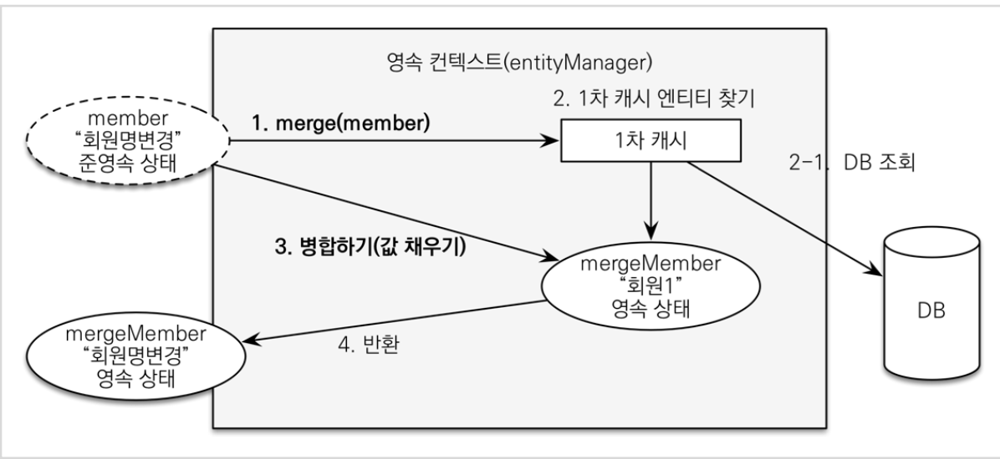

[인프런 김영한님 - 스프링부트와 JPA 활용1]([스프링 MVC 1편 - 백엔드 웹 개발 핵심 기술 - 인프런 | 강의](https://www.inflearn.com/course/%EC%8A%A4%ED%94%84%EB%A7%81-mvc-1)

# 5. 웹 계층 개발

> 참고 : 뷰 템플릿 변경 사항 서버 재시작 없이 반영하기
> 
> 1. Spring-boot-devtools 추가
> 
> 2. html 파일 build- > Recompile

## 5-1 회원 등록

+ 폼 객체 생성 
  
  + 폼에만 사용되는 객체를 분리한다.(엔티티 사용 금지 -> **웬만하면**)
  
  ```java
  @Getter @Setter
  public class MemberForm {
  
      @NotEmpty(message = "회원 이름은 필수 입니다.")
      private String name;
  
      private String city;
      private String street;
      private String zipcode;
  }
  ```
  
  + 이렇게 하는이유는 위 코드에서 보다시피 validation 룰을 걸수 있는데 폼 객체를 따로 만들지않고 엔티티를 가져다쓰면 엔티티가 많이 더러워지는 현상이 발생한다.


+ 회원 등록 컨트롤러 생성
  
  ```java
  @Controller
  @RequiredArgsConstructor
  public class MemberController {
  
      private final MemberSerivce memberSerivce;
  
      @GetMapping("/members/new")
      public String createForm(Model model) {
          model.addAttribute("memberForm", new MemberForm());
          return "members/createMemberForm";
      }
  
      @PostMapping("/members/new")
      public String create(@Valid MemberForm form , BindingResult result){
  
          if (result.hasErrors()) {
              return "members/createMemberForm";
          }
  
          Address address = new Address(form.getCity(), form.getStreet(), form.getZipcode());
          Member member =new Member();
          member.setName(form.getName());
          member.setAddress(address);
  
          memberSerivce.join(member);
          return "redirect:/"; //PRG!
      }
  
      @GetMapping("/members")
      public String list(Model model) {
          List<Member> members = memberSerivce.findmembers();
          model.addAttribute("members",members);
          return "members/memberList";
      }
  }
  ```


> 상품 등록 및 상품 목록은 다소 쉽게 때문에 건너 뜀.


## 5-2 상품 수정!

+ 컨트롤러 

```java
@GetMapping("/items/{itemId}/edit")
    public String edit(@PathVariable("itemId") Long itemId,Model model) {
        Book item = (Book) itemService.findOne(itemId);
        BookForm form = new BookForm();
        form.setName(item.getName());
        form.setIsbn(item.getIsbn());
        form.setPrice(item.getPrice());
        form.setAuthor(item.getAuthor());
        form.setId(item.getId());
        form.setStockQuantity(item.getStockQuantity());

        model.addAttribute("form", form);
        return "items/updateItemForm";
    }

    @PostMapping("/items/{itemId}/edit")
    public String update(@ModelAttribute("form") BookForm form, Model model, @PathVariable Long itemId) {

//        Book book =new Book();
//        book.setName(form.getName());
//        book.setPrice(form.getPrice());
//        book.setStockQuantity(form.getStockQuantity());
//        book.setAuthor(form.getAuthor());
//        book.setIsbn(form.getIsbn());
//        book.setId(form.getId());
        UpdateItemDto updateItemDto = UpdateItemDto.createUpdateItemDto(form);
        itemService.updateItem(updateItemDto);

        return "redirect:/items";
    }
```

+ 우선 수정 버튼을 선택하면 GET  방식으로 `/items/{itemId}/edit`형태의 URL로 요청한다. 이때 컨트롤러에서 해당 ID로 조회하여 상품을 모델 객체에 담아서 뷰로 전달한다.

+ 우리가 주목해야할 부분은 Post로 들어오는 수정 요청이다.!


## <u> 5-2-1 변경 감지와 병합(Merge)</u>

> 이번 강의에서 가장 중요한 부분이다.!


+ **준영속 엔티티란?**
  
  + 준영속 엔티티는 영속성 컨텍스트가 더는 관리하지 않는 엔티티를 의미한다.
  
  + 위의 코드에서 주석처리된 book이라는 아이를 보면 최종적으로 `setId`를 통해 id값을 지니게된다. 즉 임의로 만들어낸 엔티티가 식별자를 이미 가지고 있는 상태. 이때 이 아이는 준영속 엔티티가 된다.

+ 준영속 엔티티를 수정하는 방법.
  
  + 변경감지
  
  + 병합(Merge)사용

### 병합을 사용하여 수정

+ 위의 상황에서 `itemService.save()`를 사용하면?
  
  + 최종적으로 `itemRepostiory.save()`를 호출할것이다.
  
  + `itemRepostiory.save()`
    
    ```java
    public void save(Item item) {
            if (item.getId() == null) {
                em.persist(item);
            } else {
                em.merge(item);
            }
        }
    ```
    
    + merge가 사용된다. 즉, id값이 이미있다면(준영속 엔티티라면) merge를 이용하여 준영속상태를 영속상태로 변경하여 사용하는 기능이다. 

+ 동작 방식
  
  
  
  + `merge()`를 실행하면 준영속 엔티티의 식별자값(id)로 1차캐시에서 엔티티를 조회하고 없으면 DB를 조회하여 1차 캐시에 저장한다.
  
  + 위의 결과로 조회된 영속 엔티티(`mergeMember`)에 엔티티 값을 채워넣는다. 이때 member의 모든값을 mergeMember로 밀어넣는다.

+ 병합 방식의 문제점
  
  + 실무에서는 업데이트 기능이 매우 제한적이다. 즉, 변경가능한 데이터와 변경 불가능한 데이터를 구분하고, 변경 가능한 데이터만 노출하여 업데이트시키는것이 일반적이다.
  
  + 병합방식은 모든 필드를 변경하기때문에 만약 변경 불가능한 데이터가 null로 넘어오면 이필드가 Null로 업데이트 되는 상황이 생긴다는 것이다.


### 변경 감지를 사용하여 변경

> 실무에서는 항상 변경감지를 사용하는 것이 권장된다.


+ 코드
  
  ```java
  @Transactional
      public void updateItem(UpdateItemDto dto) {
          Item findItem = itemRepository.findOne(dto.getItemId()); //영속상태
          findItem.setPrice(dto.getPrice());
          findItem.setName(dto.getName());
          findItem.setStockQuantity(dto.getStockQuantity());
      }
  ```
  
  + `findOne`메서드로 영속성 엔티티를 찾은다음 이것을 직접 하나하나 setter로 업데이트시켜야한다. 이렇게하면 변경하고자하는 필드만 직접 바꿀 수 있다.!


----

## 후기

: 영한님이 추천해준 로드맵을따라 스프링 핵심을 배우고 바로 JPA활용편으로 넘어왔다. JPA에대한 기본 개념이 없는 상태에서 바로 활용으로 넘어왔기 때문에 처음엔 되게 낯설고 정신이 없었는데 JPA가 어떻게사용되고 뭔지에대한 느낌이 확 와닿아서 우려했던것 보단 굉장히 이해가 잘되었다. 데이터베이스에 대한 개념이 어느정도 있었기 때문에 그나마 잘 따라 갔던것 같다. 활용편을 먼저 학습하는 것이 확실히 효과적이라고 느끼는게 궁금한 부분들이 하나둘 씩 쌓인상태를 만들어서 개념 공부하는데 좀 더 수월하게 접근할 수있을것같다. 빨리 JPA에대해 깊게 공부하고 싶다는 생각이 마구든다. 더불어 앞으로 어떤 사이드 프로젝트를 진행할지 점점 감이 잡혀나간다. 어쨌든 너무 재밌었다. good
