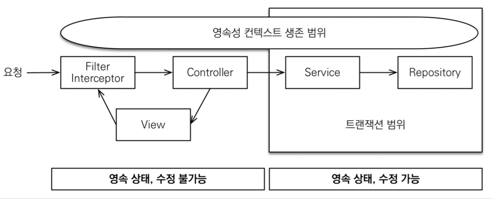
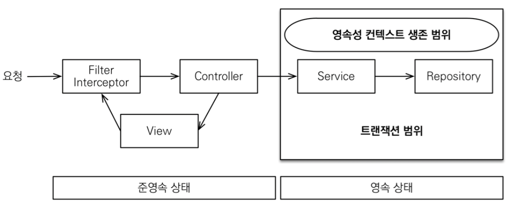

[인프런 - 김영한님 강의 스프링 부트와 JPA 활용 part2](https://www.inflearn.com/course/%EC%8A%A4%ED%94%84%EB%A7%81%EB%B6%80%ED%8A%B8-JPA-API%EA%B0%9C%EB%B0%9C-%EC%84%B1%EB%8A%A5%EC%B5%9C%EC%A0%81%ED%99%94)


# 5. OSIV

지금까지 당연하게 사용했던 지연로딩 사실 생각해보면 말이 안된다. 트랜잭션이 끝나면 영속성 컨텍스트가 닫히는거 아닌가? 근데 어떻게 지연로딩이 됐던거지?


**비밀은 OSIV에 있었다.**



최초 데이터베이스 커넥션 시작 시점부터 API 응답이 끝날 때 까지 영속성컨텍스트와 데이터베이스 커넥션을 유지한다.

지연로딩은 영속성 컨텍스트가 살아있어야 가능하다.


+ 근데 여기서 문제점
  
  + 너무 오랜시간동안 데이터베이스 커넥션 리소스를 사용한다. 만약 실시간 트래픽이 중요한 어플리케이션이라면 커넥션이 모자란 상황이 발생할 수있다.
  
  + ex) 외부 API호출하는 경우  API 대기 시간 만큼 커넥션 리소를 반환하지 못한다.


그래서 사실 ... OSIV를 꺼야한다...



OSIV를 끄면 트랜잭션을 종료할때, 영속성 컨텍스트를 닫고 , 데이터베이스 커넥션도 반환한다. 이게 사실 원칙이다.

이때 모든 지연로딩은 트랜잭션 안에서 처리해야만한다. 그래서 우리가 작성한 수많은 코드를 트랜잭션 안으로 넣어야한다..


## OSIV 를 끈 상태로 복잡성을 관리하는 방법

다양한 방법이 있는데 그중하나는 커맨드와 쿼리를 분리하는 것이다. (앞에서도 살짝 언급됐었다.)

예를들어 

Orderserivce

+ OrderSerivce : 핵심비즈니스 로직

+ OrderQuerySerivce: 화면이나 API에 맞춘 서비스 

보통 서비스 계층에서 트랜잭션을 유지한다.

아주간단한 예시는

```java
package jpabook.jpashop.service;

import jpabook.jpashop.api.OrderApiController;
import jpabook.jpashop.domain.Order;
import jpabook.jpashop.repository.OrderRepository;
import lombok.RequiredArgsConstructor;
import org.springframework.transaction.annotation.Transactional;

import java.util.List;

import static java.util.stream.Collectors.toList;

@Transactional(readOnly = true)
@RequiredArgsConstructor
public class OrderQueryService {

    private final OrderRepository orderRepository;

    public List<OrderDto> orderV3page() {
        List<Order> result = orderRepository.findAllWithItem();

        List<OrderDto> collect = result.stream()
                .map(OrderDto::new)
                .collect(toList());
        return result;
    }
}
```


+ 이런식으로 서비스에 트랜잭션을 유지하고 , 이안에서 지연로딩을 모두 처리해야한다.

+ 즉, 우리가 앞서 컨틀롤러에서 지연로딩들을 처리했는데 , 다 서비스 안에서 처리하면 될것이다.


> 참고로 OSIV는 글로벌 설정에서 키고 끄고를 할 수 있다 했는데 인터셉터나 필터를 통해 개별적으로 키고 끄고 할 수도 있다고 한다.
> 
> 필요하면 찾아보자.
