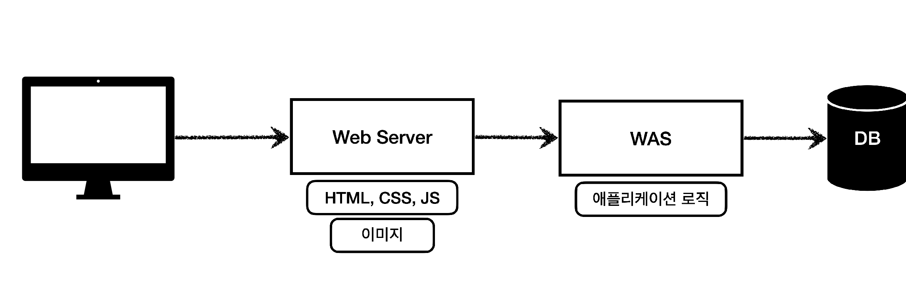
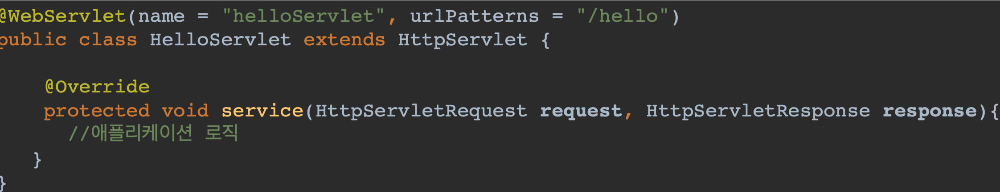
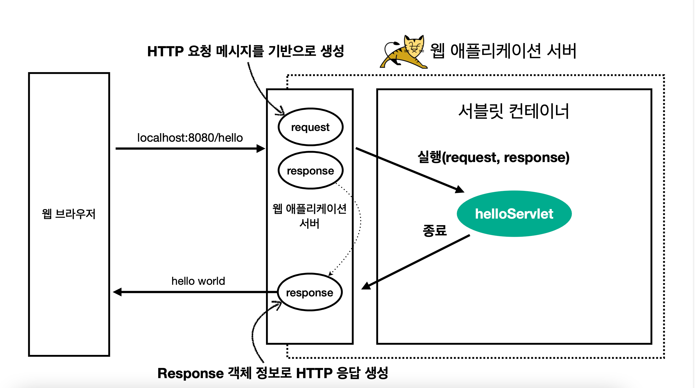

[인프런 김영한님 - 스프링 MVC1]([스프링 MVC 1편 - 백엔드 웹 개발 핵심 기술 대시보드 - 인프런 | 강의 (inflearn.com)](https://www.inflearn.com/course/%EC%8A%A4%ED%94%84%EB%A7%81-mvc-1/dashboard))

# 

# 1. 웹 어플리케이션 이해

+ 웹 어플리케이션 서버 (WAS)
  
  + HTTP 기반으로 동작함
  
  + 프로그램 코드를 실행해서 애플리케이션 로직 수행
    
    + 동적 HTML, HTTP API(JSON)
    
    + 서블릿, JSP , 스프링 MVC
  
  + ex) 톰캣 ,Jetty ..

+ 웹 시스템의 구성 - WEB , WAS ,DB)
  
  

+ 서블릿
  
  + 클라이언트 요청을 처리하고 , 그 결과를 반환하는 자바 웹 프로그래밍 기술
  
  + MVC에서 컨트롤러에 해당.
  
  

+ 서블릿 컨테이너
  
  
  
  + 서블릿을 지원하는 WAS를 서블릿 컨테이너라고함
  
  + 서블릿 객체를 싱글톤으로 관리함
  
  + 멀티 쓰레드 지원

+ WAS 의 멀티 쓰레드 지원?
  
  + WAS 는 기본적으로 필요한 쓰레드를 쓰레드 풀에 보관 하고 관리한다.
  
  + 톰캣의 경우 최대200개 기본설정으로 되어있다.
  
  + 쓰레드 풀을 사용하여 응답시간을 단축시키고 쓰레드를 생성하고 종료하는 비용이 절약된다.

+ SSR , CSR
  
  + SSR (ServerSideRendering)
    
    + HTML 최종결과를 서버에서 만듦
    
    + 주로 정적인 화면에 사용
    
    + ex) 타임리프 JSP
  
  + CSR(CLient ~)
    
    + HTML결과를 자바스크립트로 웹 브라우저에서 동적으로 생성해서 적용
    
    + 주로 동적인화면 에 사용 
    
    + Ex) React, Vue

+ 자바 웹 기술의 역사
  
  + 서블릿 -> JSP -> 서블릿 + JSP -> MVC프레임워크 -> 애너테이션기반의 스프링 MVC -> 스프링 부트
  + 
