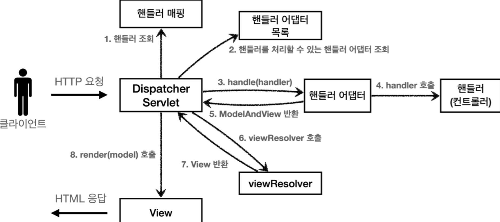

[인프런 김영한님 - 스프링 MVC1]([스프링 MVC 1편 - 백엔드 웹 개발 핵심 기술 대시보드 - 인프런 | 강의 (inflearn.com)](https://www.inflearn.com/course/%EC%8A%A4%ED%94%84%EB%A7%81-mvc-1/dashboard))

> 앞선 강의들을 요약하진 않았지만, MVC 프레임워크를 직접 구현해보았다. 지금부터는 스프링의 MVC 구조를 완벽히 학습하자.
> 
> 또한 앞으로 강의 마다 정리가 아니라 필요한 주제들만 정리하도록 하자.

# 스프링 MVC 구조

+ 앞에서 구현했던 FrontController가 DispatcherServlet에 해당한다.

+ 
