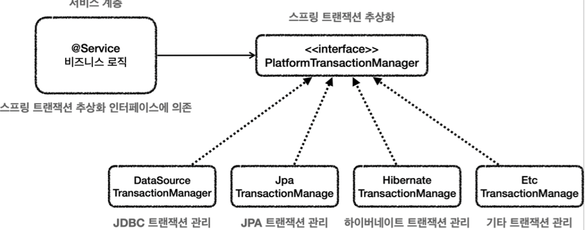
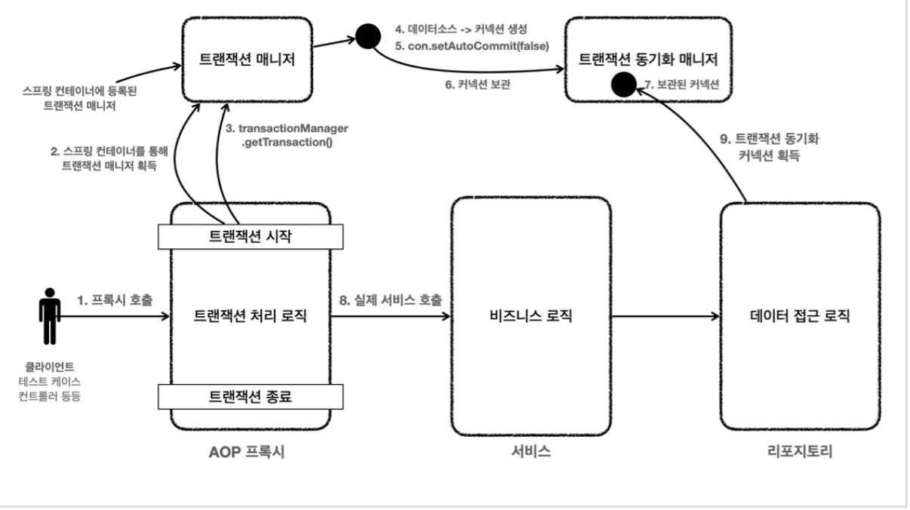
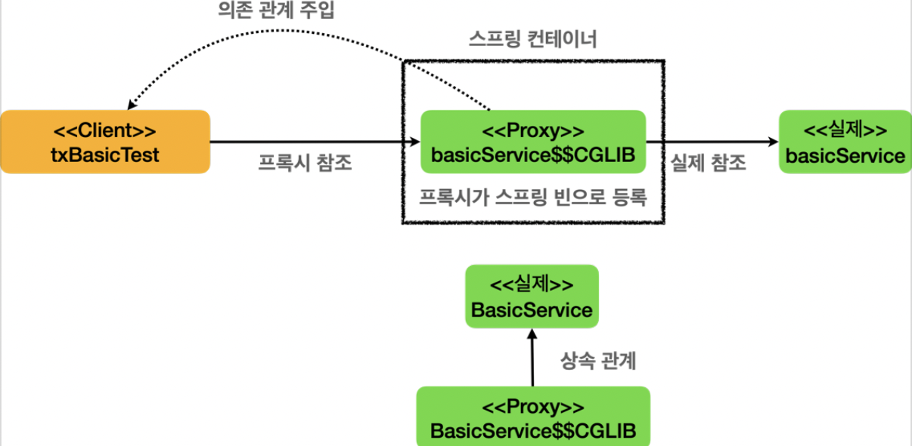
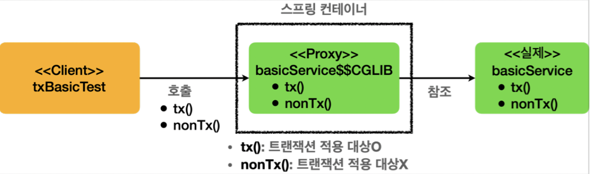
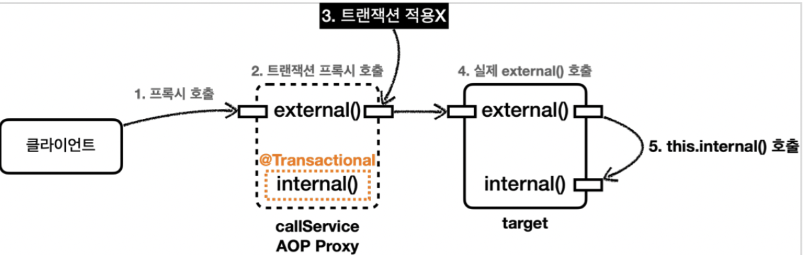

[인프런 김영한님 스프링 DB part2](https://www.inflearn.com/course/%EC%8A%A4%ED%94%84%EB%A7%81-db-2/dashboard)


# 03 스프링 트랜잭션의 이해


## 03-1 스프링의 트랜잭션 추상화



+ 스프링은 트랜잭션을 추상화한다.
  
  + JDBC Template,Mybatis 그리고 Jpa는 각기 다른 `TransationManger`를 구현한다.
  
  + 스프링부트는 접근기술에 따라 TransactionMager를 빈으로 등록해놓는다.

<br>

## 03-2 선언전 트랜잭션(@Transactional)  과 AOP

`@Transational` 를 사용하면 프록시 방식의 AOP가 적용된다.


+ 서비스 계층에서 트랜잭션 처리

```java
//트랜잭션 시작
TransactionStatus status = transactionManager.getTransaction(new DefaultTransactionDefinition());
try {
 //비즈니스 로직
 bizLogic(fromId, toId, money);
 transactionManager.commit(status); //성공시 커밋
} catch (Exception e) {
 transactionManager.rollback(status); //실패시 롤백
 throw new IllegalStateException(e);
}
```


+ 프록시 도입후 

```java
public class TransactionProxy {
     private MemberService target; //실제 서비스 클래

     public void logic() {
         //트랜잭션 시작
         TransactionStatus status = transactionManager.getTransaction(..);
         try {
         //실제 대상 호출
         target.logic();
         transactionManager.commit(status); //성공시 커밋
         } catch (Exception e) {
         transactionManager.rollback(status); //실패시 롤백
             throw new IllegalStateException(e);
         }
     }
}
```

+ 트랜잭션 프록시가 트랜잭션을 대신 해준다. 그리고 안에서 실제 로직을 호출한다. 프록시를 도입하면 실제 로직을 제외한 트랜잭션 코드를 다 날릴 수 있다.


+ 전체 과정



+ 프록시를 통해 트랜잭션 매니저는 커넥션을 생성해서 트랜잭션 동기화매니저에 보관하는데, 이때 데이터 접근기술은 커넥션을 획득할때 트랜잭션 동기화 매니저로부터 커넥션을 획득한다. (동기화한다.)

<br>

## 03-3 스프링 컨테이너에서의 트랜잭션 프록시



+ `@Transactionl` 애너테이션이 하나라도 있으면 트랜잭션 AOP가<u> 프록시를 생성해서 스프링컨테이너에 등록한다.</u>

+ 프록시는 실제 클래스를 상속받아서 만들어지기 때문에 다형성을 활용한다. 


#### 동작방식



+ 트랜잭션이 메서드 단위로 선언 되어있다면, 트랜잭션이 선언된 메서드만 트랜잭션을 적용한다. (당연한 소리겠지만 생각해보면 신기하다.)
  
  실제로 어떻게 생겼는지 보고싶긴하다.


#### 우선순위

>  스프링에서 우선순위는 항상 더 구체 적이고 자세한것이 높은 것이 우선순위를 가진다.

+ **메서드 > 클래스 > 인터페이스** 
  
  + 참고로 인터페이스에 `@Transanctional` 을 사용하는것은 지양되는 방법이다.

<br>


## 03-4 (중요!!) 트랜잭션 AOP 주의사항 - 내부 호출

>  원칙: 프록시를 거치지않고 대상 객체를 직접 호출하면, AOP가 적용 되지 않고, 트랜잭션도 적용되지 않는다.


```java
static class CallService {

        public void external() {
            log.info("call external");
            printTxInfo();
            internal();

        }

        @Transactional
        public void internal() {
            log.info("call internal");
            printTxInfo();
        }

        private void printTxInfo() {
            boolean txActive = TransactionSynchronizationManager.isActualTransactionActive();
            log.info("tx Active = {} ", txActive);
            boolean readOnly = TransactionSynchronizationManager.isCurrentTransactionReadOnly();
            //log.info("tx readOnly = {}",readOnly);

        }

    }
```

+ 이런 서비스가 정의 되어있다고 가정하자.
  
  + `@Transactional`이 메서드에 선언 되어있으므로 트랜잭션 프록시 객체가 만들어질 것이다.
  
  + 외부에서 `external()` 을 호출할 때 내부에서 `internal` 을 호출하니까 트랜잭션이 적용 되겠구나 하고 자연스럽게 생각할 수 있다.

###### 하지만 그런일은 일어나지않는다.!




+ 처음 외부에서 `callservice.external()`를 호출할때 트랜잭션이 아니므로 프록시객체 내부에 참조 되어 있는 실제 객체의 `external`을 호출 할것이다. 그리고 내부에서 `internal`을 호출하고 이것은 트랜잭션이 선언되어있지만 내부에서 `internal()` 를 호출한다는것은 `this.internal` 과 같다. 

+ 즉, 프록시 객체가아닌 실제 객체의 `internal()`을 호출하는 것이다. 이때 당연히 트랜잭션이 적용되지 않는다.!


+ 이것을 프록시 방식 AOP의 한계 라고 한다.

+ 항상 주의하자 논리적으로 맞는것 같은데 왜 트랜잭션이 적용이 안되지 라고할때 는 이것을 떠올리자.

<br>


## 03-5 가장 간단한 해결방안 - 클래스 분리

```java
    @RequiredArgsConstructor
    static class CallService {

        private final InternalService internalService;


        public void external() {
            log.info("call external");
            printTxInfo();
            internalService.internal();
        }


        private void printTxInfo() {
            boolean txActive = TransactionSynchronizationManager.isActualTransactionActive();
            log.info("tx Active = {} ", txActive);
            boolean readOnly = TransactionSynchronizationManager.isCurrentTransactionReadOnly();
            //log.info("tx readOnly = {}",readOnly);

        }
    }

    static class InternalService {

        @Transactional
        public void internal() {
            log.info("call internal");
            printTxInfo();
        }

        private void printTxInfo() {
            boolean txActive = TransactionSynchronizationManager.isActualTransactionActive();
            log.info("tx Active = {} ", txActive);
            boolean readOnly = TransactionSynchronizationManager.isCurrentTransactionReadOnly();
            //log.info("tx readOnly = {}",readOnly);

        }

    }
```

+ 한 클래스에서 내부호출하게 하지말고, 클래스를 분리한다음 주입받아서 호출하면된다.

+ 이렇게하면 당연히 프록시객체를 통해 호출하기 때문에 트랜잭션이 적용될것이다.


<br>

## 03-6 기타 주의사항

1. `public` 메서드만 적용이가능하다.
   
   + 스프링부트 3.0부터는 `protected`, `default` 에도 트랜잭션이 적용된다고한다.

2. `@PostConstuct` 를 `@Transactional` 과 같이 사용하면 적용되지 않는다
   
   + 초기화 코드가 먼저실행되기 때문이다.
   
   + 해결법:
     
     ```java
             @EventListener(ApplicationReadyEvent.class)//스프링 컨테이너가 완전히 생성되고 난다음에 실행됨
             @Transactional
             public void initV2() {
                 boolean isActive = TransactionSynchronizationManager.isActualTransactionActive();
     
                 log.info("Hello init @ApplicationReadyEvent tx active={}",isActive);
     
             }
     ```


<br>

## 03-7 트랜잭션 옵션들

1. value, transactionalManager : 사용할 트랜잭션 매니저를 지정해줄 수 있다.
   
   ```java
   public class TxService {
        @Transactional("memberTxManager")
        public void member() {...}
        @Transactional("orderTxManager")
        public void order() {...}
   }
   ```
+ 둘이상일 경우 사용하면 된다. 생략할 경우 기본으로 등록된 트랜잭션 매니저를 사용한다.


2. rollbackFor : 특정 예외가 발생하면 롤백을 할것을 명시한다.
   
   ```java
   @Transactional(rollbackFor = Exception.class)
   ```
+ 예외 기본 
  
  + 체크 예외 : `Exception` 과 그 하위 예외는 예외가 발생해도 커밋한다.
  
  + 언체크예외 : 롤백한다.

+ rollbackFor를 사용하면 체크예외가 발생해도 롤백할 수 있다.


3. noRollbackFor : 위와 반대

4. propagation: 트랜잭션 전파에 대한 옵션 

5. isolation: 격리 수준 (JPA 기본 편 참고)

6. timeOut : 수행시간에대한 타임아웃을 초로 지정


#### readOnly 옵션

트랜잭션의 디폴트값은 읽기 쓰기가 가능한 `readOnly=false` 이다. 하지만 정확히 읽기만 수행하는 트랜잭션의 경우 `readOnly=true`를 사용하여 성능의 최적화를 이끌어 낼 수있다. 


+ 특히나 JPA에서 성능 최적화가 효율적으로 일어난다.
  
  + 읽기전용일 경우 커밋시점에 플러쉬가 일어나지 않는다.(커밋할게 없으므로)
  
  + 스냅샷 객체도 생성하지않는다. 등등


<br>


## 03-8 예외와 트랜잭션 커밋,롤백 - 활용

체크예외는 커밋하는 이유 , 스프링의 철학은 이렇다.

체크 예외 - 시스템적 오류가 아닌 비즈니스적으로 의미가 있을때 발생 -> 커밋을 해도 문제가 없음

언체크예외 - 시스템적 오류가 확실하기때문에 거의 복구가 불가능함.


예시) 고객이 주문을하는경우

- 정상 : 주문 데이터 저장, 결제 상태 완료로 set

- 시스템 예외 : 주문 데이터 롤백

- 비즈니스 예외 : 잔고가 부족한 경우, : 주문 데이터 저장 -> 결제 상태 대기


주문을해서 잔고가 부족할때 , 롤백을 해버리면 주문내역이 다 사라진다. 이때 체크예외를 날리고 커밋을 해놓고, 결제 상태 대기 처리만 해놓으면 모두가 만족스러운 상황을 만들 수 있다.


1. 체크예외 생성

```java
package hello.springtx.order;

public class NotEnoughMoneyException extends Exception{ //체크예외
    public NotEnoughMoneyException(String message) {
        super(message);
    }

    //잔액 부족의 상황은 롤백을 하지않고 커밋을해야만 주문 내역이 남게 된다.
}

```

 

    2. 엔티티

```java


@Entity
@Table(name = "orders") //order 예약어 때문에
@Getter
@Setter
public class Order {

    @Id
    @GeneratedValue
    private Long id;

    private String username; //정상 예외 잔고부족
    private String payStatus; //대기 완료
}

```


3. 서비스

```java

@Slf4j
@Service
@RequiredArgsConstructor
public class OrderSerivce {

    private final OrderRepostiory repostiory;

    //JPA는 트랜잭션 커밋 시점에 Order 데이터를 DB에 반영
    @Transactional
    public void order(Order order) throws NotEnoughMoneyException {
        log.info("order 호출");
        repostiory.save(order);

        log.info("결제 프로세스 진입");

        if (order.getUsername().equals("예외")) {
            log.info("시스템 예외 발생");
            throw new RuntimeException("시스템 예외");
        } else if (order.getUsername().equals("잔고부족")) {
            log.info("잔고 부족 비즈니스 예외 발생");
            order.setPayStatus("대기");
            throw new NotEnoughMoneyException("잔고가 부족합니다."); //굳이 예외를 던질 필요는 없고, 문자열이나 이넘으로 던져서 확인하면 된다.
        } else {
            log.info("정상 승인");
            order.setPayStatus("완료");
        }
        log.info("결제 프로세스 완료");
    }


}

```

4.  리포지토리는 그냥 스프링 데이터 JPA 를 사용했다.


+ 이렇게 하면 마치 예외를 리턴값처럼 사용됨. 굳이 예외를 사용안해도되고 특정 ENUM이나 문자열을 반환해서 처리하도록 할 수도 있다.

+ 중요한것은 정상적인 상황이 아님에도 롤백이아니라 커밋을 하게 만든다는것.


