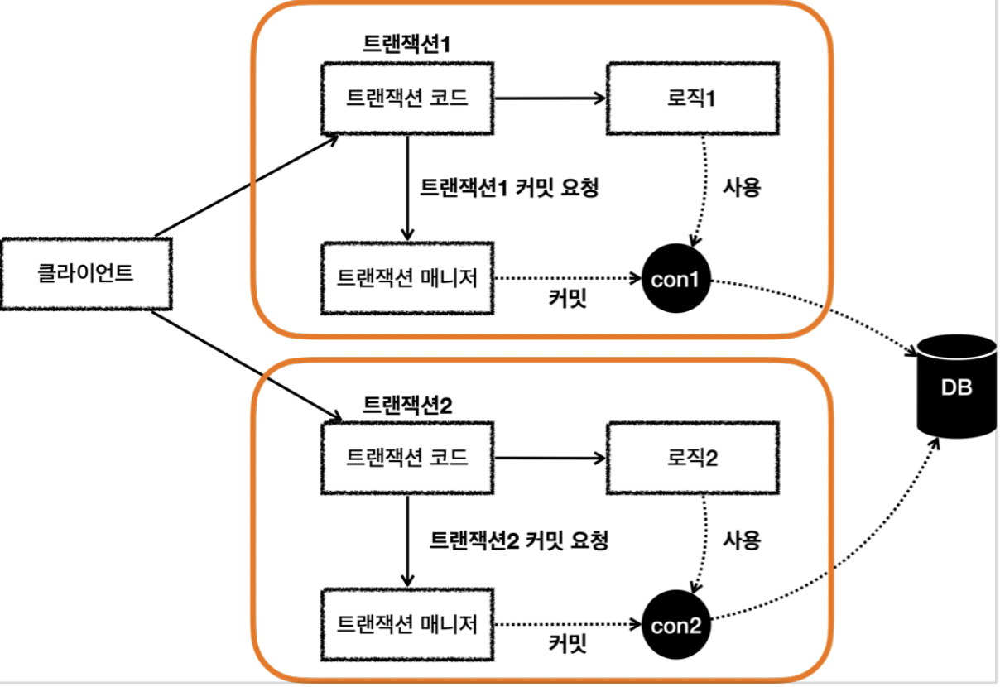
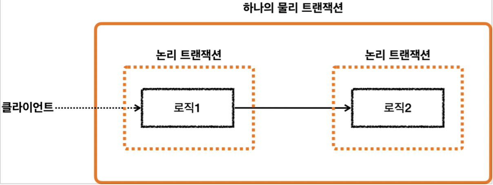
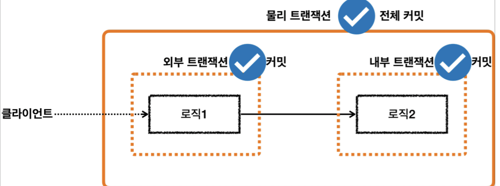
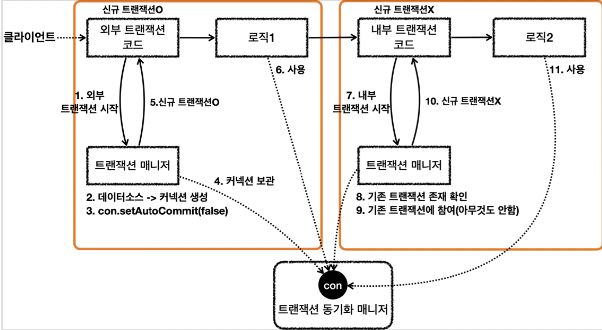
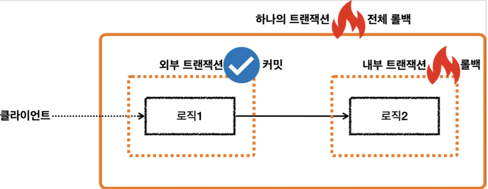
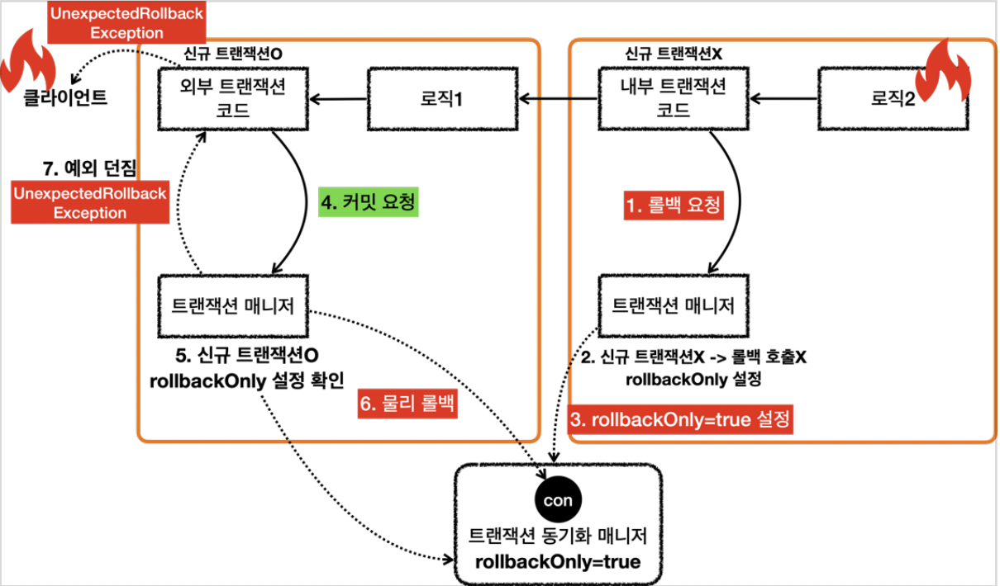
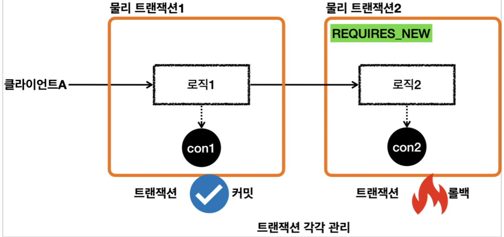
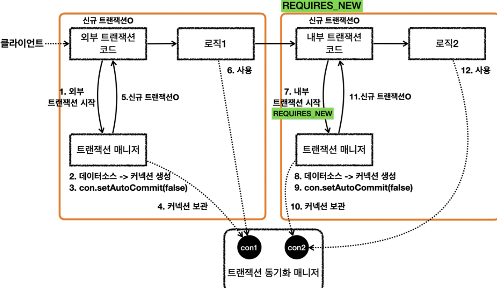

[인프런 김영한님 스프링 DB part2](https://www.inflearn.com/course/%EC%8A%A4%ED%94%84%EB%A7%81-db-2/dashboard)


# 04 스프링 트랜잭션 전파

> JPA 기본편을 떠올려보자 엔티티의 연관관계가 이리저리 얽혀있을때, 하나의 행위가 일어나면 여러가지 연쇄반응이 있을 수밖에 없었다. 이때, 트랜잭션은 어떻게 작용해야할 것 인가에대한 고민이 필요하다. 


## 04 -1 트랜잭션이 완전히 분리된 상태.

#### 두 개의 트랜잭션이 모두 커밋

```java
        @Test
        void double_commit() {
        log.info("트랜잭션1 시작");
        TransactionStatus tx1 = txManager.getTransaction(new DefaultTransactionAttribute());

        log.info("트랜잭션1 커밋 ");
        txManager.commit(tx1);


        log.info("트랜잭션2 시작");
        TransactionStatus tx2 = txManager.getTransaction(new DefaultTransactionAttribute());

        log.info("트랜잭션2 커밋 ");
        txManager.commit(tx2);

    }
       
```




위의 코드는 아래의 그림과 같이 동작한다. `tx1` 이 트랜잭션을 시작하고 커밋이 되고, `tx2` 의 트랜잭션이 시작하고 커밋되는 식이다. 서로 롤백이 되던 커밋이되던 아무 영향을 주지않는다. 독립적이기 때문이다.


<br>


## 04-2 트랜잭션의 전파 (REQUIRED 를 기준으로)

만약 외부 트랜잭션이 수행중인데 내부에서 트랜잭션이 추가적으로 수행되는 상황이라면? 가장 기대하는 방식은 두 트랜잭션 모두 하나의 트랜잭션으로 묶는 것이다. 이것을 위해 추상적인 개념을 도입할 수 있다.

#### 물리 트랜잭션, 논리 트랜잭션



+ **물리 트랜잭션** : 실제 데이터베이스에 적용되는 트랜잭션  - 실제 커넥션을 통해 트랜잭션을 시작하고 (`setAutoCommit(false)`) 실제 커넥션을 통해 커밋,롤백되는 단위 . 
+ **논리 트랜잭션** : 트랜잭션 매니저를 통해 트랜잭션을 사용하는 단위

즉, 외부의 트랜잭션과 내부의 트랜잭션을 하나의 물리 트랜잭션으로 묶는 것이다. 이때, 외부 트랜잭션과 내부 트랜잭션을 각각 논리 트랜잭션에 해당한다.


이 개념들을 가지고 원칙을 세울 수 있다.

#### 원칙

+ 모든 논리 트랜잭션이 커밋되어야 물리 트랜잭션이 커밋된다.

+ 하나의 논리 트랜잭션이라도 롤백되면 물리 트랜잭션은 롤백된다.

<br>


## 04-3 트랜잭션의 전파 예제 (커밋-커밋)




#### 테스트

```java
    @Test
    void inner_commit() {
        log.info("외부 트랜잭션시작");
        TransactionStatus outer = txManager.getTransaction(new DefaultTransactionAttribute());
        log.info("outer.isNewTransaction() = {}",outer.isNewTransaction());

        log.info("내부 트랜잭션 시작");
        TransactionStatus inner = txManager.getTransaction(new DefaultTransactionAttribute());
        log.info("inner.isNewTransaction() = {}",inner.isNewTransaction());

        log.info("내부 트랜잭션 커밋");
        txManager.commit(inner);

        log.info("외부 트랜잭션 커밋");
        txManager.commit(outer);

    }
```


#### 결과

```log
외부 트랜잭션시작                                                                                                                                                   
Creating new transaction with name [null]: PROPAGATION_REQUIRED,ISOLATION_DEFAULT                                                                           
Acquired Connection [HikariProxyConnection@1546957042 wrapping conn0: url=jdbc:h2:mem:0ec7af2a-48f2-4a84-b831-64717fee3178 user=SA] for JDBC transaction    
Switching JDBC Connection [HikariProxyConnection@1546957042 wrapping conn0: url=jdbc:h2:mem:0ec7af2a-48f2-4a84-b831-64717fee3178 user=SA] to manual commit  
outer.isNewTransaction() = true   
                                                                                                                          
내부 트랜잭션 시작                                                                                                                                                  
Participating in existing transaction                                                                                                                       
inner.isNewTransaction() = false   
                                                                                                                         
내부 트랜잭션 커밋                                                                                                                                                  
외부 트랜잭션 커밋                                                                                                                                                  
Initiating transaction commit                                                                                                                               
Committing JDBC transaction on Connection [HikariProxyConnection@1546957042 wrapping conn0: url=jdbc:h2:mem:0ec7af2a-48f2-4a84-b831-64717fee3178 user=SA]   
Releasing JDBC Connection [HikariProxyConnection@1546957042 wrapping conn0: url=jdbc:h2:mem:0ec7af2a-48f2-4a84-b831-64717fee3178 user=SA] after transaction 
```

+ 외부 트랜잭션이 시작할때 커넥션을 얻어서 , 트랜잭션 동기화 매니저에 보관한다. 

+ 내부 트랜잭션을 시작할 때, 이미 시작된 트랜잭션이 있으므로 `inner.isNewTransaction() = false` 아무일도 하지않는다.
  
  + `Participating in existing transaction` 즉, <u>기존의 트랜잭션에 참여한다.</u>

+ 내부 트랜잭션을 커밋할 때, 신규 트랜잭션이 아니므로 아무일도 하지않는다.(커밋,롤백)

+ 외부 트랜잭션은 신규 트랜잭션이므로, 최종적으로 커밋한다.


#### 실제 동작흐름



+ 신규 트랜잭션인가? 에 대한 판단이 중요한 것을 알 수 있다.


<br>


## 04-4 (핵심) 스프링 전파 - 내부 롤백

만약 외부 트랜잭션에서 롤백이 되는 상황이라면 당연히 외부 트랜잭션이 물리 트랜잭션의 커밋과 롤백을 관장하므로 롤백이 되는게 자연스럽다.

그렇다면 만약 외부가 커밋되고 내부가 롤백이 되는 상황이라면? 외부 트랜잭션을 어떻게 롤백을 해야함을 인지 할 것인가?


#### 상황




#### 테스트

```java
    @Test
    void inner_rollback() {
        log.info("외부 트랜잭션시작");
        TransactionStatus outer = txManager.getTransaction(new DefaultTransactionAttribute());
        log.info("outer.isNewTransaction() = {}",outer.isNewTransaction());

        log.info("내부 트랜잭션 시작");
        TransactionStatus inner = txManager.getTransaction(new DefaultTransactionAttribute());
        log.info("inner.isNewTransaction() = {}",inner.isNewTransaction());

        log.info("내부 트랜잭션 롤백");
        txManager.rollback(inner);
        log.info("외부 트랜잭션 커밋");
        txManager.commit(outer)
        
    }
```


#### 결과

```log
외부 트랜잭션시작                                                                                                                                                   
Creating new transaction with name [null]: PROPAGATION_REQUIRED,ISOLATION_DEFAULT                                                                           
Acquired Connection [HikariProxyConnection@1597156119 wrapping conn0: url=jdbc:h2:mem:85bc5b09-5486-417c-aed6-ecc098075b15 user=SA] for JDBC transaction    
Switching JDBC Connection [HikariProxyConnection@1597156119 wrapping conn0: url=jdbc:h2:mem:85bc5b09-5486-417c-aed6-ecc098075b15 user=SA] to manual commit  
outerisNewTransaction() = true   
                                                                                                                           
내부 트랜잭션 시작                                                                                                                                                  
Participating in existing transaction                                                                                                                       
inner.isNewTransaction() = false      
                                                                                                                      
내부 트랜잭션 롤백                                                                                                                                                  
Participating transaction failed - marking existing transaction as rollback-only                                                                            
Setting JDBC transaction [HikariProxyConnection@1597156119 wrapping conn0: url=jdbc:h2:mem:85bc5b09-5486-417c-aed6-ecc098075b15 user=SA] rollback-only      

외부 트랜잭션 커밋                                                                                                                                                  
Global transaction is marked as rollback-only but transactional code requested commit                                                                       
Initiating transaction rollback                                                                                                                             
Rolling back JDBC transaction on Connection [HikariProxyConnection@1597156119 wrapping conn0: url=jdbc:h2:mem:85bc5b09-5486-417c-aed6-ecc098075b15 user=SA] 
Releasing JDBC Connection [HikariProxyConnection@1597156119 wrapping conn0: url=jdbc:h2:mem:85bc5b09-5486-417c-aed6-ecc098075b15 user=SA] after transaction 
```

+ rollback - only option을 이용하여 롤백 수행 유무를 판단한다.

+ 추가적으로 `UnexpectedRollback` 런타임 예외를 반환한다. 커밋을 호출했지만, 롤백이 되었기때문이다.

``` 
Transaction rolled back because it has been marked as rollback-only
org.springframework.transaction.UnexpectedRollbackException: Transaction rolled back because it has been marked as rollback-only
	at app//org.springframework.transaction.support.AbstractPlatformTransactionManager.processRollback(AbstractPlatformTransactionManager.java:870)
	at app//org.springframework.transaction.support.AbstractPlatformTransactionManager.commit(AbstractPlatformTransactionManager.java:707)
```


#### 동작흐름



+ 내부 트랜잭션에서 롤백을 호출할때, 신규트랜잭션이 아니기에 아무일도 하지않지만, 물리 트랜잭션이 롤백되어야함을 표시하는데, 트랜잭션 동기화 매니저에 `rollbackOnly=true`를 표시한다.

+ 외부 트랜잭션이 커밋할 떄, 롤백 전용 표시가 있으므로 커밋을 요청했음에도 롤백을 한다.


> `UnexpectedRollbackException`을 던지는 것은 모호함을 제거하는 것이다. 개발은 명확해야한다. 기대한 결과가 다른경우, 예외를 발생시켜서 명확하게 해당 문제를 인지 시키는게 좋은 설계이다. 

<br>

## 04-5 REQUIRES_NEW

지금까지는 REQUIRED를 기준으로 나타냈다. 만약 외부와 내부의 트랜잭션을 분리 시키려면 어떻게해야할까? 


#### 상황



#### 테스트

```java
    @Test
    void inner_rollback_requiers_new() {

        log.info("외부 트랜잭션시작");
        TransactionStatus outer = txManager.getTransaction(new DefaultTransactionAttribute());
        log.info("outer.isNewTransaction() = {}",outer.isNewTransaction());

        log.info("내부 트랜잭션 시작");
        DefaultTransactionAttribute definition = new DefaultTransactionAttribute();
        definition.setPropagationBehavior(TransactionDefinition.PROPAGATION_REQUIRES_NEW); //항상 새 트랜잭션을 만들어라.

        TransactionStatus inner = txManager.getTransaction(definition);
        log.info("inner.isNewTransaction() = {}",inner.isNewTransaction());

        log.info("내부 트랜잭션 롤백");
        txManager.rollback(inner);

        log.info("외부 트랜잭션 커밋");
        txManager.commit(outer);
    }
```


#### 실행흐름



+ REQUIRES_NEW 옵션을 사용하면 내부 트랜잭션에서 신규 트랜잭션을 생성한다. 

+ 당연히 내부에서 신규 트랜잭션을 실행하므로 커밋 롤백도 일어난다.(내부에서)

+ 이때, 트랜잭션동기화 매니저에 이미 있는 외부의 트랜잭션이 생성한 커넥션은 잠시 미뤄둔다.(suspend) 

+ 전체적으로 보면 물리트랜잭션 또한 분리된다.


##### 실무에서는 REQUIRED가 대부분사용된다. - default이기도 하다.


이외에도 SUPPORT, NOT_SUPPORT, MANDATORY 옵션이 있긴하지만 거의 사용하지 않을 것 같다.


