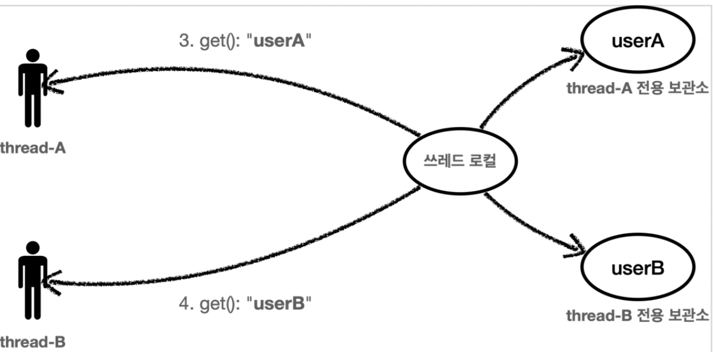

[인프런 김영한님 강의 - 스프링_고급](https://www.inflearn.com/course/%EC%8A%A4%ED%94%84%EB%A7%81-%ED%95%B5%EC%8B%AC-%EC%9B%90%EB%A6%AC-%EA%B3%A0%EA%B8%89%ED%8E%B8/dashboard)

# 02 쓰레드 로컬

> 이장에서는 앞서 만든 로그 추적기를 만들면서 발생했던 동기화문제를 쓰레드 로컬로 해결하는 과정을 다룬다.

## 02-1 필드 동기화

#### LogTrace 인터페이스

```java
public interface LogTrace {

    TraceStatus begin(String message);

    void end(TraceStatus status);

    void exception(TraceStatus status,Exception e);
}
```

+ 다양한 구현체로 변경할 수 있도록 최소한의 기능만 인터페이스로 정의했다.

#### 구현체 FieldLogTrace

```java
@Slf4j
public class FieldLogTrace implements LogTrace {

    private static final String START_PREFIX = "-->";
    private static final String COMPLETE_PREFIX = "<--";
    private static final String EX_PREFIX = "<X-";

    private TraceId traceIdHolder; // traceId 동기화  ,  동시성 이슈발생.

    public TraceStatus begin(String message) {
        syncTraceId();
        TraceId traceId = traceIdHolder;
        Long startTimeMs = System.currentTimeMillis();
        log.info("[{}] {}{}", traceId.getId(), addSpace(START_PREFIX, traceId.getLevel()), message);
        return new TraceStatus(traceId, startTimeMs, message);
    }

    private void syncTraceId() {
        if (traceIdHolder == null) {
            traceIdHolder = new TraceId();
        } else {
            traceIdHolder = traceIdHolder.createNextId();
        }
    }

  
    public void end(TraceStatus status) {
        complete(status, null);
    }

    public void exception(TraceStatus status, Exception e) {
        complete(status, e);
    }

    private void complete(TraceStatus status, Exception e) {
        Long stopTimeMs = System.currentTimeMillis();
        long resultTimeMs = stopTimeMs - status.getStartTimeMs();
        TraceId traceId = status.getTraceId();
        if (e == null) {
            log.info("[{}] {}{} time={}ms", traceId.getId(), addSpace(COMPLETE_PREFIX, traceId.getLevel()), status.getMessage(), resultTimeMs);
        } else {
            log.info("[{}] {}{} time={}ms ex={}", traceId.getId(), addSpace(EX_PREFIX, traceId.getLevel()), status.getMessage(), resultTimeMs, e.toString());
        }

        releaseTraceId();
    }

    private void releaseTraceId() {
        if (traceIdHolder.isFirstLevel()) {
            traceIdHolder = null;
        } else {
            traceIdHolder = traceIdHolder.createPreviousId();
        }
    }

    private static String addSpace(String prefix, int level) {
        StringBuilder sb = new StringBuilder();
        for (int i = 0; i < level; i++) {
            sb.append((i == level - 1) ? "|" + prefix : "|   ");
        }
        return sb.toString();
    }
}
```

앞장에서의` HelloTrace` 와 달라진점 

+ `@Componet` 가 아니라 직접 스프링 빈으로 등록한다.

+ `private TraceId traceIdHolder;` 필드에 `TraceId`를 보관한다.

+ 필드에 기존 `TraceId` 를 공유하면서 동기화 처리를 했기때문에, 더이상 파라미터로 넘길 필요가없어졌다. 

+ `releaseTraceId()` : 이 부분 로직도 재미있다.level이 0면 기존에 보관했던 `TraceId`를 null로 바꾼다. <u>기존 `HelloTrace` 의 경우 종료 로직자체가 로그 찍고 끝이였는데 이 과정이 추가된것은, 빈으로 등록되면 필드를 공유하기때문에(싱글톤) null 로 처리해야 다음 `TraceId` 객체를 생성할 것 이기 때문이다.</u>

<br>

## 02-2 필드 동기화 - 동시성문제

이미 코드를 따라치면서 예상했던 문제는 동시성문제다. 스프링 기본편에서 싱글톤 패턴을 배울 때 주의할 점으로 공유되는 필드에서의 동시성문제가 발생한다는 것이였다. 

#### 동시성 문제 발생한 로그 결과

```log
[nio-8080-exec-3] [aaaaaaaa] OrderController.request()
[nio-8080-exec-3] [aaaaaaaa] |-->OrderService.orderItem()
[nio-8080-exec-3] [aaaaaaaa] | |-->OrderRepository.save()
[nio-8080-exec-4] [aaaaaaaa] | | |-->OrderController.request()
[nio-8080-exec-4] [aaaaaaaa] | | | |-->OrderService.orderItem()
[nio-8080-exec-4] [aaaaaaaa] | | | | |-->OrderRepository.save()
[nio-8080-exec-3] [aaaaaaaa] | |<--OrderRepository.save() time=1005ms
[nio-8080-exec-3] [aaaaaaaa] |<--OrderService.orderItem() time=1005ms
[nio-8080-exec-3] [aaaaaaaa] OrderController.request() time=1005ms
[nio-8080-exec-4] [aaaaaaaa] | | | | |<--OrderRepository.save()
time=1005ms
[nio-8080-exec-4] [aaaaaaaa] | | | |<--OrderService.orderItem()
time=1005ms
[nio-8080-exec-4] [aaaaaaaa] | | |<--OrderController.request() time=1005ms
```

+ 위 상황은 HTTP GET 요청을 빠르게 연달아서 요청한경우다.

+ 잘보면 크게 `OrderController.request()` 가 두번 요청되는데 `TraceId` 가 하나이며, depth를 공유해버려서 5레벨 까지 들어가버렸다.

+ 즉, 완전히 분리된 HTTP 요청이 하나의 필드를 공유해버려서 동시성 이슈가 발생한것.

<br>

## 02-3 ThreadLocal - 동시성 문제 해결

싱글톤 객체의 필드를 사용하면서, 동시성 문제를 해결을 하고자 할때 사용하는 것이 ThreadLocaldl이다.

#### ThreadLocal 이란

+ 해당 쓰레드만 접근할 수 있는 저장소



+ 이런식으로 각자의 쓰레드가 각자의 데이터를 유지한다.

#### ThreadLocalLogTrace

```java
@Slf4j
public class ThreadLocalLogTrace implements LogTrace {

    private static final String START_PREFIX = "-->";
    private static final String COMPLETE_PREFIX = "<--";
    private static final String EX_PREFIX = "<X-";

    //private TraceId traceIdHolder; // traceId 동기화  ,  동시성 이슈발생.
    private ThreadLocal<TraceId> traceIdHolder = new ThreadLocal<>();

    public TraceStatus begin(String message) {
        syncTraceId();
        TraceId traceId = traceIdHolder.get();
        Long startTimeMs = System.currentTimeMillis();
        log.info("[{}] {}{}", traceId.getId(), addSpace(START_PREFIX, traceId.getLevel()), message);
        return new TraceStatus(traceId, startTimeMs, message);
    }

    private void syncTraceId() {

        TraceId traceId = traceIdHolder.get();

        if (traceId == null) {
            traceIdHolder.set(new TraceId());
        } else {
            traceIdHolder.set(traceId.createNextId());
        }

    }

    public void end(TraceStatus status) {
        complete(status, null);
    }

    public void exception(TraceStatus status, Exception e) {
        complete(status, e);
    }

    private void complete(TraceStatus status, Exception e) {
        Long stopTimeMs = System.currentTimeMillis();
        long resultTimeMs = stopTimeMs - status.getStartTimeMs();
        TraceId traceId = status.getTraceId();
        if (e == null) {
            log.info("[{}] {}{} time={}ms", traceId.getId(), addSpace(COMPLETE_PREFIX, traceId.getLevel()), status.getMessage(), resultTimeMs);
        } else {
            log.info("[{}] {}{} time={}ms ex={}", traceId.getId(), addSpace(EX_PREFIX, traceId.getLevel()), status.getMessage(), resultTimeMs, e.toString());
        }

        releaseTraceId();
    }

    private void releaseTraceId() {
        TraceId traceId = traceIdHolder.get();

        if (traceId.isFirstLevel()) {
            traceIdHolder.remove();
        } else {
            traceIdHolder.set(traceId.createPreviousId());
        }
    }

    private static String addSpace(String prefix, int level) {
        StringBuilder sb = new StringBuilder();
        for (int i = 0; i < level; i++) {
            sb.append((i == level - 1) ? "|" + prefix : "|   ");
        }
        return sb.toString();
    }
}
```

+ 기존 필드에 `TraceId` 를 직접 보관했던것관는 달리 `ThreadLocal` 에다 보관한다. 값을 저장할때는 `set()` 을 쓰고 조회할때는 `get()` 을 쓴다.


##### ThreadLocal.remove()

ThreadLocal 사용법은 간단하다. 그렇지만 여기서 주의할 점은 분명히 있다. 바로, 요청이 끝날때 쓰레드 로컬을 꼭 제거해야한다는 것이다. 분명히 쓰레드로컬은 쓰레드마다 각자 갖는데 , 하나의 쓰레드가 요청이 끝나서 쓰레드 풀에 들어갔다가 요청으로 인해 다시 할당 되면?

쓰레드 로컬에는 계속 값이 남아있는 상황이 발생한다.

그러므로 꼭 ! remove()를 해줘야한다. -> data 삭제의 개념이다.


> 참고 ) ThreadLocal의 내부 동작 방식 - chatgpt 참조
> 
> ThreadLocal 내부에는 ThreadLocalMap 이라는 맵 자료구조 형태로 키-값을 저장한다.
> 
> 키에는 쓰레드의 고유 식별자가 들어가고 값에는 우리가 저장한 데이터가 들어가게 된다.
> 
> 따라서 내가 궁금했던 부분인 싱글톤 객체의 필드가 여러개라면 쓰레드 로컬을 여러개 선언해야한다는 뜻이다.


