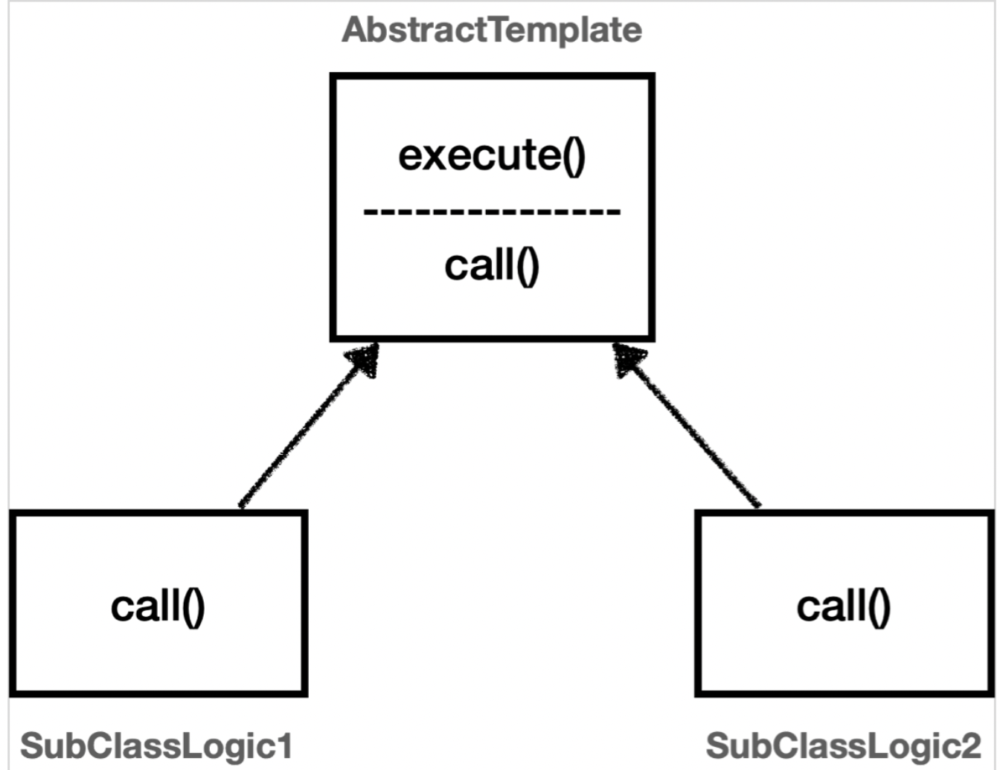
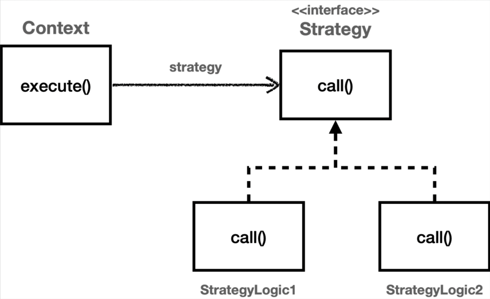
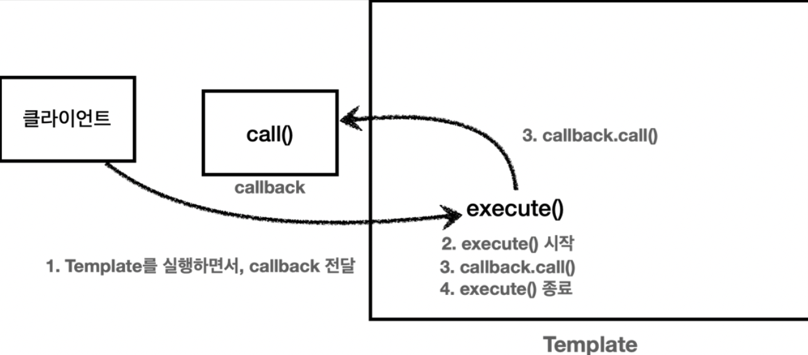

[인프런 김영한님 강의 - 스프링_고급](https://www.inflearn.com/course/%EC%8A%A4%ED%94%84%EB%A7%81-%ED%95%B5%EC%8B%AC-%EC%9B%90%EB%A6%AC-%EA%B3%A0%EA%B8%89%ED%8E%B8/dashboard)

# 03 템플릿 메서드 패턴과 콜백 패턴

01장, 02장을 거치면서 로그추적기의 기능을 완성했다. 기능의 완성을 위해 쓰레드로컬을 도입했고, 동시성 문제를 해결하면서 필드로 쉽게 공유되게했다.

이제 남은것은 실제 사용성을 증대 시키는 것이다.

```java
public class OrderControllerV3 {

    private final OrderSerivceV3 orderSerivce;
    private final LogTrace trace;

    @GetMapping("/v3/request")
    public String request(String itemId) {

        TraceStatus status = null;
        try {

            status = trace.begin("OrderController.request()");
            orderSerivce.orderItem(itemId);
            trace.end(status);
            return "ok";

        } catch (Exception e) {
            trace.exception(status,e);
            throw e; //예외를 꼭 다시 던져줘야한다. catch로 예외를 먹어버리면
                     //정상흐름으로 동작해버린다. 로그가 애플리케이션 흐름에 영향을 주어선안된다.
        }
    }
}
```

+ 기능적으로는 완성되었지만 사용성이 너무 부족하다.
+ 지금 부터는 이 반복되는 코드를 최대한으로 줄여서 사용성을 높힐 것이다.

#### 핵심기능과 부가기능의 분리

+ 핵심기능
  
  + 해당 객체가 제공하는 고유의 기능
  
  + 

+ 부가기능
  
  + 핵심기능을 보조하기 위한 기능
    
    + ex) 로그추적, 트랜잭션 등..

+ 우리는 이것들을 분리하기만하면된다.

<br>

## 03-1 템플릿 메서드 패턴

템플릿 메서드 패턴은 이름그대로 템플릿을 사용한다. 템플릿이란 틀이있고, 변하는 기능들은 상속과 오버라이딩을 통해 해결한다.

#### 코드에 적용



이런 형태로 템플릿메서드 패턴을 구현 할 것이다.

템플릿을 인터페이스로, 핵심기능은 자식클래스에서 담당한다.

#### AbstractTemplate

```java
@RequiredArgsConstructor
public abstract class AbstractTemplate<T> {

    private final LogTrace trace;

    public T excute(String message) {
        TraceStatus status = null;
        try {
            status = trace.begin(message);

            //로직 호출 
            T result = call();
            trace.end(status);

            return result;
        } catch (Exception e) {
            trace.exception(status, e);
            throw e;
        }
    }

    protected abstract T call();
}
```

+ 템플릿 - 메서드 패턴의 핵심 아이디어는 `abstract`클래스를 사용하는 것이다. 정확히는 핵심 기능을 자식클래스에서 구현하도록 `abstract` 메소드를 선언한다.

+ 자식클래스에서는 추상메서드인 `call()` 만 구현하면된다.

+ 여기서 제네릭`T` 를 쓴것은 핵심로직의 반환 타입이 다를 수 있기 때문이다. 예를들어 , 리포지토리 ,서비스 계층에서는 반환 값이 없다. (현재 예시에서는) 그런데, 컨트롤러에서는 "ok"라는 문자열을 반환하고 있으므로 제네릭으로 처리했다.

#### 실제 호출(Controller)

```java
@RestController
@RequiredArgsConstructor
public class OrderControllerV4 {

    private final OrderSerivceV4 orderSerivce;
    private final LogTrace trace;

    @GetMapping("/v4/request")
    public String request(String itemId) {

        AbstractTemplate<String> template = new AbstractTemplate<>(trace) {
            @Override
            protected String call() {
                orderSerivce.orderItem(itemId);
                return "ok";
            }
        };

        return template.excute("OrderController.request()");
    } 
}
```

+ 제네릭을 지정해줘야한다. 여기서는 문자열을 반환하기 떄문에 String으로 지정했다. 참고로 void 여야하는 상황이면 `Void` 로 지정해줘야한다.

+ 템플릿 메서드를 호출하는 방법에는 두가지 방법이있다.
  
  + 자식클래스를 생성해서 내부에 `override` 하는 방법
  
  + 지금처럼 익명클래스를 구현하는 방법.
  
  + 재사용을 하는 경우에는 첫번째를 아니라면 두번째를 하면된다.

> 좋은 설계란?
> 
> 진정한 좋은 설계는 변경이 일어날때 드러난다.

템플릿 메서드를 사용하는 것은 코드를 줄이기 위함이 아니다. 단일 책임 원칙을 지키는 것이다.

#### 템플릿 메서드 패턴의 문제점

상속을 받는다는 것은, 특정 부모클래스에 의존함을 의미한다. 심지어 강하게 의존해버린다.

가장 대표적인 문제점은, 부모클래스의 기능을 전혀 사용하지 않으면서 부모 클래스를 알아야한다는 것이다. 또, 부모클래스를 수정하면 자식클래스에도 영향이 미친다.

이를 보완하기위해서 전략패턴(Strategy Pattern)을 고려할 수 있다.

<br>

## 03-2 전략 패턴

> GoF 디자인 패턴에서 정의한 전략 패턴의 의도(Intention)
> 
> 알고리즘 제품군을 정의하고 각각을 캡슐화하여 상호 교환 가능하게 만들자. 전략을 사용하면 알고리즘을 사용하는 클라이언트와 독립적으로 알고리즘을 변경할 수 있다

전략패턴은 템플릿 메서드 패턴과 다르게 상속이 아닌 <u>위임</u>을 사용해 문제를 해결한다.



앞서 템플릿-메서드 패턴의 템플릿이 Context에 해당한다 

#### 예시1 (필드에 전략을 주입) - 테스트

```java
/**
 * 필드에 전략을 보관하는 방식
 */
@Slf4j
public class ContextV1 {

    private Strategy strategy;

    public ContextV1(Strategy strategy) {
        this.strategy = strategy;
    }

    public void execute() {
        long startTime = System.currentTimeMillis();

        //비즈니스 로직실행
        strategy.call();
        //비즈니스 로직 종료

        long endTime = System.currentTimeMillis();
        long resultTime = endTime -startTime;
        log.info("resultTime={}",resultTime);
    }
}
```

+ 여기서 Strategy는 `call()` 을 정의해놓은 인터페이스다.

+ 전략 패턴을 사용하면 다양한 형태로 호출할 수 있다(인터페이스사용)

```java
/**
     * 전략 패턴 사용
     */

    //Strategy 인터페이스를 구현한 클래스를 생성하여 전달
    @Test
    void strategyV1() {
        StrategyLogic1 strategyLogic1 = new StrategyLogic1();
        ContextV1 contextV1 = new ContextV1(strategyLogic1);
        contextV1.execute();

        StrategyLogic2 strategyLogic2 = new StrategyLogic2();
        ContextV1 contextV2 = new ContextV1(strategyLogic1);
        contextV1.execute();
    }

    // 익명 클래스로 전달
    @Test
    void strategyV3() {

        ContextV1 contextV1 = new ContextV1(new Strategy() {
            @Override
            public void call() {
                log.info("비즈니스 로직 1 실행");
            }
        });
        contextV1.execute();

        ContextV1 contextV2 = new ContextV1(new Strategy() {
            @Override
            public void call() {
                log.info("비즈니스 로직 2 실행");
            }
        });
        contextV2.execute();
    }
    //람다식으로 전달
    @Test
    void strategyV4() {

        ContextV1 contextV1 = new ContextV1(() -> log.info("비즈니스 로직 1 실행"));
        contextV1.execute();

        ContextV1 contextV2 = new ContextV1(() -> log.info("비즈니스 로직 2 실행"));
        contextV2.execute();
    }
```

람다식을 활용하는게 사실 제일 효과적이다. 인터페이스에 메서드 하나만 정의되어있을때, 람다식으로 표현할 수 있다.

#### 필드로 전달하는 방식의 문제점

결론부터 말하면 <u>선 조립 후 실행</u> 방식으로 작동하기때문에 좋지않다. 즉, 필드에서 의존성 주입을 받는 형태로 작동하고 있어서, 조립이 되버리고 나면 전략을 바꾸기가 번거롭다는 것. 즉 유연하지 않은 상황이다.

또, 만약 `Context`를 싱글톤으로 사용하면 동시성 이슈도 발생할 수 있다.  -> 매번 객체를 생성 하면 가능하긴하다. 이또한 유연하지 못하다는 것이다.

#### 예시2 (파라미터로 전달)

```java
/**
 * 전략을 파라미터로 전달받는 방식
 */
@Slf4j
public class ContextV2 {

    public void execute(Strategy strategy) {
        long startTime = System.currentTimeMillis();

        //비즈니스 로직실행
        strategy.call();
        //비즈니스 로직 종료

        long endTime = System.currentTimeMillis();
        long resultTime = endTime -startTime;
        log.info("resultTime={}",resultTime);
    }
}
```

좀 더 단순해졌다. 이제 `Strategy` 를 파라미터로 받게 되었다. 이것만 봐도 파라미터에 람다로 넘기는 모습을 상상 할 수 있다. 

의존성 문제도 사라졌기때문에 유연한 형태이다.  언제든지 strategy를 갈아끼울수 있다. 파라미터만 제대로 넘어오길 기대하면된다.

```java
    /**
     * 전략패턴 적용
     */
    @Test
    void strategyV1() {
        ContextV2 context = new ContextV2();

        context.execute(() -> log.info("로직 1 호출"));
        context.execute(() -> log.info("로직 2 호출"));
    }
```

람다만 사용한 예시를 보면 엄청 깔끔하고 유연한 코드임을 알 수 있다.


두번째 방식을 스프링에서는 특이하게 정의한다.그리고 아주 많이 쓴다.

<br>


## 03-3 템플릿 콜백 패턴

스프링에서는 위와 같은 방식을 템플릿 콜백 패턴 이라고 한다.`Context` 가 템플릿에 해당하고 `Strategy`가 콜백에해당한다. 

참고로 템플릿 콜백패턴은 GoF 패턴은 아니고 스프링에서 자주 사용하는 패턴이다. (전략 패턴에서 템플릿과 콜백 부분이 강조됨) `Template` 이 붙은 스프링의 모든것에서 이 템플릿 콜백 패턴이 쓰인다.


> 콜백이란?
> 
> 콜백이란 다른 코드의 인자로 넘겨주는 실행가능한 코드를 의미한다. 
> 
> call(호출) + back(뒤에서) 코드를 넘겨주는곳 뒤에서 호출된다는 의미를 내포하고있다.
> 
> 자바에서는 자바8 이후로 보통 람다를 사용한다. 이전에는 익명 내부클래스.





#### 코드 적용

```java
@RequiredArgsConstructor
public class TraceTemplate {

    private final LogTrace trace;

    public <T> T execute(String message, TraceCallback<T> callback) {

        TraceStatus status = null;
        try {
            status = trace.begin(message);

            //로직 호출
            T result = callback.call();
            trace.end(status);

            return result;
        } catch (Exception e) {
            trace.exception(status, e);
            throw e;
        }
    }
}

```


```java
public interface TraceCallback<T> {
    T call();
}
```

결국 최종적으로, 파라미터에 callback이 들어갔고, 제네릭을 써서 유연하게 동작하게 했다.


마지막으로 컨트롤러의 코드가 어떻게 변화했는지 살펴보자

```java
@Controller
public class OrderControllerV5 {

    private final OrderSerivceV5 orderSerivce;
    private final TraceTemplate template;


    public OrderControllerV5(OrderSerivceV5 orderSerivce, LogTrace trace) {
        this.orderSerivce = orderSerivce;
        this.template = new TraceTemplate(trace);
    }

    @ResponseBody
    @GetMapping("/v5/request")
    public String request(String itemId) {

        return template.execute("OrderController.request()", () -> {
            orderSerivce.orderItem(itemId);
            return "ok";
            }
        );
    } //깔끔
}
```

아주 깔끔해진것을 확인할 수 있다. 참고로 Temlate 은 직접 빈으로 등록해서 사용할 수도 있다.


## 정리

우리는 변하는 코드와 변하지 않는 코드를 분리하기위해 템플릿 - 메서드패턴, 전략패턴 을 거쳐

템플릿 콜백 패턴을 적용하고 최종적으로 람다로 깔끔하게 구현했다.

여기서 한계점은, 결국 기존에 있던 코드가 있었다고 가정했을때 로그 추적기를 사용하기위해 그모든 코드를 다 고쳐야한다. 이거 말고 다른 방법은 없을까?


이제 AOP를 배워야할 차례가 왔다.
