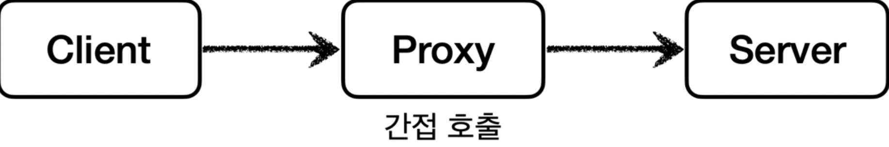
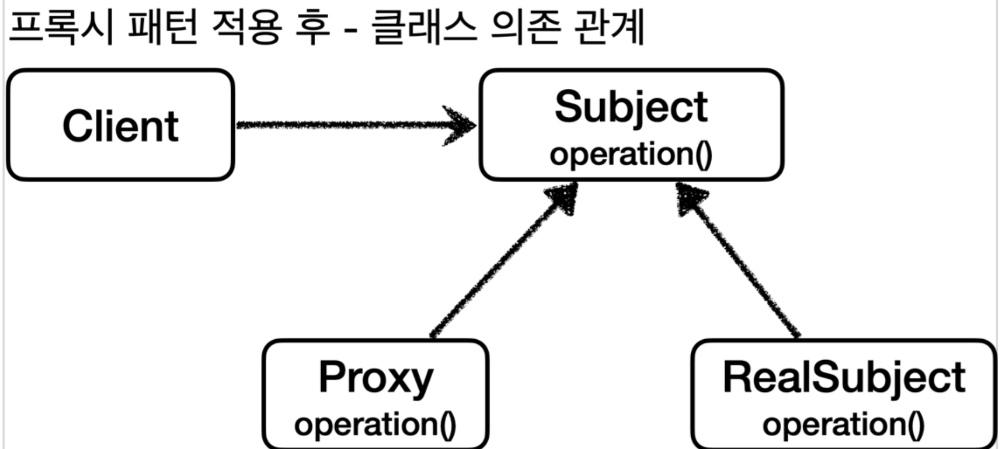
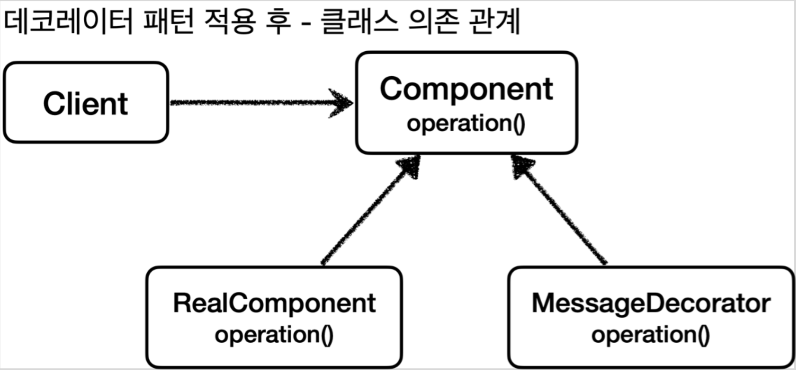
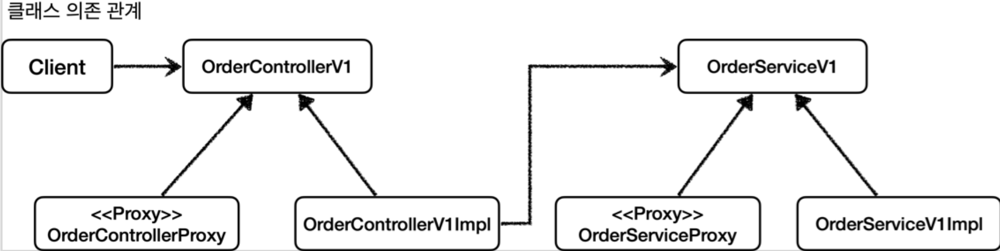
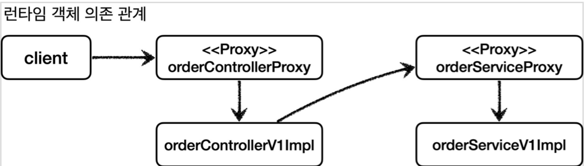
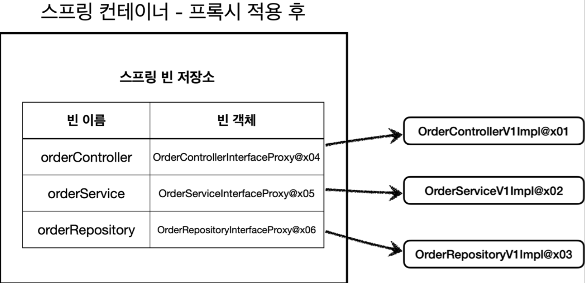

[인프런 김영한님 강의 - 스프링_고급](https://www.inflearn.com/course/%EC%8A%A4%ED%94%84%EB%A7%81-%ED%95%B5%EC%8B%AC-%EC%9B%90%EB%A6%AC-%EA%B3%A0%EA%B8%89%ED%8E%B8/dashboard)

# 04 프록시 패턴과 데코레이터 패턴

#### 들어가기 앞서

**이번장에서 목표**

:  디자인 패턴을 사용하여 , 원본의 코드 변경 없이 로그 추적기가 작동되게 해보자.

**추가되는 요구사항**

: 스프링빈 자동등록 하는 경우, 수동등록 하는 경우 모두 다 작동해야하며, 인터페이스가 있던 없던 다 되야한다..

위의 요구사항을 예제로 만들기 위해 3가지 상황을 구현한다.

1. 인터페이스와 구체 클래스로 각 계층을 설계하고, 스프링 빈을 수동 등록한다.  ex) OrderController(인터페이스) - OrderControllerImpl(구체 클래스)

2. 인터페이스 없이 구체 클래스

3. 2번에서 컴포넌트 스캔으로 스프링 빈 자동 등록

다양한 패턴을 써가며 1번 2번 3번을 모두 만족시키는게 현재의 목표이다.

우선 원본코드를 수정하지 않고 어떻게 로그추적기를 도입할 수 있을까? 

-> 이제 프록시의 개념을 이해할 차례이다.

<br>

## 04-1 프록시 , 프록시 패턴 , 데코레이터 패턴

#### 프록시란?

클라이언트와 서버의 개념을 먼저 살펴보자 

+ 클라이언트
  
  + 서버에 필요한 것을 요청하는 주체

+ 서버
  
  + 클라이언트의 요청을 처리하는 것.

이 개념은 많은 영역에 쓰인다.


+ 클라이언트가 서버에 직접 요청하고 , 직접 결과를 받을 때 직접호출이라고한다.



+ 만약 클라이언트가 어떤 **대리자**를 통해서 서버에 간접적으로 요청한다면? 
  
  + 이때 대리자가**프록시(Proxy)** 에 해당한다.

#### 프록시의 특징

+ 프록시는 체이닝이 가능하다. 즉 여러 프록시가 연결될 수도 있다.

+ 서버와 프록시는 같은 타입이여야한다. 즉, 클라이언트는 내가 서버에 요청하는 것인지, 프록시에 요청하는 것인지 알 수 없다.

+ 프록시라는 개념은 여러곳에서 쓰인다. 웹서버에도 있고 객체안에서도 쓰인다 하지만 근본적인 역할은 같다.

#### 프록시의 기능

크게 두가지로 나누어진다.

+ 접근제어
  
  + 권한에 따른 접근 차단
  
  + 캐싱
  
  + 지연 로딩

+ 부가 기능 추가
  
  + 요청값이나, 응답값의 변형
  
  + 실행시간 및 추가로그

#### 디자인패턴

위에서 나누어진 기능은 각각 다른 디자인 패턴으로 다루어진다

+ 프록시 패턴 : 접근제어의 의도

+ 데코레이터 패턴 : 새로운 기능 추가의 의도

> 참고로 디자인패턴을 공부할때 가장 중요한것은 형태에 집중하는 것이 아니라 의도(intent)에 집중하는 것이다. 그 이유는 형태자체는 디자인패턴을 어떻게 구현하냐에따라 매우 똑같아 질 수 있다. 하지만 정말 다른것은 '의도'이기 때문이다. 
> 
> 따라서 의도를 파악하는 것이 중요하다.

<br>

## 04-2 프록시패턴 예제



`Subject` 라는 인터페이스를 만든 후 실제 로직을 수행하는 `RealSubject` 와 프록시 클래스 `Proxy`  를 구현하려한다.

#### 캐싱 예제

```java
@Slf4j
public class CacheProxy implements Subject{

    private Subject target;
    private String cacheValue;

    public CacheProxy(Subject target) {
        this.target = target;
    }

    @Override
    public String operation() {
        log.info("프록시 호출");

        if (cacheValue == null) {
            cacheValue = target.operation();
        }

        return cacheValue;
    }
}
```

`target` 은 실제 객체가 담긴다. 

이 프록시는 주 기능이 캐싱이기 때문에 내부에 데이터를 저장하는 필드가 있다.

만약 이 프록시의 `operation` 이 호출되면 , 첫번째 호출일 경우 null이므로 실제 객체의 로직을 수행하고 아니면 바로 값을 반환 한다.

```java
@Test
void cacheProxyTest() {

    RealSubject realSubject = new RealSubject();         //실제 객체
    CacheProxy cacheProxy = new CacheProxy(realSubject); //프록시
    ProxyPatternClient client = new ProxyPatternClient(cacheProxy);

    client.execute();
    client.execute();
    client.execute();
}
```

클라이언트에게 실제로 주입되는 구현체는 프록시 객체이지만, 클라이언트 코드에서는 파라미터를 `Subject` 인터페이스로 받고 있기때문에 상관이 없다.

프록시를 사용하면서 얻는 이점중 가장 큰것은 기존 코드의 변화없이 프록시를 도입할 수 있다는 것이다.

-> 이것은 모두 자바의 다형성을 활용한다.

<br>

## 04-3 데코레이터 패턴 예제



형태는 프록시패턴과 같다. 

#### 예제코드

```java
@Slf4j
public class MessageDecorator implements Component {

    private Component component;

    public MessageDecorator(Component component) {
        this.component = component;
    }

    @Override
    public String operation() {
        log.info("MessageDecorator 실행");

        String result = component.operation();
        String decorResult = "*****" + result + "*****";
        log.info("MessageDecorator 꾸미기 적용 전 = {}, 적용 후 = {}", result, decorResult);
        return decorResult;
    }
}
```

반환값을 이름그대로 데코레이트하고 있는 코드이다.

프록시 패턴과 비슷하게 `Component` 에는 실제 객체가 담긴다. **엄밀히 말하면** 다음 실행되어야할 객체다. 즉, 다른 프록시가 위치할 수도 있고, 실제 객체일수도 있다.

```java
@Test
void decorator2() {
    Component realComponent = new RealComponent();
    Component messageDecorator = new MessageDecorator(realComponent);
    Component timeDecorator = new TimeDecorator(messageDecorator);
    DecoratorPatternClient client = new DecoratorPatternClient(timeDecorator);

    client.execute();
    //client -> time -> message -> real
}
```

이렇게 두개의 데코레이터를 체이닝해서 사용할 수 있다.

<br>

## 04-4 인터페이스 기반 프록시 적용

맨위의 3가지 상황 중 첫번째 상황을 해결해보자.

[인터페이스와 구체 클래스로 각 계층을 설계하고, 스프링 빈을 수동 등록한다]

최종적으로 이그림을 만들어야한다.(리포지토리 생략)



생각 보다 간단하다.

우선 컨트롤러 부터 보면

```java
@RequestMapping //스프링은 @Controller 또는 @RequestMapping 이 있어야 스프링 컨트롤러로 인식
@ResponseBody
public interface OrderControllerV1 {

    @GetMapping("/v1/request")
    String request(@RequestParam("itemId") String itemId);

    @GetMapping("/v1/no-log")
    String noLog();
}
```

+ 수동등록하는 상황이기때문에 `RequestMapping`을 했다. -> 3.0에서는 안먹힘

그다음 실제 로직이 담긴 실제 객체는 이렇다.

```java
public class OrderControllerV1Impl implements OrderControllerV1{

    private OrderServiceV1 orderservice;

    public OrderControllerV1Impl(OrderServiceV1 orderservice) {
        this.orderservice = orderservice;
    }

    @Override
    public String request(String itemId) {
        orderservice.orderItem(itemId);
        return "ok";
    }

    @Override
    public String noLog() {
        return "ok";
    }
}
```

마지막으로 프록시를 구현한다.

```java
@RequiredArgsConstructor
public class OrderControllerInterfaceProxy implements OrderControllerV1 {

    private final OrderControllerV1 target;
    private final LogTrace logTrace;

    @Override
    public String request(String itemId) {
        TraceStatus status = null;
        try {
            status = logTrace.begin("OrderController.request()");
            //target 호출
            String result = target.request(itemId);
            logTrace.end(status);
            return result;
        } catch (Exception e) {
            logTrace.exception(status,e);
            throw e;
        }

    }

    @Override
    public String noLog() {
        return target.noLog();
    }
}
```

+ 참고로 `noLog()` 는 로그 추적을 하지않아야하는 메서드이므로 요구사항에맞게 프록시에서 어떤 동작을 하지않고 바로 target에게 동작을 호출한다.


이게끝이다. 인터페이스가 있으면 딱히 생각할게 없다.


그럼 어떻게 클라이언트의 요청이 동작할까?

+ 클라이언트가 `Get` 으로 요청을하면 

+ 제일 먼저 컨트롤러 프록시의 request()를 호출한다. 

+ 실제 객체의 request()를 호출한다.

+ 다시 서비스 프록시의 로직을 호출한다.




이런식이다. 핵심은 실제 로직이 수행되기전에 프록시를 거친다는 것이다. 모든 계층에서.

이 일은 프록시 객체를 추가하고 의존성주입만 제대로 하면 모두 처리된다. 즉 기존 코드를 수정하지 않는 것이다.


#### config

```java
@Configuration
public class InterfaceProxyConfig {

    @Bean
    public OrderControllerV1 orderController(LogTrace logTrace) {
        OrderControllerV1Impl controllerImpl = new OrderControllerV1Impl(orderService(logTrace));
        return new OrderControllerInterfaceProxy(controllerImpl,logTrace);
    }

    @Bean
    public OrderServiceV1 orderService(LogTrace logTrace) {
        OrderSerivceV1Impl orderSerivceImpl = new OrderSerivceV1Impl(orderRepository(logTrace));
        return new OrderSerivceInterfaceProxy(orderSerivceImpl,logTrace);
    }

    @Bean
    public OrderRepositoryV1 orderRepository(LogTrace logTrace) {

        OrderRepositoryV1Impl orderRepositoryImpl = new OrderRepositoryV1Impl();
        return new OrderRepositoryInterfaceProxy(orderRepositoryImpl,logTrace);
    }

}
```

반환값을 보면 알 수 있듯이, 이렇게 되면 실제 빈의 객체는 모두 프록시가 등록될 것이다.



실제 객체는 어떻게 되나요? 라는 질문을 생각 할 수 도 있지만, 실제 객체는 프록시 객체내부에서 참조하고 있다. 즉, 프록시 객체가 등록될 때, <u>실제 객체도 같이 생성되어 힙영역에 올라가고, 프록시 객체 내부의 필드에서 참조하고 있으므로 아무 문제없다. 이것도 싱글톤처럼 작동한다.</u>


이렇게 첫번째 상황을 해결했다.

이제 인터페이스가 없고 구체클래스만 있을때 프록시를 어떻게 사용할지에 대해 알아보자.

<br>


## 04-5 구체클래스 기반 프록시

인터페이스가 없는데 어떻게 프록시를 적용할 수 있을까? 

자바에서의 다형성은 인터페이스만 있는게 아니다. 구체 클래스도 다형성이 적용된다. 바로 '상속'이 있기 때문이다.

예시없이 바로 코드에 적용시켜보자


```java
public class OrderControllerConcreteProxy extends OrderControllerV2 {

    private final OrderControllerV2 target;
    private final LogTrace logTrace;

    public OrderControllerConcreteProxy(OrderControllerV2 target, LogTrace logTrace) {
        super(null);
        this.target = target;
        this.logTrace = logTrace;
    }

    @Override
    public String request(String itemId) {
        TraceStatus status = null;
        try {
            status = logTrace.begin("OrderController.request()");
            //target 호출
            String result = target.request(itemId);
            logTrace.end(status);
            return result;
        } catch (Exception e) {
            logTrace.exception(status,e);
            throw e;
        }

    }

    @Override
    public String noLog() {
        return target.noLog();
    }
}
```


핵심은 상속 + `overriding` 이다. 이러면 끝이다.

다만 생성자안의 `super(null);` 이 부분 이 얘길 해보자. 자바 기본 문법 중 상속에 관한 내용 중에 이런 내용이 있다. 자식클래스를 생성할때 항상 부모 클래스의 생성자 `super()` 를 호출해야한다.


만약, 부모클래스에 디폴트 생성자만 있다면 딱히 적어주지 않아도 컴파일러가 알아서 `super()` 를 호출한다. 하지만 매개변수 생성자가 존재해서 디폴트 생성자가 없다면?

직접 명시해주어야한다. 안하면 컴파일 오류난다.

위의 상황에서는 프록시 입장에서 부모의 생성자의 매개변수를 쓸일이 없다.(`OrderService`) 그래서 null로 해도 무방하다.


더 안봐도 될것같다.


## 정리 + 남은 문제점

이번장에서 그간 강의를 들으면서 자주 나왔던 개념인 프록시에 대해 깊게 알아봤다. 결국 프록시라는 놈은 자바의 다형성을 활용하여 기존 코드 변경없이 책임을 분리하면서 공통적인 다양한 기능을 추가할 수 있는 장점이 있었다. 

프록시를 사용할때 재밌는점은 기존 스프링빈이 다 프록시로 대체된다는 점이다.


하지만 아직 주어진 상황중 3번이 남아있다. 또, 프록시 클래스를 너무 많이 정의해야한다는 것도 단점이다. 프록시 적용 클래스가 100개 면 100개의 프록시 클래스를 만들어야한다. 이건 현실적으로 너무 버겁다. 다른 방법은 없을까?


