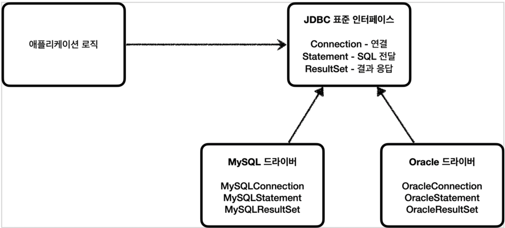
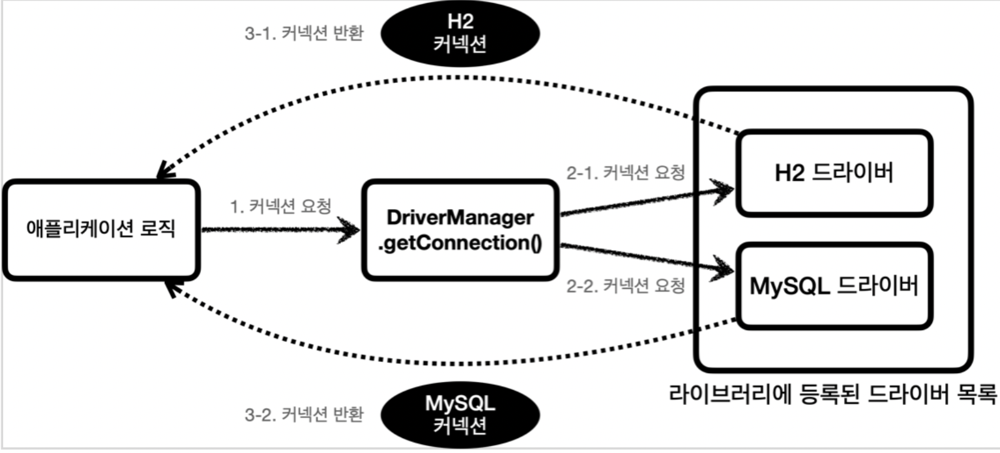

[인프런 김영한님 강의 스프링 DB part1](https://www.inflearn.com/course/%EC%8A%A4%ED%94%84%EB%A7%81-db-1/dashboard)

# 01. JDBC

## 01-1 JDBC(Java Database Connectivity)

#### JDBC 표준 인터페이스

> JDBC : 자바에서 데이터 베이스에 접속할 수 있도록 하는 자바 API

+ 대표적으로 3가지 기능을 표준 인터페이스로 정의 해서 제공한다.
  
  + `java.sql.Connection` : 연결
  
  + `java.sql.Statement` : SQL을 담은 내용
  
  + `java.sql.ResultSet` : SQL 요청응답

#### 의의

+ 데이터베이스를 변경하여도 코드를 유지할 수 있다.(구현 라이브러리만 변경하면된다.)

+ 각각 데이터베이스마다 커넥션,응답 , SQL 전달을 다르게 익히지 않아도 된다.

#### 한계

+ 표준화에는 한계가 있다. 각각 데이터베이스마다 SQL문 , 데이터 타입등의 일부 사용법이다르다.

+ JPA를 사용하면 많은 부분을 해결 할 수 있다.

 

## 01-2 JDBC DriverManager

DB에 연결 하려면 Connection을 얻어야하는데  JDBC는 `java.sql.Connection` 표준 커넥션 인터페이스를 제공한다.

이때, 각 DB의 드라이버 들은 `Connection` 인터페이스를 구현한 구현체를 제공한다.

#### DriverManager.getConnection() 요청흐름

+ DriverManager.getConnection()으로 커넥션을 요청하면

+ DriverManager가 라이브러리에 등록된 드라이버 목록을 자동으로 인식한다.

+ 이 드라이버에 잘 알고있는 URL ,이름 비밀번호등 접속에 필요한 정보를 전달하여 드라이버를 선택한다. 
  
  + URL 규칙을 잘보면 드라이버가 보인다. 
  
  + `jdbc:h2:tcp://localhost/~/test`

+ 찾은 커넥션 구현체가 클라이언트에 반환된다.

