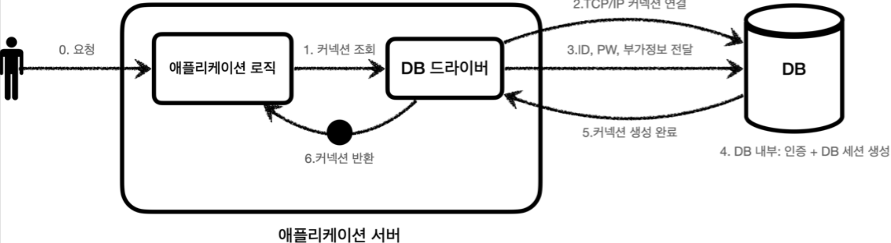
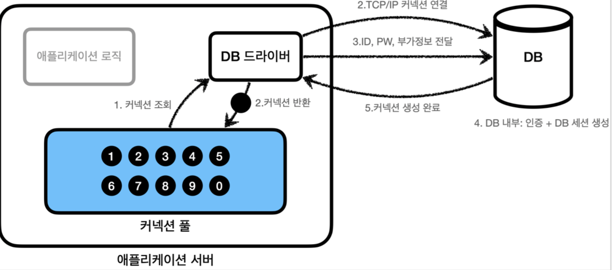
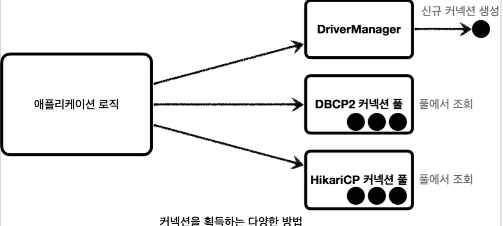
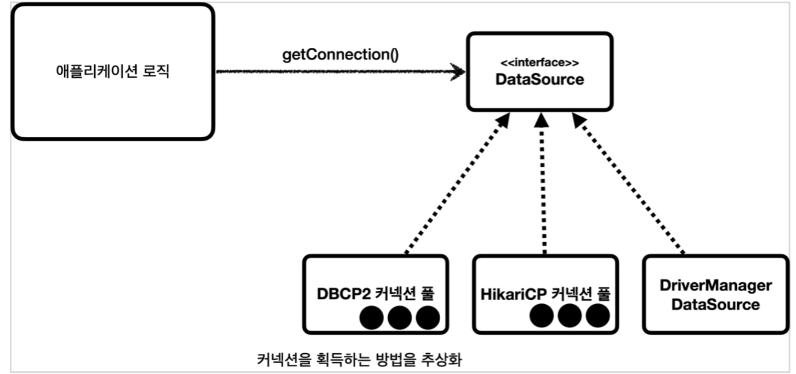

[인프런 김영한님 강의 스프링 DB part1](https://www.inflearn.com/course/%EC%8A%A4%ED%94%84%EB%A7%81-db-1/dashboard)

# 02 커넥션과 데이터소스

## 02-1 커넥션풀

#### 커넥션 획득 과정

1. 앞장에서 배운대로 드라이버를 통해 커넥션을 조회 한다.

2. 드라이버는 DB와 `TCP/IP` 연결을 맺는다.(3 way handshake)  -> 네트워크 동작 발생

3. 그다음 ID,PW를 전달하고 인증이 완료되면 내부에 DB 세션을 생성한다. 

4. DB는 커넥션 생성이 완료되었다는 응답을 보낸다.

5. <u>DB 드라이버는 커넥션 객체를 생성해서 클라이언트에게 반환한다.</u>

+ 커넥션을 새로 만드는것은 과정도 복잡하고 시간이 많이 소모된다.

+ 커넥션을 요청할때 마다 `TCP/IP` 연결을 하는것은 매우 비효율 적인 일이다.

#### 커넥션 풀

+ 애플리케이션 시작시점에 필요한 만큼 커넥션을 미리 확보해서 풀에 보관해 놓는다. 

+ 서비스 특징과 서버스펙에따라 다르지만 기본값은 보통 10개이다.

#### 커넥션 풀 사용

+ 커넥션 풀을 사용하면 이제 커넥션을 종료하는 것이 아니라 그대로 커넥션 풀에 반환한다.(살아있는 상태로) -> `TCP/IP` 연결이 계속 유지됨.

+ **실무에서 항상 기본으로 사용한다.**

+ 개념적으로 단순하기 때문에 직접 구현 할 수 도 있으나 이미 오픈소스들이 많으니 오픈소스를 사용하자.

+ 대표 커넥션 풀 오픈소스 :
  
  + `common-dbcp2` , `tomcat-jdbc-pool` , `HikariCP` 등
  
  + 스프링 2.0 부터 `HikariCp` 를 기본으로 제공한다. 
  
  + 대부분 `HikariCp` 사용

 

## 02-2 DataSource

커넥션을 획득하는 방법에는 다양한 방법이 있다. 앞장에서처럼 `DriverManager.getConnection()` 을 사용하여 매번 커넥션을 새로 획득 하는 방법이 있고, 위에서처럼 풀에서 조회 할 수도 있다.

그렇다면 커넥션을 획득 하는 방법이 변경 된다면 어떻게할까? 많은 부분 코드를 고쳐야할 것이다. 또한 사용법도 다를 것이다. 이럴땐 항상 추상화다.

#### DataSource: 커넥션 획득 방법을 추상화

+ 즉 이제 커넥션을 얻는 로직을 DataSource 인터페이스에 의존하도록 작성하면 된다.!
