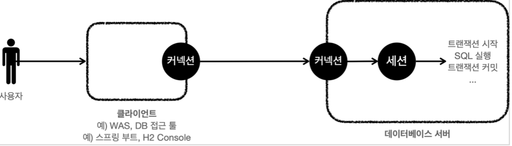

[인프런 김영한님 강의 스프링 DB part1](https://www.inflearn.com/course/%EC%8A%A4%ED%94%84%EB%A7%81-db-1/dashboard)

# 03 트랜잭션

## 트랜잭션이란

트랜잭션은 이름 그대로 거래라는 뜻. 가장 쉬운 예시는 이체이다. A가 B에게 5000원을 이체하면 A의 계좌에서는 5000원이 차감되야하고 B의 계좌는 5000원이 증가해야한다.

이때, 문제가 발생하면 거래이전으로 되돌려야 한다. -> `rollback`

정상적으로 실행 됐다면 그때서야 DB에 정상반영한다. -> `commit` 

#### 트랜잭션 ACID

+ 원자성(Atomicity) : 트랜잭션 내에서 실행한 작업들은 마치 하나의 작업인것처럼 (원자인것처럼)  모두 성공하거나 모두 실패해야한다. 두가지 선택지 밖에 없다.

+ 일관성(Consistency) : 모든 트랜잭션은 일관성 있는 데이터베이스 상태를 유지해야한다.ex) 무결성 제약조건을 항상 만족해야한다.

+ 격리성(Isolation) :동시에 실행되는 트랜잭션들이 서로에게 영향을 미치지 않도록 격리한다. Ex) e동시에 같은 데이터를 수정하지 못하도록 해야한다.  -> 트랜잭션 격리수준을 선택할 수있다.

+ 지속성(Durability) : 트랜잭셔을 성공적으로 끝내면 그결과가 항상 기록되어야한다. -> 데이터 베이스 로그등을 사용해서 성공한 트랜잭션 내용을 복구 할 수 있어야한다.

> 트랜잭션 격리수준 - Isolation leverl
> 
> + READ UNCOMMITED (커밋되지 않은 읽기) -> 다른 트랜잭션 안에서 아직 커밋되지않은 내용을 읽을 수있다.
> 
> + READ COMMITED (커밋된 읽기) - 일반적으로 많이 사용
> 
> + REPEATABLE READ(반복된 읽기)
> 
> + SERIALZIABLE (직렬화 가능 )

--> 밑으로 갈수록 성능이 빡세진다.

#### 데이터베이스 연결 구조와 DB 세션

앞서 커넥션을 획들 할때 DB 내부에서 세션을 생성한다고 했다. 이 세션이라는 놈이 SQL을 실행한다.

+ 세션은 트랜잭션을 시작하고 커밋 또는 롤백을 통해 트랜잭션을 종료한다.

+ 커넥션을 닫거나 DBA 가 세션을 강제로 종료하면 세션은 종료된다.

> 트랜잭션의 시작:
> 
> DB는 기본적으로 auto_commit이 true인 상태이다. 이걸 false로 한다면? 내가 따로 commit하거나 rollback 할때까지 트랜잭션이 지속되는 것이다. 
> 
> 즉 `set autocommit false;` 을 하는 시점부터 트랜잭션을 시작 한다고 표현한다.

 

## 3-2 DB 락

트랜잭션의 원자성을 지키려면 내가 수정하고 있는 데이터를 다른 누군가사 수정해선안된다.

이걸 막기 위해 DB에서는 락이라는 개념이 있다.

어떤 데이터를 변경하려면 먼저 락을 획들해야한다. 락을 획득 하지 못하면 데이터를 변경할 수 없다.

(선착순)

트랜잭션이 종료되면 - 락을 반환한다.

> 참고_  기본적으로 select할때는 락을 획득 할 필요가 없으나 `select for update` 구문을 사용하면 된다. 물론 이때 트랜잭션이 끝나면 락을 반납함.
> 
> 즉, 내가 어떤 데이터를 조회 할때, 내가 조회 할때 동안은 값이 바뀌면 안되는 경우 사용
