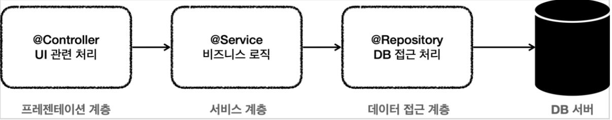
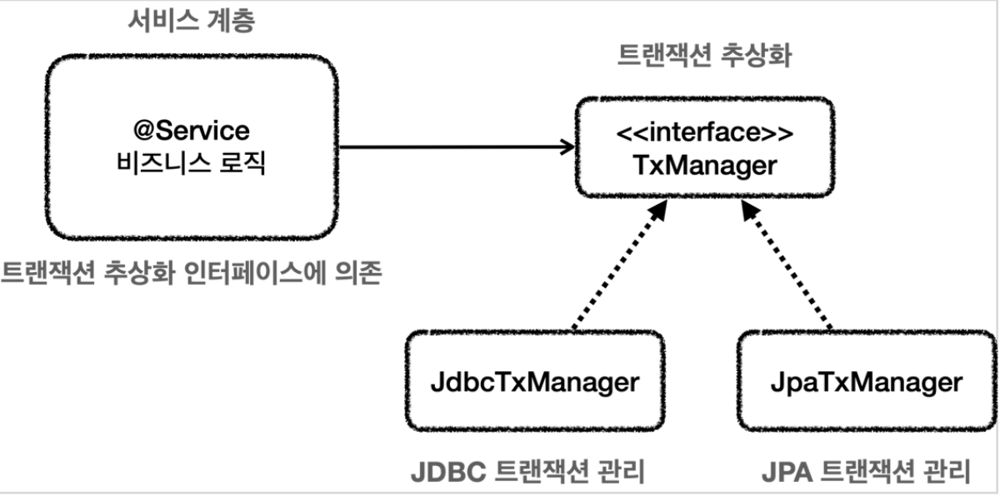
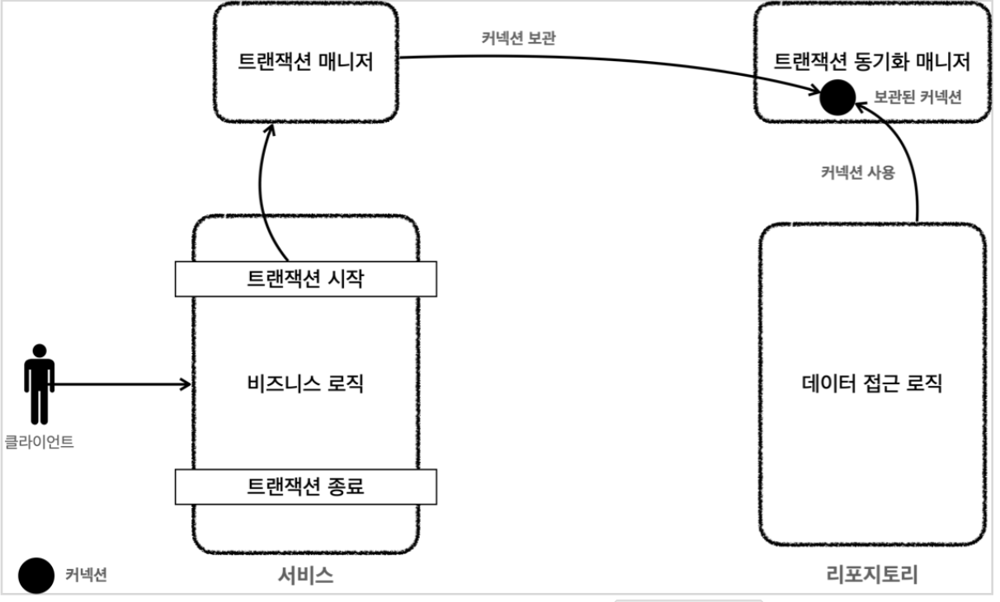

[인프런 김영한님 강의 스프링 DB part1](https://www.inflearn.com/course/%EC%8A%A4%ED%94%84%EB%A7%81-db-1/dashboard)

# 04 스프링과 문제 해결 - 트랜잭션

> 이장의 핵심은 애플리케이션 구조를 명확히 나누는데 초점을 맞춘다.

## 04-2 문제점

저번 프로젝트를 진행하면서 느꼈던 의문점은 애플리 케이션 구조를 어떻게 가져 가야햐나는 것이었다. JPA강의 , 또 이번 강의를 거치거면서 이제 점점 명확해 지고 있다.

<br>

#### 애플리케이션 구조



+ 프레젠테이션 계층
  
  + UI 처리 담당
  
  + 웹 요청 및 응답
  
  + validation 등을 수행한다.

+ 서비스계층
  
  + 비즈니스 로직 담당
  
  + **가급적 특정 기술에 의존하지 않고 순수 자바 코드로만 작성한다.**  : 이번장에서 가장 중요한부분

+ 데이터 접근계층
  
  + 실제 데이터 베이스에 접근하는 코드
  
  + DB 접근 기술을 직접 사용해야하기때문에 특정 코드에 종속 될수 밖에 없다.

<br>

#### 순수한 서비스 계층

가장 중요한 부분은 당연히 비즈니스로직을 담당하는**서비스 계층**이다.UI가 바뀌고 API가 추가 변경 되고 데이터 저장기술이 바뀌거나해도 무조건  **비즈니스로직은 변경없이 유지되어야한다.**

그럼 어떻게 해야하나?

+ 특정 기술에 종속적이지 않게 개발한다. 특정 기술에 종속적인 부분은 모두 컨트롤러와 리포지토리가 담당한다. 

<br>

#### 종속적인 서비스 계층 예시 (MemberServiceV2)

```java
/**
 * 트랜잭션 - 파라미터 연동, 풀을 고려한 종료
 */
@Slf4j
@RequiredArgsConstructor
public class MemberServiceV2 {

    private final DataSource dataSource;
    private final MemberRepositoryV2 memberRepository;

    public void accountTransfer(String fromId, String toId, int money) throws SQLException {
        Connection connection = dataSource.getConnection();

        try {
            connection.setAutoCommit(false); //트랜잭션 시작
            //비즈니스 로직
            bizLogic(connection, fromId, toId, money);

            connection.commit(); //성공 시 커밋
        } catch (Exception e) {
            connection.rollback();
            throw new IllegalStateException(e);
        } finally {
            release(connection);
        }

    }

    private void bizLogic(Connection connection, String fromId, String toId, int money) throws SQLException {
        Member fromMember = memberRepository.findById(connection, fromId);
        Member toMember = memberRepository.findById(connection, toId);

        memberRepository.update(connection,fromId, fromMember.getMoney() - money);
        validation(toMember);
        memberRepository.update(connection,toId, toMember.getMoney() + money);
    }

    private void release(Connection connection) {
        if (connection != null) {
            try {
                connection.setAutoCommit(true); //풀에 다시 돌아갈땐 디폴트값인 true로 바꾸고 반환
                connection.close();
            } catch (Exception e) {
                log.info("error", e);
            }
        }
    }

    private void validation(Member toMember) {
        if (toMember.getMemberId().equals("ex")) {
            throw new IllegalStateException("이체중 예외발생");
        }
    }
}
```

+ 위의 코드에서 몇가지 문제점들을 확인할 수 있다.
  
  + 첫번째, `java.sql.SQLException`, `java.sql.Connection` , `java.sql.Connection` 은 모두 JDBC 기술이다. 현재 서비스계층에서 JDBC 기술에 의존하 고 있다.
  
  + 두번쨰, 트랜잭션을 유지하기위해 커넥션을 계속 파라미터로 넘기고 있다.
  
  + 세번째, `SQLException` 을 누수 하고 있다. 즉 다음장에서 다룰 체크예외를 반복적으로 해결해야한다.
  
  + 마지막으로 try 문을 남발하여, 트랜잭션 코드의 반복이 일어난다. 비즈니스 로직보다 이런 코드의 비율이 너무 높다.

+ 스프링을 이용하여 이것들을 해결해야한다.

## 04-2 트랜잭션 추상화

+ 위의 코드에서 JDBC의 트랜잭션을 사용하기 위해 `con.setAutoCommit(false)`를 사용했다. 근데 만약 이제 JPA 기술을 사용해야한다면?
  
  + JPA기술에서 트랜잭션은 `tx.begin()` 을 사용하는데, 이러면 코드를 전면 수정해야하나?

+ 그래서 우리는 추상화를 적극이용해야한다

<br>

#### 트랜잭션 매니저

트랜잭션은 간단하다. 트랜잭션의 추상화는 다음과 같다

```java
   public interface TxManager {
        begin();
        commit();
        rollback();
  }
```



+ 트랜잭션을 추상화한 인터페이슨 `TxManager`에의존하면 기술이 바뀌어도 서비스 코드를 전혀 변경하지 않아도 된다.  -> OCP를 준수하게된다.

## 04-3  트랜잭션 동기화

트랜잭션을 유지하려면 트랜잭션의 시작부터 끝까지 항상 같은 커넥션을 유지해야한다. -> 당연하다.

위의 `MemberSerivceV2` 에서는 파라미터로 계속 Connection 객체를 넘겨서 유지하고 있다. 그러나 이렇게 하면 코드가 지저분해지고, 메서드 오버로딩을 의미 없이 해줘야한다.

<br>

#### 트랜잭션 동기화 매니저



동작방식:

1. 트랜잭션을 시작하기 위해 트랜잭션 매니저가 데이터소스를 통해 커넥션을 만들고 시작한다. ->보통 서비스 계층에서 트랜잭션을 사용함.

2. 이때, 트랜잭션 매니저는 커넥션을 트랜잭션 동기화 매니저에 보관한다.

3. 리포지토리에서는 트랜잭션 동기화 매니저에 보관된 커넥션을 꺼내서 사용한다.

4. 트랜잭션이 종료되면 트랜잭션매니저는 트랜잭션 동기화 매니저에 보관된 커넥션을 종료하고, 커넥션을 닫는다.

> 참고 트랜잭션 동기화 매니저는  쓰레드 로컬을 사용한다. -> 스프링 고급편 참고

<br>

## 04-4 예제

#### MemberServiceV3_1 : 트랜잭션 매니저

```java
package hello.jdbc.service;

/**
 * 트랜잭션 - 트랜잭션 매니저
 */
@Slf4j
@RequiredArgsConstructor
public class MemberServiceV3_1 {

    private final PlatformTransactionManager transactionManager;
    private final MemberRepositoryV3 memberRepository;

    public void accountTransfer(String fromId, String toId, int money) throws SQLException {

        //트랜잭션 시작
        TransactionStatus status = transactionManager.getTransaction(new DefaultTransactionDefinition());

        try {
            //비즈니스 로직
            bizLogic(fromId, toId, money);

            transactionManager.commit(status); //성공 시 커밋
        } catch (Exception e) {
            transactionManager.rollback(status); //실패시 롤백
            throw new IllegalStateException(e);
        }

    }

    private void bizLogic(String fromId, String toId, int money) throws SQLException {
        Member fromMember = memberRepository.findById(fromId);
        Member toMember = memberRepository.findById(toId);

        memberRepository.update(fromId, fromMember.getMoney() - money);
        validation(toMember);
        memberRepository.update(toId, toMember.getMoney() + money);
    }

    private void validation(Member toMember) {
        if (toMember.getMemberId().equals("ex")) {
            throw new IllegalStateException("이체중 예외발생");
        }
    }
}
```

<br>


#### MeberServiceV3_2 : 트랜잭션 템플릿

```java
/**
 * 트랜잭션 - 트랜잭션 템플릿
 */
@Slf4j
@RequiredArgsConstructor
public class MemberServiceV3_2 {

    //private final PlatformTransactionManager transactionManager;
    private final TransactionTemplate txtemplate;
    private final MemberRepositoryV3 memberRepository;

    public MemberServiceV3_2(PlatformTransactionManager transactionManager, MemberRepositoryV3 memberRepository) {
        this.txtemplate = new TransactionTemplate(transactionManager);
        this.memberRepository = memberRepository;
    }

    public void accountTransfer(String fromId, String toId, int money) throws SQLException {

        txtemplate.executeWithoutResult(status -> {
            try {
                bizLogic(fromId, toId, money);
            } catch (SQLException e) {
                throw new IllegalStateException(e);
            }
        });
    }

    private void bizLogic(String fromId, String toId, int money) throws SQLException {
        Member fromMember = memberRepository.findById(fromId);
        Member toMember = memberRepository.findById(toId);

        memberRepository.update(fromId, fromMember.getMoney() - money);
        validation(toMember);
        memberRepository.update(toId, toMember.getMoney() + money);
    }

    private void validation(Member toMember) {
        if (toMember.getMemberId().equals("ex")) {
            throw new IllegalStateException("이체중 예외발생"); //언체크 예
        }
    }
}
```

#### 

<br>

#### MemberServiceV3_3 : 스프링 AOP - 프록시


```java

/**
 * 트랜잭션 - @Transactional AOP
 */
@Slf4j //클래스레벨에 @Transactional을 붙이면 외부에서 호출하는 모든 메소드가 Transactiond의 대상이 됨.
@Service
public class MemberServiceV3_3 {

    private final MemberRepositoryV3 memberRepository;

    public MemberServiceV3_3(MemberRepositoryV3 memberRepository) {
        this.memberRepository = memberRepository;
    }

    @Transactional
    public void accountTransfer(String fromId, String toId, int money) throws SQLException {
        bizLogic(fromId, toId, money);
    }

    private void bizLogic(String fromId, String toId, int money) throws SQLException {
        Member fromMember = memberRepository.findById(fromId);
        Member toMember = memberRepository.findById(toId);

        memberRepository.update(fromId, fromMember.getMoney() - money);
        validation(toMember);
        memberRepository.update(toId, toMember.getMoney() + money);
    }


    private void validation(Member toMember) {
        if (toMember.getMemberId().equals("ex")) {
            throw new IllegalStateException("이체중 예외발생");
        }
    }
}

```


