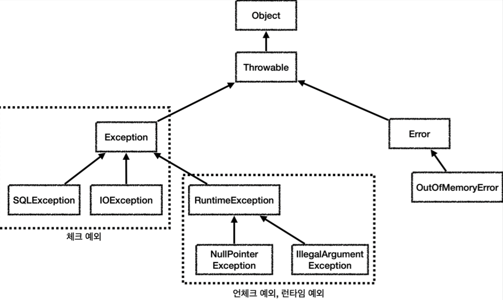
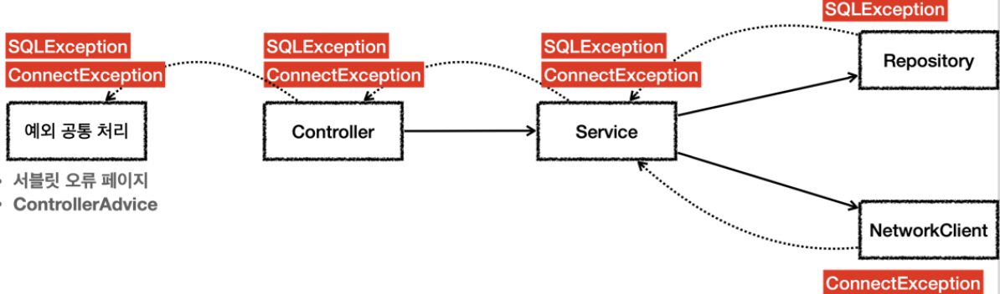

[인프런 김영한님 강의 스프링 DB part1](https://www.inflearn.com/course/%EC%8A%A4%ED%94%84%EB%A7%81-db-1/dashboard)

# 05 자바 예외 이해

> 본 장에서는 자바 기본 문법? 에 해당하는 자바 예외에 관한 부분을 다룬다. 지금까지 웹 개발을 배우면서 사실 예외에 관한 내용을 깊게 학습한 적이 없다. 이 기회에 예외에 대해 이해하고, 처리는 어떻게 하는지 배워보자

## 05-1 자바 예외 계층



+ 최상위 예외는 `Throwable` 이다.

+ `Error`: 메모리 부족, 시스템오류 같이 애플리케이션에서 복구 불가능한 시스템 예외. 개발자는 이예외까지 잡으려 해서는 안된다.
  
  + `Throwable` 로 캐치하면 `Error` 까지 같이 잡는다.

+ 체크예외 : 컴파일러가 체크하지않는예외

+ 언체크 예외 : 런타임 예외라고도하고 , 컴파일러가 체크하지 않는 예외이다. 

#### 예외의 기본 규칙

+ 예외는 2가지 기본규칙이 있다
  
  + 잡아서 처리하거나 (catch) - 이때 하위의 예외를 모두 잡을 수 있다.
  
  + 던져야한다.(throw) -하위의 예외를 모두 던질 수 있다.

<br>

## 05-2 체크 예외

+ `RuntimeException` 이 아닌 예외이다.

+ **체크 예외는 반드시 잡아서처리하거나, 밖으로 던지도록 선언해야한다.**

+ `Exception` 을 상속 받으면 체크 예외가 된다.

#### 장점

+ 개발자가 실수로 예외를 누락하지 않도록 컴파일러를 통해 문제를 잡을 수 있다.

#### 단점

+ 만약 현재 계층에서 처리할 수 없어서 다음 계층으로 던지는 일이 반복된다면 너무 번거로운 일이된다.

+ 나의 관심사가 아닌 예외조차 던져져서 올라오기 때문에 의존 관계에따른 단점이 있다.

+ ex) `SQLException`을 계속 throw 하는 경우 : `SQLException`은 JDBC 기술에 종속되는 오류이다. 즉, 예외를 던짐으로써 어떤 한 기술에 의존적인 상황이 발생하는 것이다.

<br>

## 05-3 언체크 예외

+ `RuntimeException`을 상속 받는다.

+ 컴파일러가 체크하지 않는다.

+ `throw` 를 선언하지 않아도 된다. (생략할수 있다.) 이경우 자동으로 예외를 던진다.

#### 장점

+ 예외를 밖으로 던지는 throw를 생략할 수 있다.
  
  + 신경쓰고 싶지 않은 언체크 예외를 무시 할 수 있다.
  
  + 의존관계를 참조 하지 않아도 된다.

##### 단점

+ 개발자가 실수로 예외를 누락할 수 있다.(까먹고 처리를 안하면 누락이다.)

## 05-4 체크 예외 활용

언제 체크예외를 사용하고 언제 언체크 예외를 사용하나?

#### 원칙

+ 기본적으로 언체크 예외를 사용한다.

+ 체크 예외는 비즈니스 로직상 의도적으로 던지는 예외에 사용한다.
  
  + ex)
    
    + 계좌 이체 실패 예외
    
    + 결제시 포인트 부족 예외
    
    + 등
  
  + 물론 이경우에도 언체크예외를 사용해도 되긴한다.

#### Exception은 던지면 무슨일이 일어는가?

+ throw하는 체크 예외가 많아서 부모인 `Exception`을 던지면 ?
  
  + 체크예외를 사용하는 의미가 없어진다. 무슨 예외을 던지고, 무슨 예외를 캐치하는지 모호해지는 현상이 발생한다.

#### 예외는 어디서 처리하는가?



+ 기본적으로 시스템 레벨에서 올라오는 예외는 대부분 복구가 불가능하다. 즉, 어차피 서비스계층이나 컨트롤러 계층에서는 처리할 방법이 없다.

+ 웹 어플리케이션 예외는 보통 서블릿 필터, 스프링 인터셉터, 스프링 `ControlAdvice` 를 사용해서 공통으로 처리한다.

<br>

## 05-4 예외 전환

+ **체크 예외는 런타임 예외로 전환할 수 있다.**

```java
static class RuntimeSqlException extends RuntimeException {
        public RuntimeSqlException(Throwable cause) {
            super(cause);
        }
    }


static class Repository {
        public void call() {
            try {
                runSql();
            } catch (SQLException e) {
                throw new RuntimeSqlException(e);
            }
        }

        public void runSql() throws SQLException {
            throw new SQLException("ex");
        }
    }
```

+ 테스트 코드 내부에 있는 한부분인데, 우선 현재 체크예외 인 `SQLException`을 대신해서 던질 런타임 예외를 임의로 생성한다. ( `RuntimeException`을 상속 받았다.)

+ 그리고 `SQLException`을 발생시키는 지점에서 catch하고 `RuntimeSqlException` 로 바꿔서 던진다.

+ <mark><u>이때 꼭 파라미터로 해당 체크 예외를 포함해서 던져야한다. </u> --------------------중요</mark>
  
  + 이래야만 나중에 예외를 처리하는 곳에서 스택트레이스에서 기존 예외를 확인할 수 있기때문이다.

#### 기타

+ 자바 초창기 시절에는 체크예외가 컴파일 할 때 오류를 잡을 수 있어서 아주 합리 적인 선택이였다. 하지만 시간이흐르고 라이브러리들이 기하급수 적으로 늘어나면서 별의 별 예외를 다 던지기 시작했을때, 체크예외는 재앙이 되었다.

+ 그래서 최근의 라이브러리들. 스프링 등은 런타임예외를 기본으로 제공한다.

+ <u>런타임 예외는 놓칠 수 있기 때문에 문서화가 매우 중요하다.</u>
