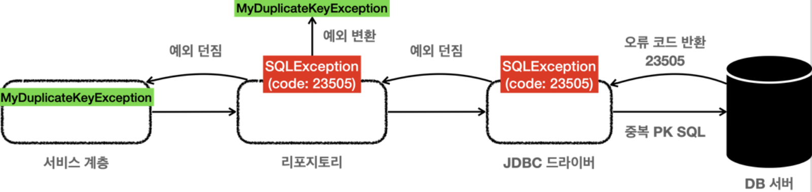
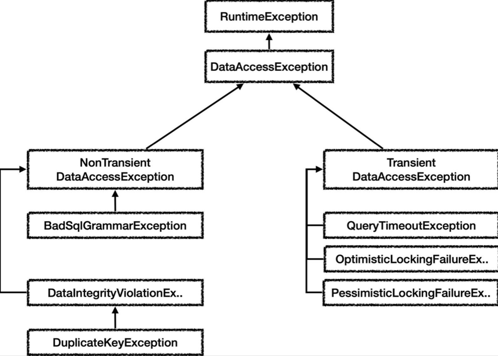

[인프런 김영한님 강의 스프링 DB part1](https://www.inflearn.com/course/%EC%8A%A4%ED%94%84%EB%A7%81-db-1/dashboard)

# 06 스프링 예외처리

> 수많은 선배 개발자들은 생산성을 증대시키기위해 계속해서 반복을 줄이고, 추상화해왔다. 

## 06-1 체크 예외와 인터페이스

체크예외를 사용할때 인터페이스 구조는 어떻게될까?

```java
public interface MemberRepositoryEx {
    Member save(Member member) throws SQLException;

    Member findById(String memberId) throws SQLException;

    void update(String memberId, int money) throws SQLException;

    void delete(String memberId) throws SQLException;
}
```

+ 아주 기본적인 리포지토리 인터페이스다. 그런데 만약 체크 예외를 던지겠다고 이런식으로 인터페이스를 만들면 ..... JDBC 기술에 종속할 수 밖에 없다. 이건 아니야..
  + 앞에서 배운 예외 전환을 통해 언체크로 던진다면 더이상 throw 하지 않아도 될것이다.

<br>


## 06-2 예외 코드

같은 예외라도 예외코드로 구분할 수 있다.

예를들어 `SQLException` 중에서 H2 데이터베이스에서 키 중복 오류의 경우

`e.getErroCode() == 23505` 이다. 그림으로 보면



+ DB에서는 각 상황마다 특정 오류 코드를 반환한다. (DB 마다 오류코드가 다 다르다.)

+ 오류코드는 수십 수백 가지가 있다.


#### 오류 코드 별로 처리할 수 있을까?

```java
public Member save(Member member) {
            String sql = "insert into member(member_id, money) values(?,?)";
            Connection con = null;
            PreparedStatement pstmt = null;

            try {
                con = dataSource.getConnection();
                pstmt = con.prepareStatement(sql);
                pstmt.setString(1, member.getMemberId());
                pstmt.setInt(2, member.getMoney());

                pstmt.executeUpdate();
                return member;
            } catch (SQLException e) {

                if (e.getErrorCode() == 23505) {
                    throw new MyDuplicateKeyException(e);
                }
                throw new MyDbException(e);

            } finally {
                JdbcUtils.closeStatement(pstmt);
                JdbcUtils.closeConnection(con);
            }
}
```

+ `catch` 문을 보면 에러코드가 위에서처럼 중복 된키 오류 일 경우 특정한 임의로 생성한 오류를 던지게했다. 즉, 특정 상황 까지 확인 할 수 있는 것이다. 

+ 이때, `SQLException` 을 `MyDbException` 로 전환하고 

+ `MyDuplicateKeyException` 이  `MyDbException` 을 상속 받게 한다. 이러면  계층 구조가 좀더 명확해진다. 

+ 즉,  `MyDuplicateKeyException`  은  DB 관련 발생한 예외이고, 중복 키 관련 예외라는 것을 쉽게 확인 할 수 있게 되는 것이다.

<br>

## 06-3 스프링 예외 추상화 이해

그러면 앞서 설명한대로 예외를 임의로 죄다 생성해서 해서 던져야하는가? 스프링은 역시 또 이것들을 모두 일관성있게 예외들을 추상화했다.




+ 이 그림은 데이터 접근계층에대한 일부분이다. 다른계층들도 존재한다.

+ `Transient` : <u>일시적</u> 
  
  + 동일한 SQL 을 다시 시도 했을때 성공할 가능성이 있는 예외들이다. 쿼리 타임아웃, 락 과 관련있다.


#### 예외 변환기

스프링은 예외를 자동으로 변환해주는 변환기를 제공한다.

```java
  SQLExceptionTranslator exTranslator = new SQLErrorCodeSQLExceptionTranslator(dataSource);
  DataAccessException resultEx = exTranslator.translate("select", sql, e);
```

+ 첫번재 파라미터는 설명, 두번째는 실행하는 sql 세번째는 발생한 실제 예외이다.


<br>

```java
    @Test
    void exceptionTranslator() {
        //given
        String sql = "select Bad";
        //when
        try {
            Connection connection = dataSource.getConnection();
            PreparedStatement pstmt = connection.prepareStatement(sql);
            pstmt.executeQuery();
        } catch (SQLException e) {
            assertThat(e.getErrorCode()).isEqualTo(42122);

            SQLErrorCodeSQLExceptionTranslator exTranslator = new SQLErrorCodeSQLExceptionTranslator(dataSource);
            DataAccessException resultEx = exTranslator.translate("select", sql, e);

            log.info("resultEx",resultEx);

            assertThat(resultEx.getClass()).isEqualTo(BadSqlGrammarException.class);
        }
        //then
    }
```

+ 최종적으로 반환하는 에러는 `BadSqlGrammerException` 이다. 


참고)

```java

package org.springframework.jdbc;

public class BadSqlGrammarException extends InvalidDataAccessResourceUsageException {

	private final String sql;


	public BadSqlGrammarException(String task, String sql, SQLException ex) {
		super(task + "; bad SQL grammar [" + sql + "]", ex);
		this.sql = sql;
	}


	public SQLException getSQLException() {
		return (SQLException) getCause();
	}


	public String getSql() {
		return this.sql;
	}

}
```


#### 실제 리포지토리에서 translator 적용

```java
    @Override
    public Member save(Member member) {
        String sql = "insert into member(member_id, money) values (?, ?)";

        Connection con = null;
        PreparedStatement pstmt = null;

        try {
            con = getConnection();
            pstmt = con.prepareStatement(sql);
            pstmt.setString(1, member.getMemberId());
            pstmt.setInt(2, member.getMoney());
            pstmt.executeUpdate();
            return member;
        } catch (SQLException e) {
            throw exTransalator.translate("save",sql,e); /////////////
        } finally {
            close(con, pstmt, null);
        }

    }
```

+ **드디어 템플릿 없이 예외를 가장 쉽게 처리할 수 있는 방법**까지 왔다. catch문 안에서 한줄이면 스프링이 추상화 해놓은 예외로 체크 예외를 변환하여 쉽게 던질 수 있게 되었다.

<br>


## 06-4 반복문제 해결 JdbcTemplate

예외는 어찌저찌 해결했다지만 여전히 반복의 문제가 남아있다.

+ 커넥션 조회, 커넥션 동기화

+ 쿼리 실행

+ 결과 바인딩

+ 예외 발생시 스프링 예외 변환기 실행

+ 리소스 종료

너무 많은 것들이 반복된다.


JdbcTemplate를 사용하면 해결할 수 있다.

```java


/**
 * JdbcTemplate 사용
 */
@Slf4j
public class MemberRepositoryV5 implements MemberRepository {

    private final JdbcTemplate template;

    public MemberRepositoryV5(DataSource dataSource) {
        this.template = new JdbcTemplate(dataSource);
    }

    @Override
    public Member save(Member member) {
        String sql = "insert into member(member_id, money) values (?, ?)";

        template.update(sql,member.getMemberId(),member.getMoney());
        return member;

    }

    @Override
    public Member findById(String memberId) {
        String sql = "select * from   member where member_id = ?";
        return template.queryForObject(sql, memberRowMapper() ,  memberId);

    }

    private RowMapper<Member> memberRowMapper() {

        return (rs, rowNum) -> {
            Member member = new Member();
            member.setMemberId(rs.getString("member_id"));
            member.setMoney(rs.getInt("money"));
            return member;
        };
    }


    @Override
    public void update(String memberId, int money) {
        String sql = "update member set money=? where member_id=?";
        template.update(sql,money,memberId);

    }


    @Override
    public void delete(String memberId) {
        String sql = "delete from member where member_id=?";

        template.update(sql,memberId);
    }

}

```


> 현재 시점에서 이미 많은 기술들이 복잡하고 반복되는 코드들을 추상화 , 원자화로 제공한다. 그렇다면 실제 기술 사용자인 나는 내부 동작이 어떻게 흘러 가는지 가늠하기 힘들다. 그렇다고 해서 무작정 사용하다간 각종 트러블을 대처할 수 없을 것이다.
> 
> 내부 동작을 정확하게 이해하자 
