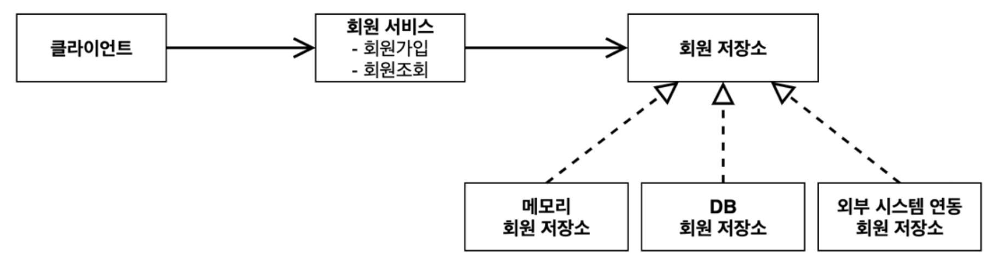
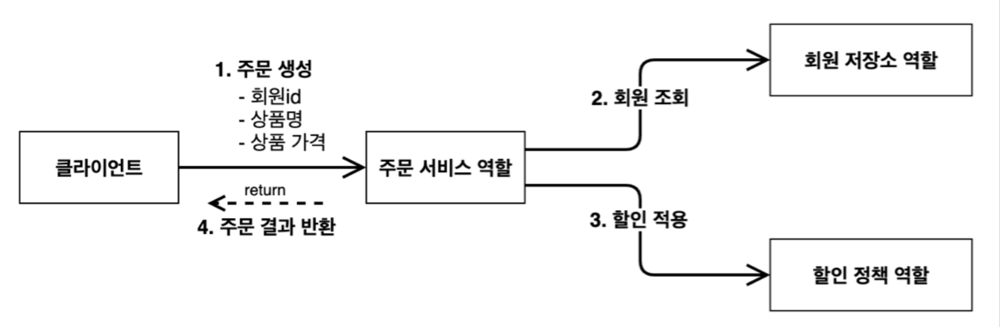

> [인프런 김영한님 -스프링 핵심 원리 - 기본편](https://www.inflearn.com/course/%EC%8A%A4%ED%94%84%EB%A7%81-%ED%95%B5%EC%8B%AC-%EC%9B%90%EB%A6%AC-%EA%B8%B0%EB%B3%B8%ED%8E%B8)

# 2. 스프링 핵심 원리 이해1 -예제

(중요한 부분 위주로 정리)

## 2-1 프로젝트 생성

+ 환경 : Java11 , IntelliJ

+ [스프링 부트 스타터 사이트](https://start.spring.io)로 이동해서 스프링 프로젝트 생성

+ 프로젝트 선택
  
  + Project: Gradle - Groovy Project
    Spring Boot: 2.3.x  
    Language: Java  
    Packaging: Jar
    
    Java: 11
    Project Metadata
    
    groupId: hello
    
    artifactId: core
    Dependencies: 선택하지 않는다.

+ build.gradle -> open as project (IntelliJ)

+ preferences-> gradle 검색 -> Build and run using , Run tests using -> IntelliJ Idea 
  
  Gradle 대신에 Intelli J 가 자바를 직접실행하게 하여 실행속도를 빠르게 .
  
  

## 2-2  비즈니스 요구사항과 설계 (순수한 자바로만)

### 2-2-1 회원도메인 설계

+ 회원 도메인 요구사항  
  -회원을 가입하고 조회할 수 있다.  
  -회원은 일반과 VIP 두 가지 등급이 있다.  
  -회원 데이터는 자체 DB를 구축할 수 있고, 외부 시스템과 연동할 수 있다. (미확정)
+ 
+ 분석
  + 회원저장소를 아직 어떤 것을 사용할지 미정이기 때문에 인터페이스를 통한 구현은 필수적이다.

+ 설계
  
  + <u>회원은 일반과 VIP 두 가지 등급이 있다.</u>  
    
    ```java
    package hello.core.member;
    
    public enum Grade {
        BASIC,
        VIP
    }
    ```
    
    (enum은 열거형(enumerated type)이라고 부른다. 열거형은 서로 연관된 상수들의 집합이라고 할 수 있다)  ->**[enum 공부필요]**
  
  + 회원 저장소 인터페이스 설계 
    
    ```java
    package hello.core.member;
    
    public interface MemberRepository {
        void save (Member member);  //회원 가입 메소드 
    
        Member findById(Long memberId);  //회원 조회 메소드 
        }
    ```
    
    + 아직 회원 저장소를 어떤것을 쓸지 컨펌이 나지 않은 상태이다. 지금은 데이터에 베이스를 모방한 자료구조를 이용하여 저장소를 구현한다.​
  
  + 회원저장소 구현
  
  + ```java
    package hello.core.member;
    
    import java.util.HashMap;
    import java.util.Map;
    
    public class MemoryMemberRepository implements MemberRepository{
    
        private static Map<Long,Member> store = new HashMap<>();
        @Override
        public void save(Member member) {
            store.put(member.getId(), member);
    
        }
    
        @Override
        public Member findById(Long memberId) {
            return store.get(memberId);
        }
    }
    ```
  
  + 회원서비스 구현 (인터페이스 생략)
  
  + ```java
    package hello.core.member;
    
    public class MemberServiceImpl implements MemberService{
    
        private final MemberRepository memberRepository = new MemberMemberRepository(); //이부분에서 OCP 와 DIP 를 위반한다.자세한건 뒤에서
        @Override
        public void join(Member member) {
            memberRepository.save(member);
        }
    
        @Override
        public Member findMember(Long memberId) {
            return memberRepository.findById(memberId);
        }
    }
    ```

+ 테스트 (JUNIT5)
  
  + 요즘엔 테스트 코드 설계 없이는 개발이 불가능 할 정도로 테스트 코드를 작성하는 것이 중요해졌다.
  
  ```java
  package hello.core.member;
  
  import org.assertj.core.api.Assertions;
  import org.junit.jupiter.api.Test;
  
  public class MemberServiceTest {
  
      MemberService memberService = new MemberServiceImpl();
      @Test
      void join() {
          //given  //~환경에서
          Member member = new Member(1L,"memberA" ,Grade.VIP);
  
          //when  //이렇게 동작하면
          memberService.join(member);
          Member findMember = memberService.findMember(1L);
  
          //then   //이렇게될것이다.
          Assertions.assertThat(member).isEqualTo(findMember);
      }
  }
  ```
  
  + 본 강의는 스프링 강의 이기 때문에 JUNIT 5 에대한 설명 보다는 실제 테스트 코드작성에 주목한다.
  + 테스트 코드 부분은 앞으로 생략하기로 한다.

### 2-2-2 주문과 할인 도메인 설계

+ 주문과 할인 도메인 설계
  
  + 주문과 할인 정책
    
    회원은 상품을 주문할 수 있다.
    
    회원 등급에 따라 할인 정책을 적용할 수 있다.
    
    할인 정책은 모든 VIP는 1000원을 할인해주는 고정 금액 할인을 적용해달라. (나중에 변경 될 수
    있다.)
    
    <b>할인 정책은 변경 가능성이 높다. 회사의 기본 할인 정책을 아직 정하지 못했고, 오픈 직전까지 고민을
    미루고 싶다. 최악의 경우 할인을 적용하지 않을 수 도 있다. (미확정)</b>
  
  +       
  
  + ```java
    package hello.core.order;
    
    import hello.core.discount.DiscountPolicy;
    import hello.core.member.Member;
    import hello.core.member.MemoryMemberRepository;
    import hello.core.member.MemberRepository;
    
    public class OrderServiceImpl implements OrderService {
    
        private final MemberRepository memberRepository = new MemoryMemberRepository();
        private final DiscountPolicy discountPolicy = new FixDiscountPolicy();
    
        @Override
        public Order createOrder(Long memberId, String itemName, int itemPrice) {
            Member member = memberRepository.findById(memberId);
            int discountPrice = discountPolicy.discount(member, itemPrice);
    
            return new Order(memberId, itemName, itemPrice, discountPrice);
        }
    }
    ```
    
    + 쉽게 말해 주문이 들어오면 회원 정보를 조회하여 할인정책을 적용하고(FixDiscountPolicy) 주문 객체를 생성해서 반환한다.
    
    + 참고로 하나의 인터페이스에 구현체가 하나일시 구현체의 이름은 "인터페이스 이름" + "Impl"로 하는 것이 보통이다.
    
    + 이 코드도 현재 객체지향 원칙이 잘 지켜지지 않은것이 보이나, 다음장에서 처리하도록 한다.


## 3.정리

이번 장에서는 예제를 가지고 자바로만 설계하였다. 스프링을 사용하지 않음에도 역할과 구현을 완전히 분리시키는게 1차적인 목표이고, 두번째는 main 메소드에서 출력으로 테스트하는 방식이 아닌 JUNIT5를 이용해서 테스트코드로 테스트를 해보는것이 두번째 목표이다. 

