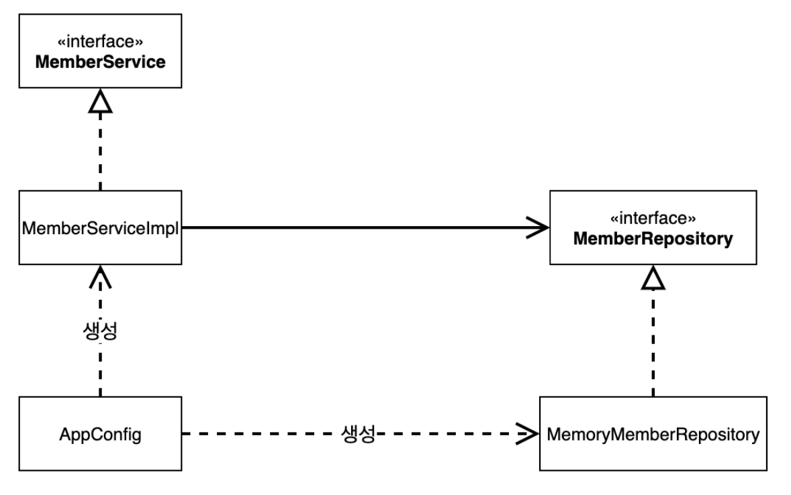

> [인프런 김영한님 -스프링 핵심 원리 - 기본편](https://www.inflearn.com/course/%EC%8A%A4%ED%94%84%EB%A7%81-%ED%95%B5%EC%8B%AC-%EC%9B%90%EB%A6%AC-%EA%B8%B0%EB%B3%B8%ED%8E%B8)

# 3. 스프링 핵심 원리 이해2 -객체 지향 원리 적용

(중요한 부분 위주로 정리)

## 3-1 새로운 할인 정책 개발

+ **상황** : 기존에 VIP 등급의 회원에게 고정으로 1000원을 할인해주는 정책이 아니라 금액당 10%할인해주는 정률 할인 정책으로 변경해야하는 상황 이라고 가정을 하자.

+ 바로 이것이 객체지향 원칙을 준수해서 설계를 해야하는 이유이다.

+ 설계
  
  + 기존 고정 할인정책
  
  + ```java
    package hello.core.discount;
    
    import hello.core.member.Grade;
    import hello.core.member.Member;
    
    public class FixDiscountPolicy implements DiscountPolicy {
    
        private int discountFixAmount = 1000; //1000원 할인
    
        @Override
        public int discount(Member member, int price) {
            if (member.getGrade() == Grade.VIP) {  //enum은 == 을 쓴다.
                return discountFixAmount;
            } else {
                return 0;
            }
        }
    }
    ```
  
  + 새로운 할인 정책
  
  + ```java
    package hello.core.discount;
    
    import hello.core.member.Grade;
    import hello.core.member.Member;
    
    public class RateDiscountPolicy implements DiscountPolicy{
    
        private int discountPercent = 10;
    
        @Override
        public int discount(Member member, int price) {
            if(member.getGrade() == Grade.VIP) {
                return price * discountPercent / 100;
            } else {
                return 0;
            }
        }
    }
    ```

+ **그렇다면 이 할인정책을 의존하고 있는 구현체는 어떻게 코드가 변화해야하는가?**

-주문서비스 구현체는 할인 정책에 의존한다.    

+ ```java
  package hello.core.order;
  
  import hello.core.discount.DiscountPolicy;
  import hello.core.member.Member;
  import hello.core.member.MemoryMemberRepository;
  import hello.core.member.MemberRepository;
  
  public class OrderServiceImpl implements OrderService {
  
      private final MemberRepository memberRepository = new MemoryMemberRepository();
      //private final DiscountPolicy discountPolicy = new FixDiscountPolicy();
      private final DiscountPolicy discountPolicy = new RateDiscountPolicy();
  
      @Override
      public Order createOrder(Long memberId, String itemName, int itemPrice) {
          Member member = memberRepository.findById(memberId);
          int discountPrice = discountPolicy.discount(member, itemPrice);
  
          return new Order(memberId, itemName, itemPrice, discountPrice);
      }
  }
  ```

+ 기존에 DiscountPolicy 인터페이스의 구현체는 고정 할인정책인 FixDiscountPolicy이다. 이제 고정 할인정책 적용을 위해 코드를 바꿔 끼워 넣었다.

+ **하지만 여기서 문제가 발생한다.**

## 3-2 문제 발생

### 3-2-1문제점

+ 역할과 구현을 충실하게 분리한 상황

+ 다형성과 인터페이스와 구현객체를 분리했다

+ **객체지향 설계 원칙을 충실히 지켰는가? -> (x)**
  
  + 1. DIP 위반  - (구현하는 클래스에 의존하지말고 인터페이스 자체에만 집중할것.) 
    
    : 위의 코드블럭에서 OrderServiceImpl은 현재 인터페이스인 DiscountPolicy 에도 의존하고  구현체인 RateDiscountPolicy에도 의존한다. 이는 DIP 위반이다.   
  
  + 2. OCP 위반  - (소프트웨어는 확장에는 열려있고, 변경에는 닫혀있어야한다.)
    
    :  코드를 바꿔 끼워넣으면 클라이언트 코드에도 영향을 준다 이는 OCP 위반이다.

### 2-2-2 문제해결

+ 인터페이스만 의존 하도록 코드를 변경한다.
  
  + ```java
    public class OrderServiceImpl implements OrderService {
    
                     :
        private DiscountPolicy discountPolicy; //DIP 위반 방지를 위하여 인터페이스만 의존하도록 설계
        //private final DiscountPolicy discountPolicy = new RateDiscountPolicy();
                     :
        }
    }
    ```

+ 이렇게 되면 구현체가 없는 코드는 어떻게 실행시키는가?

### 3-2-3 관심사의 분리

+ 기존 코드에서는 OrderServiceImpl 이  의존하는 인터페이스 와 그의 구현체를 모두 가지고 있었다. 즉, 연극으로치면 로미오 역할을 하는 배우가 줄리엣 역할을 하는 여자 주인공을 직접 선별하는 책임을 가지고 있었다는 뜻 ! **배우는 본인의 역할의 배역을 수행하는데만 집중해야한다.**

+ 우리는 이를 막기위해  **공연기획자** 를 섭외해야한다.

+ 관심사의 분리란 객체지향 5원칙중 SRP(단일 책임 원칙)의 다른 말이다.
  
  + 여기서 관심사(concern) 는 많은 의미를 내포한다. 자세한건 나중에 따로 기록하자.

## 3-3 AppConfig의 등장

+ 애플리케이션의 전체 동작 방식을 구성하는 즉, 구현 객체를 생성하고 연결하는 기능을 가진 설정 클래스
  
  ```java
  package hello.core;
  import hello.core.discount.FixDiscountPolicy;
  import hello.core.member.MemberService;
  import hello.core.member.MemberServiceImpl;
  import hello.core.member.MemoryMemberRepository;
  import hello.core.order.OrderService;
  import hello.core.order.OrderServiceImpl;
  
  public class AppConfig {
        public MemberService memberService() {
            return new MemberServiceImpl(new MemoryMemberRepository());
        }    
        public OrderService orderService() {
            return new OrderServiceImpl(
                    new MemoryMemberRepository(),
                    new FixDiscountPolicy());
        } 
  }
  ```

+ 이제 기존코드를 수정하면 **관심사의 분리**는 끝이 난다.
  
  ```java
  package hello.core.member;
  
  public class MemberServiceImpl implements MemberService{
  
      private final MemberServiceImpl memberRepository;
  
      public MemberServiceImpl(MemberRepository memberRepository) {
          this.memberRepository = memberRepository;
      }
  
      //(생략)
  }
  ```

+ 기존 코드는 흔히 말해 **필드 주입법**(필드에서 선언과 동시에 인스턴스를 생성하는) 이였다. 지금은 필드에 선언을 해놓고 실제 구현체는 생성자를 통해 들어오게 된다. 이것을 **생성자 주입법** 이라고한다.그래서 왜 이렇게 했다고?
  
  + 첫번째로 , MemberServiceImpl은 이제 더이상 MemoryMemberRepository를 의존하지 않게 된다.단지  MemberServiceImpl에 만 의존한다. ---> <u>DIP</u> 준수 
  
  + 두번쨰로 이제 MemberServiceImpl은 MemberRepository의 구현체가 바뀌는 상황 예를들어, db이전 등에서 코드를 수정할 필요가 전혀 없다. ---> <u>OCP</u> 준수
  
  + MemberServiceImpl 은 의존관계에 대한 고민은 AppConfig 에 맡기고 실행에 집중한다.

+ 클래스 다이어 그램
  
  
  
  + AppConfig 클래스의 객체는 MemoryMemberRepository 객체를 생성하여 그 참조값을 memberServiceImpl을 생성할때 생성자로 주입한다.
  
  + MemberServiceImpl 입장에서 의존관계를 외부에서 주입받기 때문에 이것을 
    
    ### <u>의존관계 주입(Dependency Injection, DI) 이라고 한다! </u>

+ 테스트 코드 수정
  
  ```java
  class MemberServiceTest {
  
        MemberService memberService;
  
        @BeforeEach
        public void beforeEach() {
            AppConfig appConfig = new AppConfig();
            memberService = appConfig.memberService();
        }
  
        //(생)
  }
  
  ```

+ #### @BeforeEach
  
  + JUNI5 의 기본 어노테이션중 하나로 테스트 메서드 실행 이전에 수행되는 메소드이다.
  
  + 이외에도 @BeforeAll, @AterAll, @AfterEach 등이 있다. 이름에서 직관적으로 이해할 수있다.

## 3-4 AppConfig 리팩터링

+ 현재 AppConfig 를 보면 중복이 있고, 역활과 구현이 한눈에 직관적으로 들어 오지 않는다.
  
  ```java
  public class AppConfig {
        public MemberService memberService() {
            return new MemberServiceImpl(new MemoryMemberRepository());
        }    
        public OrderService orderService() {
            return new OrderServiceImpl(
                    new MemoryMemberRepository(),
                    new FixDiscountPolicy());
        } 
  }
  ```
  
  + new MemoryMemberRepository() 중복, 인터페이스와 구현체가 눈에 들어오질 않음.

+ 리팩터링 후
  
  ```java
  public class AppConfig {
  
        public MemberService memberService() {
            return new MemberServiceImpl(memberRepository());
        }
  
        public OrderService orderService() {
            return new OrderServiceImpl(
                    memberRepository(),
                    discountPolicy());
        }
  
        public MemberRepository memberRepository() {
            return new MemoryMemberRepository();
        }
  
        public DiscountPolicy discountPolicy() {
            return new FixDiscountPolicy();
        }
  }
  ```
  
  + 중복을 제거했기때문에 코드 수정시 고칠 부분이 줄어들었다.
  
  + 역할과 구현이 한눈에 들어온다.

+ 이제 할인정책을 변경하려면 어떻게 될까?

```java
 public DiscountPolicy discountPolicy() {
          //return new FixDiscountPolicy();
          return new RateDiscountPolicy();
      }
```

#### 끝이다.

+ 클라이언트 코드를 변경하였는가? (x)  코드 수정이 빈번했는가? (x)

## 3-5 좋은 객체 지향 설계를 위한 5가지 원칙의 적용

-이 예제에선 3가지만 중점적으로 다루었다.

+ SRP 단일 책임 원칙 - 한 클래스는 하나의 책임만 가져야한다.
  
  + AppConfig를 만들면서 클라이언트 객체는 실행의 책임만 갖게 되었다.

+ DIP 의존관계 역전 원칙 - "추상화에 의존해야지, 구체화에 의존하면 안된다."
  
  + 기존에 OrderServiceImpl 은 DiscountPolicy와 구현체인 FixDiscountPolicy 에 모두 의존하고 있었다.
  
  + 제일 먼저한것은 OrderServiceImpl에서 FixDiscountPolicy 의존 관계를 제거한 것이다.
  
  + 두번째는 AppConfig가 FixDiscountPolicy 인스턴스를 생성하여 OrderServiceImpl 생성자에 주입 되게하였다.

+ OCP - "소프트웨어 요소는 확장에는 열려 있으나 변경에는 닫혀 있어야 한다"
  
  + AppConfig 가 구현체를 생성해서 클라이언트 코드에 주입하는 형태이므로 할인 정책이 변경되어도 클라이언트 코드를 변경하지않고 AppConfig 만 변경하면 된다.
  
  + 쉽게말해 소프트웨어 요소를 새롭게 확장해도 사용 영역의 변경은 닫혀 있다!

## 3-6 IOC, DI ,컨테이너

+ **제어의 역전 IoC (Inversion of Control)**
  
  + AppConfig 등장이후로 프로그램의 제어흐름 모두 AppConfig 가 가져가게 되었다.
  
  + 클라이언트 코드는 묵묵히 자신 로직만 수행하면 끝이다. 
  
  + 이렇듯 프로그램의 제어흐름을 직접제어하는 것이 아니라 외부에서 관리하는 것을 제어의역전 (IoC)이라 한다.

+ **의존관계 주입** DI (Dependency Injection)
  
  + 의존 관계에는 두가지 종류의 형태가 있다.
    
    + 1. 정적 클래스 의존관계
         
         : 정적클래스 의존관계는 쉽게 import 구문 만 보고 알수 있다.
         
         현재 예제에서는 OrderServiceImpl이 MemberRepository와 DiscountPolicy에의존하는 것을 알수 있다.
         
         그러나 어떤 객체가 주입될지는 알 수없다.
      
      2. 동적 클래스 의존관계
         
         : 애플리케이션 실행시점에 연결된 의존관계

+ 애플리케이션 실행 시점에서 외부에서 구현객체를 생성 후 클라이언트에 전달해서 클라이언트와 서버의 실제 의존관계가 연결되는것을 의존관계 주입 즉, DI 라고 한다.

+ 의존관계 주입을 사용하면 정적 클래스 의존관계 변경없이 동적인 클래스 의존관계를 쉽게 변경할 수 있다.

+ IoC 컨테이너, DI 컨테이너
  
  + 앞서 외부라는 말을 썼다. AppConfig 처럼 외부에서 객체를 생성하고 관리하면서 의존관계를 주입해주는 것을 IoC 컨테이너 또는 DI 컨테이너라고한다.
  
  + 최근에는 DI 컨테이너라는 말을 많이 쓴다.

## 3-7 드디어 스프링으로 전환하기!

+ AppConfig 스프링 기반으로 변경
  
  ```java
  //(생략)
  
  import org.springframework.context.annotation.Bean;
  import org.springframework.context.annotation.Configuration;
  
  @Configuration //설정 정보라는 것을 의미
  public class AppConfig {
  
      @Bean //스프링 컨테이너에 등록됨
      public MemberService memberService() {
          return new MemberServiceImpl(memberRepository()); //생성자 주입
      }
  
      @Bean
      public MemberRepository memberRepository() {
          return new MemoryMemberRepository();
      }
  
      @Bean
      public OrderService orderService() {
          return new OrderServiceImpl(memberRepository(), discountPolicy());
      }
  
      @Bean
      public DiscountPolicy discountPolicy() {
          return new RateDiscountPolicy();
      }
  }
  ```

+ 기존 코드에 적용 하기 
  
  ```java
  
  //(생략)
  
  import org.springframework.context.ApplicationContext;
  import org.springframework.context.annotation.AnnotationConfigApplicationContext;
  
  public class MemberApp {
  
      public static void main(String[] args) {
          //AppConfig appConfig = new AppConfig();
          //MemberService memberService = appConfig.memberService();
          //MemberService memberService = new MemberServiceImpl();
  
  
  ```

```

        ApplicationContext applicationContext = new AnnotationConfigApplicationContext(AppConfig.class); //스프링으로 전환
        MemberService memberService = applicationContext.getBean("memberService", MemberService.class);
        Member member = new Member(1L, "memberA", Grade.VIP);
        memberService.join(member);

        Member findMember = memberService.findMember(1L);
        System.out.println("new member = "+member.getName());
        System.out.println("find member = "+findMember.getName());
    }

}



```

+ ApplicationContext 을 '스프링 컨테이너' 라고한다.

+ 스프링 컨테이너는 @Configuration 이 붙은 AppConfig를 설정 정보로 사용한다.

+ **@Bean이 붙은 메서드를 모두 호출하고, 반환된 객체를 스프링 컨테이너를 등록한다.** 이 각각의 객체를 '스프링 빈'이라한다. 메서드명을 스프링빈의 이름으로 한다.

+ 이렇게 appConfig 를 스프링 컨테이너에게 넘겨주고 스프링 전환이 끝났다.

+ <u>근데 의문, 왜 스프링 컨테이너를 사용하는 걸까? </u> 이제 그걸 조금씩 알아가보자...

## 2-8 이 장에서 새로 배운것

+ 관심사의 분리, AppConfig, 생성자 주입법, 제어의 역전(IoC), 의존관계주입(DI) ,DI 컨테이너 , 스프링 컨테이너, 스프링 빈

+ 정리하다보니 너무 길어졌다,, 하지만 이장에 중요한것들이 많아서 어쩔수없었다...
  
  ```
  
  ```
