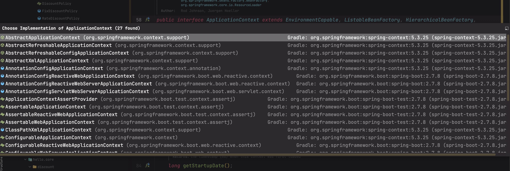
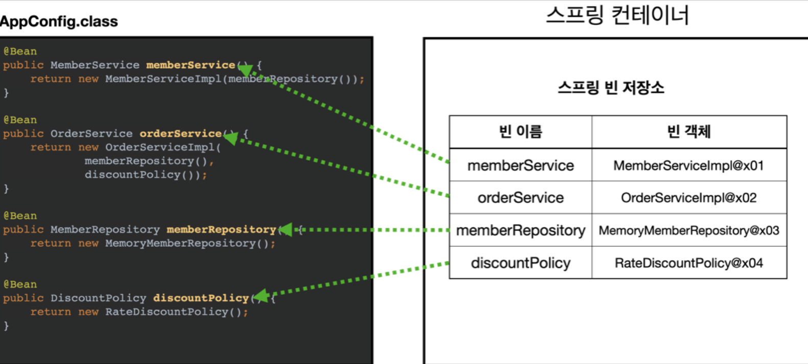
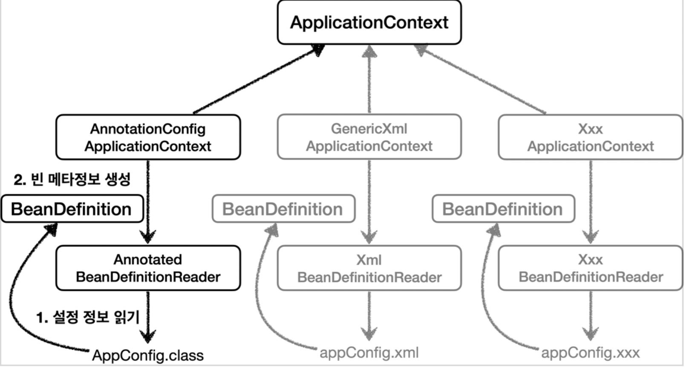

> [인프런 김영한님 -스프링 핵심 원리 - 기본편](https://www.inflearn.com/course/%EC%8A%A4%ED%94%84%EB%A7%81-%ED%95%B5%EC%8B%AC-%EC%9B%90%EB%A6%AC-%EA%B8%B0%EB%B3%B8%ED%8E%B8)

# 4.스프링 컨테이너와 빈

## 4-1 스프링 컨테이너

+ 앞장 마지막 부분에서 AppConfig를 스프링에 넘겨주면서 스프링 컨테이너를 사용해보았다.
  
  ```java
  ApplicationContext ac = new 
              AnnotationConfigApplicationContext(AppConfig.class);
  ```
  
  + 여기서 ApplicationContext 가 스프링 컨테이너이다.
  
  + ApplicationContext는 인터페이스이다.
  
  + AnnotationConfigApplicationContext은 ApplicationContext의 구현체인데 어노테이션기반으로 컨테이너를 만든것이다. 
  
  + 물론 ApplicationContext의 구현체는 아주 많다. 얼마나 많냐? 
  
  
  
  + 무려 27개나 있다. 가장 대표적인 것이 어노테이션기반 과 XML 기반 인데 요즘은 어노테이션 기반 ApplicationContext를 많이 쓴다.

+ 그럼 위의 코드가 실행 되면 컨테이너에선 무슨 일이 일어날까?)
  
  
  
  + 빈의 이름은 메서드의 이름으로 등록이 된다 . 혹은 빈의 이름을 직접 지정할 수 도 있다.
    
    ```java
    @Bean(name = "memberService")
    public xxxxxx() {
    
    }    
    ```
  
  + 언제나 그렇듯 빈의 이름은 중복 되면 안된다. 스프링 설정에따라 기존 빈이 무시되거나 덮어버리거나, 오류가 뜰 수 있다.
  
  + 스프링 빈을 등록할때 의존 관계주입도 한번에 처리되는데, 이부분은 의존관계 자동 주입에서 다시한번 정리하자.

## 4-2  스프링 빈 조회 하기

### 4-2-1 빈 조회 1

+ 실제 컨테이너에 등록된 빈을 조회해보자 
  
  + 첫번째는 컨테이너에 등록된 모든 빈을 조회해보자
  
  ```java
  package hello.core.beanfind;
  
  import hello.core.AppConfig;
  import hello.core.member.MemberService;
  import hello.core.member.MemberServiceImpl;
  import org.junit.jupiter.api.Assertions;
  import org.junit.jupiter.api.DisplayName;
  import org.junit.jupiter.api.Test;
  import org.springframework.beans.factory.NoSuchBeanDefinitionException;
  import org.springframework.context.annotation.AnnotationConfigApplicationContext;
  
  import static org.assertj.core.api.Assertions.assertThat;
  
  class ApplicationContextBasicFindTest {
  
      AnnotationConfigApplicationContext ac = new AnnotationConfigApplicationContext(AppConfig.class);
  
      @Test
      @DisplayName("모든 빈 출력하기")
        void findAllBean() {
            String[] beanDefinitionNames = ac.getBeanDefinitionNames();
            for (String beanDefinitionName : beanDefinitionNames) {
                Object bean = ac.getBean(beanDefinitionName);
                System.out.println("name=" + beanDefinitionName + 
          " object=" + bean);
              }
      }
  }
  ```
  
  + getBeanDefinitionNames메서드로 모든 빈의 이름을 가져와 getBean 을 찍어본다.
    
    결과는?
    
    ```java
    name=org.springframework.context.annotation.internalConfigurationAnnotationProcessor object=org.springframework.context.annotation.ConfigurationClassPostProcessor@33c2bd
    name=org.springframework.context.annotation.internalAutowiredAnnotationProcessor object=org.springframework.beans.factory.annotation.AutowiredAnnotationBeanPostProcessor@1dfd5f51
    name=org.springframework.context.annotation.internalCommonAnnotationProcessor object=org.springframework.context.annotation.CommonAnnotationBeanPostProcessor@3c321bdb
    name=org.springframework.context.event.internalEventListenerProcessor object=org.springframework.context.event.EventListenerMethodProcessor@24855019
    name=org.springframework.context.event.internalEventListenerFactory object=org.springframework.context.event.DefaultEventListenerFactory@3abd581e
    name=appConfig object=hello.core.AppConfig$$EnhancerBySpringCGLIB$$deaee0b8@4d4d8fcf
    name=memberService object=hello.core.member.MemberServiceImpl@610db97e
    name=memberRepository object=hello.core.member.MemoryMemberRepository@6f0628de
    name=orderService object=hello.core.order.OrderServiceImpl@3fabf088
    name=discountPolicy object=hello.core.discount.RateDiscountPolicy@1e392345
    ```
  
  + 스프링 내부에서 사용한 빈과 내가 등록한 빈이 모두 출력이된다. 이제 내가 등록한 빈 만 출력해보자.
    
    ```java
    @Test
        @DisplayName("애플리케이션 빈 출력하기")
        void findApplicationBean() { //JUNIT5 부터는 public 을 붙일 필요가 없다고 한다.
            String[] beanDefinitionNames = ac.getBeanDefinitionNames();
            for (String beanDefinitionName : beanDefinitionNames) {
                BeanDefinition beanDefinition = ac.getBeanDefinition(beanDefinitionName);
    
                //ROLE_APPLICATION: 직접 등록한 애플리케이션 빈
                //ROLE_INFRASTURCURE : 스프링이 내부에서 사용하는 빈
                if(beanDefinition.getRole() == BeanDefinition.ROLE_APPLICATION) {
                    Object bean = ac.getBean(beanDefinitionName);
                    System.out.println("name  = " + beanDefinitionName + "      object = "+ bean);
                }
            }
        }
    ```

```java
name  = appConfig      object = hello.core.AppConfig$$EnhancerBySpringCGLIB$$91055622@ea27e34
name  = memberService      object = hello.core.member.MemberServiceImpl@33a2499c
name  = memberRepository      object = hello.core.member.MemoryMemberRepository@e72dba7
name  = orderService      object = hello.core.order.OrderServiceImpl@33c2bd
name  = discountPolicy      object = hello.core.discount.RateDiscountPolicy@1dfd5f51
```

잘 출력이 된다.

### 4-2-2 빈조회 2

- 위의 클래스와 다른 클래스에서 진행했으나 기본 맥락은 같으므로 메서드만 정리하자.
  
  + 빈 이름으로 조회하기
  
  + ```java
    @Test
    @DisplayName("빈 이름으로 조회")
        void findBeanByName() {
            MemberService memberService = ac.getBean("memberService",
    MemberService.class);
            assertThat(memberService).isInstanceOf(MemberServiceImpl.class);
    }
    ```
    
    + getBean("메소드이름","타입") 혹은 getBean("타입")으로 빈을 조회가 가능하다.
  
  + 빈 이름으로 조회하기 실패
    
    ```java
    //import static org.junit.jupiter.api.Assertions.*;
        @Test
        @DisplayName("빈 이름으로 조회 실패")
        void findBeanByNameX() {
           // MemberService xxxxx = ac.getBean("xxxxx", MemberService.class);
            assertThrows(NoSuchBeanDefinitionException.class,
                    () -> ac.getBean("xxxxx", MemberService.class));
        }
    ```
    
    + JUNIT5 의 기본메소드인 assertThrows 를 통해 어떤 예외를 던지는지 테스트 할 수 있다.

### 4-2-3 동일한 타입이 둘 이상의 경우 빈 조회

+ 타입이 같은 빈이 둘 이상 있을때 타입으로 조회를 하면?
  
  + ```java
        @Test
        @DisplayName("타입으로 조회시 같은 타입이 둘 이상 있으면, 중복오류가 발생한다.")
        void findBeanByTypeDuplicate() {
            //NoUniqueBeanDefinitionException
            assertThrows(NoUniqueBeanDefinitionException.class,
                    () -> ac.getBean(MemberRepository.class) );
        }           
    ```
    
    + NoUniqueBeanDefinitionException 이 발생하는걸 확인할수 있다.
  
  + 이럴때도 역시 메소드이름을 같이 명시 해주면 된다
  
  + ```java
    ac.getBean("memberRepository1", MemberRepository.class);
    ```

+ 특정 타입을 모두 조회를 하려면?
  
  + ```java
        @Test
        @DisplayName("특정 타입을 모두 조회하기")
        void findAllBeanByType(){
            Map<String, MemberRepository> beansOfType = ac.getBeansOfType(MemberRepository.class);
            for (String key : beansOfType.keySet()) {
                System.out.println("key = " + key + " value = " + beansOfType.get(key));
            }
            System.out.println("beansOfType = " + beansOfType);
            assertThat(beansOfType.size()).isEqualTo(2);
        }
    ```
  
  + 딱히 설명할 부분이 없다.

### 4-2-4 빈 조회 마지막 - 상속관계

+ 테스트를 위한 설정 정보 클래스 생성 
  
  + ```java
    @Configuration
        static class TestConfig {
            @Bean
            public DiscountPolicy rateDiscountPolicy() {
                return new RateDiscountPolicy();
            }
    
            @Bean
            public DiscountPolicy fixDiscountPolicy() {
                return new FixDiscountPolicy();
            }
        }
    
    }
    ```
  
  + 부모타입이 같은 DiscountPolicy로 같은 경우이다.

+ 이때 부모 타입으로 조회하면?
  
  + ```java
        AnnotationConfigApplicationContext ac = new AnnotationConfigApplicationContext(TestConfig.class);
    
        @Test
        @DisplayName("부모 타입으로 조회시 자식이 둘이상있으면, 중복오류가 발생한다.")
        void findBeanByParentTypeDuplicateType() {
            assertThrows(NoUniqueBeanDefinitionException.class,() -> ac.getBean(DiscountPolicy.class));
        }
    ```
  
  + 여기서도 NoUniqueBeanDefinitionException 이 발생한다.
  
  + 이떄도 빈의 이름을 같이 명시하면 오류가 발생하지않는다. 혹은 하나의 구현체로 조회하면된다.

+ 그럼 해당 타입을 부모로 갖는 것들을 모두 조회하면 ? 특이하게 Object로 해보자 ->(Object는 모든 객체의 부모타입이다)
  
  + ```java
        @Test
        @DisplayName("부모타입으로 모두 조회하기 - Object")
        void findAllBeanByObjectType(){
            Map<String, Object> beansOfType = ac.getBeansOfType(Object.class);
            for (String key : beansOfType.keySet()) {
            System.out.println("key = " + key+ " value = "+ beansOfType.get(key));
        }
    ```
  
  + 결과는 ? **모든 빈이 조회된다**

+ 지금까지 빈 조회를 알아보았다. 사실 빈을 직접 조회 할 일은 많지 않다고 한다. 워낙 기초에해당하는 부분이고, 테스트코드에 익숙해지 자는데 의의가 있는 것같다.

## 4-3 BeanFactory와 ApplicationContext

+ BeanFactory란?
  
  + 스프링 컨테이너스의 최상위 인터페이스
  
  + 스프링 빈을 관리하고 조회하는 역할

+ 그럼 ApplicatonContext 는?
  
  + BeanFactory의 빈 관리, 조회 이외에 부가기능을 추가한 인터페이스
    
    빈 관리 및 조회만으로는 개발에 부족하다.
  
  

+ 어떤 부가기능이 있나?
  
  + 메시지 소스를 활용한 국제화 기능
    
    + 한국에서 접속하면 한국어로 ,영어권에서 접속하면 영어로 출력하게하는 기능
  
  + 환경변수
    
    + 로컬, 개발 , 운영 등을 구분해서 처리하는 기능 이외에도 스테이지 환경이라고 운영 환경과 비슷한 환경이 있다고 한다.
  
  + 애플리케이션 이벤트 
    
    + 이벤트를 발행하고 구독하는 모델을 편리하게 지원하는 기능
  
  + 편리한 리소스 조회
    
    + 파일 , 클래스패스, 외부 등에서 리소스를 편하게 조회하는기능

## 4-4 스프링 빈 설정 메타 정보 - BeanDefinition

+ BeanDefinition 
  
  + BeanDefinition은 빈 설정 메타정보이다.
  
  + 스프링은 다양한 형태의 설정 정보를 BeanDefinition 으로 추상화해서 사용한다.
  
  + @Bean하나당 혹은 <bean> 하나당 각각 하나씩 메타정보가 생성된다.

+ AppConfig.class, AppConfig.xml 같이 다양한 형식의 설정 형식을 지원할 수 있는 이유?
  
  + 바로 모든형식을 읽어서 BeanDefinition으로 만들기 때문이다.
  
  + 그림으로 보면 다음과 같다.
  
  + 
  
  + AnnotationConfigApplicationContext 는 AnnotatedBeanDefinitionReader 를 사용해서 AppConfig.class 를 읽고 BeanDefinition 을 생성한다.
  
  + 실제로 궁금해서 AnnotatedBeanDefinitionReader 를 찾아보니 bean 과 같은것들을 static final 변수로 초기화 시켜두고 비교하며 읽어들이는것 같았다.

+ BeanDefinition 살펴보기
  
  + BeanClassName : 생성할 빈의 클래스명 -> 자바 설정파일 처럼 팩토리 역할을 하는 빈을 사용하면 값이 없다.(Null)   
  
  + factoryBeanName : 팩토리 역할을 하는 빈을 사용하는 경우 ex) appConfig
  
  + factoryMethodName: 빈을 생성할 팩토리 메서드 지정, 예) memberService
  
  + lazyInit: 스프링 컨테이너를 생성할 때 빈을 생성하는 것이 아니라, 실제 빈을 사용할 때 까지 최대한
    생성을 지연처리 하는지 여부
  
  + InitMethodName: 빈을 생성하고, 의존관계를 적용한 뒤에 호출되는 초기화 메서드 명
  
  + DestroyMethodName: 빈의 생명주기가 끝나서 제거하기 직전에 호출되는 메서드 명 
  
  + Constructor arguments, Properties: 의존관계 주입에서 사용한다. (자바 설정 처럼 팩토리 역할의빈을 사용하면 없음)

+ BeanDefinition을 직접 생성해서 컨테이너에 등록을 할 수도 있지만 그럴일은 거의 없다고한다.

+ BeanDefinition 이 뭔지 정도만 알고 있어도 된다.

## 4-5 배운점

이번장에서는 앞장에서 배운 스프링 컨테이너와 빈에대해 조금 더 자세 하게 공부했다. 실제 컨테이너에 등록된 빈들을 JUNIT 5 환경에서 출력도해보고 assertThat 과 assertThrow를 이용해서 테스트도 해보았다.(테스트 할때 출력은 가급적 안하는게 좋다고한다.) 

항상 다른곳에서 컨테이너 컨테이너 할때마다 잘 와닿지 않았는데 드디어 조금씩 개념을 잡아가는것 같다.
