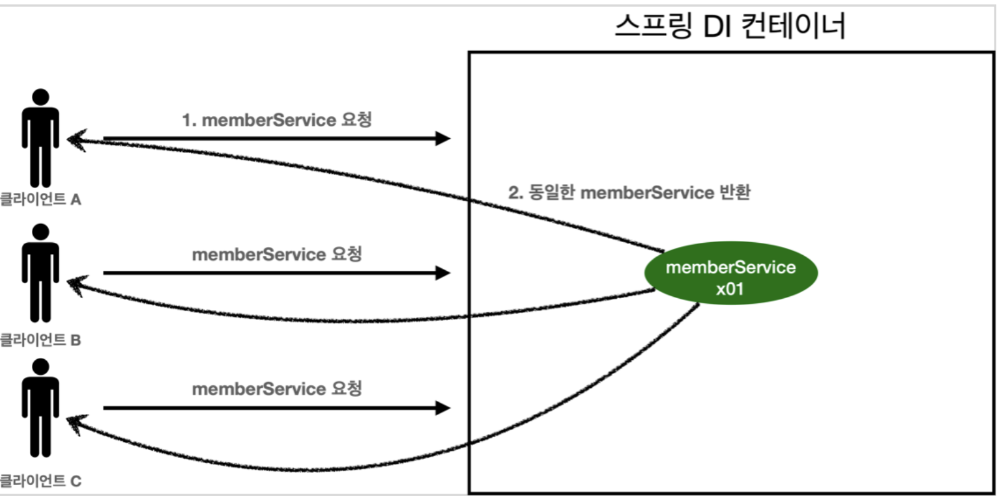
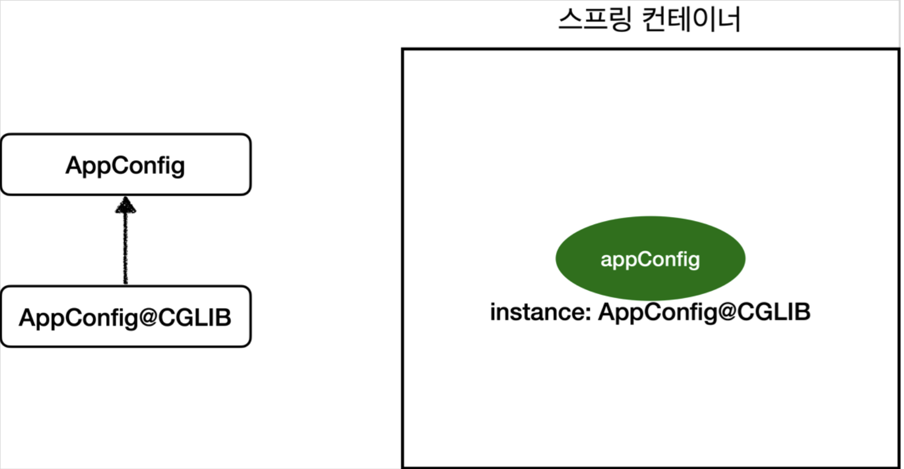

> [인프런 김영한님 -스프링 핵심 원리 - 기본편](https://www.inflearn.com/course/%EC%8A%A4%ED%94%84%EB%A7%81-%ED%95%B5%EC%8B%AC-%EC%9B%90%EB%A6%AC-%EA%B8%B0%EB%B3%B8%ED%8E%B8)

# 5.싱글톤 컨테이너


## 5-1 웹 어플리케이션과 싱글톤

+ 스프링은 기본적으로 기업용 온라인 서비스 기술을 지원하기 위해 탄생했다. 웹 어플리케이션은 보통 여러 고객이 동시에 요청한다.

+ 근데 스프링 없는 순수한 DI 컨테이너는 요청할때마다 새로운 개체를 생성한다.
  
  + 만약 고객 트래픽이 초당 100이라면?
  
  + 초당 100개의 객체가 생성된다.!! -> 메모리 낭비가 심하다.
  
  + 그래서 우리는 싱글톤 패턴을 이용한다.

### 5-1-1 싱글톤 패턴 (Singleton Pattern)

+ 클래스의 인스턴스가 딱 1개만 생성되는 것을 보장하는 **디자인패턴**

+ 원리 : private 생성자를 사용해서 외부에서 임의로 new 키워드를 사용하지 못하도록 막는다.

+ 싱글톤 패턴의 예

```java
package hello.core.singleton;

public class SingletonService {

    private static final SingletonService instance = new SingletonService();

    public static  SingletonService getInstance() {
        return instance;
    }

    private  SingletonService() {
        //디폴트 생성자를 private 지시자를 붙임으로써 외부에서 인스턴스 생성을 막음.
    }

    public void logic() {
        System.out.println("싱글톤 객체 로직 호출");
    }


}
```

(instance 변수는 JVM 메모리영역중 메서드영역에 인스턴스의 주소값을 가지고있고 객체는 heap영역에 있겠구나)

+ 이 객체의 사용은 오직 getInstance() 메서드를 통해서만 조회할수 있다. 이때 항상 같은 인스턴스만 반환한다.

> 싱글톤패턴을 구현하는 방법에는 여러가지가 있고 여기서는 객체를 미리 생성해두는 방법을 선택하였음.

+ 싱글톤 패턴의 문제점
  
  + 구현하는 코드가 많이들어간다.
  
  + 의존 관계상 클라이언트가 구체 클래스에 의존 -> DIP 위반
  
  + 클라이언트가 구체클래스에 의존해 OCP 원칙 위반 가능성
  
  + 내부속성 을 변경하거나 초괴화하기 어려움
  
  + private 생성자때문에 자식클래스 생성이 어려움
  
  + 종합하면 유연성이 떨어진다.
  
  + 안티패턴!


## 5-2 싱글톤 컨테이너

+ 스프링컨테이너는 싱글톤 패턴의 문제점을 해결하면서 객체인스턴스를 싱글톤으로 관리한다.

+ 싱글톤 객체를 생성하고 관리하는 기능을 싱글톤 레지스트리라한다.



+ 스프링 컨테이너는 고객이 요청이 올때마다 인스턴스를 생성하는게아니라 이미 만들어진 인스턴스를 공유해서 효율적으로 재사용할 수 있다.

> 스프링 기본 빈 등록 방식이 싱글톤이지만, 싱글톤 방식만 지원하는 것은 아님.


## 5-3 싱글톤 방식의 주의점!!  (중요)

+ stateful / stateless
  
  + (주로 웹 서버 쪽에서 쓰이는 것같은데 여기서도 쓰이는군)
  
  + stateful 은 상태 유지, stateless 무상태

+ 싱글톤 방식은 하나의 객체를 공유하기 때문에 stateful 하게 설계하면 안된다. - 자명하다.

+ staless 로 설계한다. ? 무상태
  
  + 특정 클라이언트에 의존적인 필드가 있으면 안된다.
  
  + 특정 클라이언트가 값을 변경할 수 있는 필드가 있으면 안됨.
  
  + 필드 대신 지역변수,파라미엍, ThreadLocal 등을 사용해야한다.

> ## ThreadLocal
> 
>  ThreadLocal은 한 쓰레드에서 읽고 쓰여질 수 있는 변수를 할당하여 접근할 수 있도록 합니다. 멀티 쓰레드 환경에서 각 쓰레드마다 get(), set() 메서드를 통해 독립적으로 변수에 접근할 수 있습니다. 말그대로 Thread 내부에서 사용하는 지역변수입니다.

+ <u>진짜 공유필드는 조심해야 한다! 스프링 빈은 항상 무상태(stateless)로 설계하자.</u>


## 5-4 @Configuration 과 싱글톤

+ 근데 우리가 작성한 AppConfig를 보면 싱글톤이 깨지게 되는거 아니냐 반문할 수 있다. 

+ ```java
  package hello.core;
  
  
  import 생략
  
  @Configuration //설정 정보라는 것을 의미
  public class AppConfig {
  
      @Bean //스프링 컨테이너에 등록됨
      public MemberService memberService() {
          return new MemberServiceImpl(memberRepository()); //생성자 주입
      }
  
      @Bean
      public MemberRepository memberRepository() {
          return new MemoryMemberRepository();
      }
  
      @Bean
      public OrderService orderService() {
          return new OrderServiceImpl(memberRepository(), discountPolicy());
      }
  
      @Bean
      public DiscountPolicy discountPolicy() {
          return new RateDiscountPolicy();
      }
  }
  ```

+ 자세히보면 new MemoryMemberRepository() 가 사실상 3번호출되어서 인스턴스가 3개 생성되는것이 아닌가 하는 의문을 품게한다.

+ 근데 테스트를 해보니 3개다 같은 인스턴스를 공유하는 것을 확인할 수 있었다.

+ 이게 어찌 된 일일까?


## 5-5 @Configuration 과 바이트 조작

+ 스프링이 뭔가 처리한 것은 분명하다. 다음코드를 통해 확인해 보았다. 

+ ```java
      @Test
      void configurationDeep() {
          ApplicationContext ac = new AnnotationConfigApplicationContext(AppConfig.class);
          AppConfig bean = ac.getBean(AppConfig.class);
  
          System.out.println("bean.getClass() = " + bean.getClass());
      }
  ```

+ AppConfig의 스프링 빈을 조회해서 클래스 정보를 출력했더니.

+ ```java
    bean.getClass() = class hello.core.AppConfig$$EnhancerBySpringCGLIB$$4a5fc277
  ```

+ 이렇게 나왔다. 순수한 클래스라면 **class hello.core.AppConfig** 라고 나왔어야한다. 

+ 뒤에 붙은 CGLIB 는 스프링이 CGLIB라는 바이트코드 조작 라이브러리를 사용해서 AppConfig를 상속받은 임의의 클래스를 만들고 그 클래스를 빈으로 등록하고 있던것이다...........

+ 


+ 아마 AppConfig @CGLIB 클래스는 이런식으로 되어있을 것이다.

+ ```java
  @Bean
  public MemberRepository memberRepository() {
      if (memoryMemberRepository가 이미 스프링 컨테이너에 등록되어 있으면?) { 
          return 스프링 컨테이너에서 찾아서 반환;
      } else { //스프링 컨테이너에 없으면
          기존 로직을 호출해서 MemoryMemberRepository를 생성하고 
          스프링 컨테이너에 등록 return 반환
      } 
  }
  ```

+ 이렇게 싱글톤이 보장되는 것이다.


> AppConfig @CGLIB 클래스는 AppConfig 타입의 자식타입 이므로 AppConfig타입으로 조회 할수있다.

+ 근데 만약 @Configuration을 쓰지 않고 @Bean 만 붙여놨다면?
  
  + 당연히 싱글톤 보장이 되지않는다. 즉 CGLIB 기술을 쓰지않는다.
