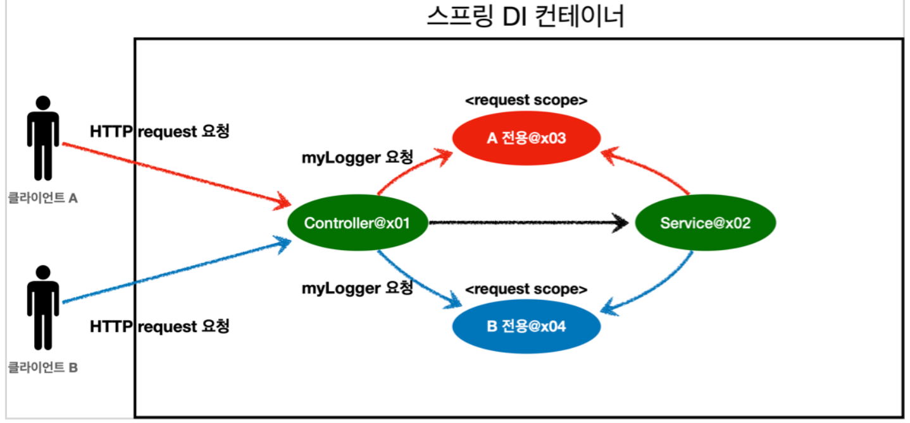

[인프런 김영한님 -스프링 핵심 원리 - 기본편](https://www.inflearn.com/course/%EC%8A%A4%ED%94%84%EB%A7%81-%ED%95%B5%EC%8B%AC-%EC%9B%90%EB%A6%AC-%EA%B8%B0%EB%B3%B8%ED%8E%B8)

# 08 빈 생명주기 콜백

+ 스프링 빈의 라이프 사이클
  
  + 스프링컨테이너생성 ->스프링빈생성-> 의존관계주입 ->초기화콜백 사용 -> 소멸전콜백 -> 스프링 종료

### 스프링 빈  생명주기 콜백의 방법

+ 인터페이스

+ 설정 정보에 초기화메서드 , 종료메서드 지정

+ **`@PostConstruct`, `@PreDestory `애노테이션**
1. 인터페이스를 이용하는 방법
   
   ```java
   public class NetworkClient implements InitializingBean, DisposableBean {
    //생략
   
   //
       @Override
       public void afterPropertiesSet() throws Exception {
           connect();
           call("초기화 연결 메시지");
   }
       @Override
       public void destroy() throws Exception {
           disConnect();
       }
   }
   ```
+ InitializingBea 과 DisposableBean 을 구현하여 콜백을 가능하게한다.

+ 메서드 이름 변경이 불가능하고, 외부라이브러리에 사용할수 없다. 초창기 버전이다.
2. 설정 정보를 이용한 방법
   
   ```java
    @Bean(initMethod = "init", destroyMethod = "close")
   ```
+ 종료메서드 를 적어주지않아도 메서드이름이 close 혹은 shutdown이면 알아서 인식해준다.

    3.애너테이션 활용

+ 해당 메서드에    ` @PostConstruct` ,`@PreDestory` 를사용하면 가장 편리하게 초기화 와 종료가 가능하다.

+ 가장 권장되는 방법이다.

+ 자바 표준방법이다.

+ 컴포넌트 스캔과 어울린다. 외부 라이브러리에는 사용이불가능하므로 그때는 2번의 방법을 사용하자.

----

# 09 빈 스코프

+ 빈 스코프란?
  
  + 앞서 빈의 라이프사이클을 배웠는데 스코프는 빈이 언제 생성되고 ,언제 소멸되는지에 대한 범위를 나타낸다.

+ 종류
  
  + 싱글톤
  
  + 프로토타입
  
  + 웹 관련스코프 (request, session, application)

## 09-1 프로토 타입 스코프

+ 프로토 타입 빈이란
  
  + 싱글톤 타입빈과 달리 프로토타입 빈 요청시 항상 <u>**새로운**</u> 빈을 만들고 의존관계 주입하여 반환한다.

+ 스코프 설정 방법
  
  ```java
    @Scope("prototype")
    @Bean
    PrototypeBean HelloBean() {
        return new HelloBean();
    } //수동
  ```
  
    @Scope("prototype")
    @Bean
    PrototypeBean HelloBean() {
  
        return new HelloBean();
  
    } //자동


+ 중요한점은 스프링컨테이너는 프로토타입의 빈의 생성과 의존관계 주입, 초기화(PostConstruct) 까지만 처리한다. 그이후는 관리하지 않는다. ex(PreDestroy)


## 09-2 싱글톤과 프로토타입빈의 혼용시의 문제점

+ 싱글톤 빈 안에서 프로토 타입 빈을 의존하고 있다면?

+ 싱글톤 타입 빈의 생성시점에 의존관계 주입이 된다면 이때 프로토 타입빈이 새로 생성되는 것은 자명한데. 싱글톤 빈은 한번 생성되면 유지되므로 다른 사용자가 이 빈에 접근해도 똑같은 빈을 반환할것이다. 이때, 프로토타입빈마저 똑같은 빈이라는 문제가 발생한다.

```java
static class ClientBean {
      private final PrototypeBean prototypeBean;
      @Autowired
      public ClientBean(PrototypeBean prototypeBean) {
          this.prototypeBean = prototypeBean;
      }
}
```

+ 이런 상황을 머릿 속으로 그려보면 무슨 말인지 알것이다.

## 09-3 문제 해결

+ 스프링 컨테이너에 직접요청
  
  ```java
  static class ClientBean {
  
            @Autowired
            private ApplicationContext ac;
  
                public int logic() {
                    PrototypeBean prototypeBean = ac.getBean(PrototypeBean.class);
                    prototypeBean.addCount();
                    int count = prototypeBean.getCount();
                    return count;
      } 
  }
  ```
  
  + 애플리케이션 컨텍스트를 주입받아서  `getBean()`을 통해 프로토타입 빈을 요청하면 새로운 빈을 생성한다.
  
  + 이렇게 되면 위의 문제를 해결이 된다.
    
    + 이렇게 직접 의존관계를 찾는것을  DI 가 아닌 **Dependency LookUp(DL)** 의존관계 조회 라고한다.
  
  + 이방법은 느껴지기에도 그리 좋은 방법이 아닌것 같다.우선 스프링 종속적인 코드가 되고, 단위테스트가 어려워진다.

## 09-4 Provider

+ 우리는 DL 만 정확하게 수행하는 기능을 가진 녀석만 필요하다. 그게 바로 Provider이다.

+ Provider에는 두가지 종류가있다. 스프링에서 제공하는 `ObjectProvider`, 자바표준` JSR-330 Provider`

+ 사용예시
  
  ```java
  @Scope("singleton")
      static class ClientBean {
          @Autowired
          private Provider<PrototypeBean> prototypeBeanProvider;
  
          public int logic() {
              PrototypeBean prototypeBean = prototypeBeanProvider.get();
              prototypeBean.addCount();
              int count = prototypeBean.getCount();
              return count;
          }
      }
  ```
  
  + Provider의 get()을 통해 스프링컨테이너에서 해당 빈을 찾아서 반환한다.(DL) 물론 스코프 빈이기떄문에 새로운 빈을 반환할것이다.

## 09-5 웹 스코프

+ 특징
  
  + 웹환경에서만 작동한다.
  
  + 프로토타입과달리 생성시점 부터 종료시점까지 모두 관리한다. 

+ 종류
  
  + **request : HTTP 요청 하나가 들어오고 나갈 때 까지 유지되는 스코프, <u>각각</u>의 HTTP 요청마다 별도의 빈인스턴스가 생성되고, 관리된다.**
  
  + session
  
  + application
  
  + socket

+ 그림




+ 코드
  
  + request scope의 class
    
    ```java
    @Component
    @Scope(value="request")
    public class MyLogger {
    
        private String uuid;
        private String requestUrl;
    
        public void setRequestUrl(String requestUrl) {
            this.requestUrl = requestUrl;
        }
    
        public void log(String message) {
            System.out.println("[" + uuid + "]" + requestUrl + "]"+ message);
        }
    
        @PostConstruct
        public void init() {
            uuid = UUID.randomUUID().toString();
            System.out.println("[" + uuid + "] request scope bean create :" + this );
        }
    
        @PreDestroy
        public void close() {
            System.out.println("[" + uuid + "]" + requestUrl + "]"+ this);
        }
    
    }
    ```
  
  + 컨트롤러
    
    ```java
    @Controller
    @RequiredArgsConstructor
    public class LogDemoController {
    
        private final LogDemoService logDemoService;
        private final MyLogger myLogger;
    
        @RequestMapping("log-Demo")
        @ResponseBody
        public String logDemo(HttpServletRequest request) throws InterruptedException {
            String requestURL = request.getRequestURL().toString();
    
            System.out.println(myLogger.getClass());
    
            myLogger.setRequestUrl(requestURL);
            myLogger.log("controller test");
            Thread.sleep(1200);
    
            logDemoService.logic("testId");
            return "OK";
        }
    }
    ```
  
  + 서비스
    
    ```java
    @Service
    @RequiredArgsConstructor
    public class LogDemoService {
    
        private final MyLogger myLogger;
    
        public void logic(String id){
            myLogger.log("service id =" + id);
        }
    }
            
    ```
  
  + 위의코드가 실행이 될까????? *아뇨*

+ `request`스코프는 실제 고객의 Http 요청이 와야 생성 할수 있다!

+ Controller와 Serivce는 기본적으로 싱글톤 빈일 테고, 이안에서 `requset`스코프 빈을 의존 하면 당연히 문제가 발생한다. 이때 우리는 실제 고객의 요청이 들어올때까지 빈의 생성을 <u>지연</u> 시켜줘야 한다.

+ 첫번째는 앞에서의 Provider를 이용하는 방법을 고려 해볼 수 있다. 이부분은 생략하겠다.

## 09-6 Proxy

+ 두번째는 바로 가짜 프록시 클래스를 이용하는 방법이다. 간단하다. 코드 자체는 이것만 추가해주면 된다.
  
  ```java
  @Component
  @Scope(value="request", proxyMode = ScopedProxyMode.TARGET_CLASS)
  public class MyLogger {
          //...
  }
  ```
  
  + 프록시의 대상이 인터페이스라면 ScopedProxyMode.TARGET_INTERFACE 이고 아니면 위의 코드와 같다.
  
  + 스코프에 request앞에 value값을 명시한것도 프록시를 사용하기 위해서이다.

+ 이때 주입된 가짜 프록시 객체를 확인해보면 
  
  ```java
  myLogger = class hello.core.common.MyLogger$$EnhancerBySpringCGLIB$$b68b726d
  ```
  
  + 이렇게 확인이 된다. 우리는 위와 같은 놈을 config를 등록할 때본적이있다. 스프링 내부적으로 특정 원본을 상속받은 놈을 조작하여 이용하는것. 이것도 마찬가지다.

+ 이런식으로 테스트를 해보았다.
  
  ```java
          System.out.println(myLogger.getClass());
          myLogger.setRequestUrl(requestURL);
          System.out.println(myLogger.getClass());
  ```
  
  + 컨트롤러 메서드 안에서  이런순으로 myLogger 빈을 출력해보았는데 많은 걸 알 수 있었다.
    
    ```java
    class hello.core.common.MyLogger$$EnhancerBySpringCGLIB$$822fe22b
    [f868e32c-0dd5-4da2-8205-48bd8542682d] request scope bean create :hello.core.common.MyLogger@6a2acdda
    class hello.core.common.MyLogger$$EnhancerBySpringCGLIB$$822fe22b
    ```
    
    + 우선, 기본적으로 의존관계 주입 시켜놓은 프록시 객체가 계속 그자리를 유지한다는 점,
    
    + 둘째, 프록시 객체를 통해 메소드 호출이 이루어지면(setRequestUrl()) 그때 내부 동작으로 실제 빈을 생성하고 요청을 위임한다는 점이다. 이부분은 사실 확실 하지 않다.
    
    + 나의 의문점은 계속 저런석으로 위임하는 행위를 반복하는것인가이다. 이부분은 좀더 알아볼 필요가있다.

+ 프록시는 기본적으로 싱글톤처럼 작동하므로 주의해서 사용해야한다.

----

# 후기

스프링 베이직 강의가 이렇게 끝났다. 학원에서 배웠던 겉핥기 식의 스프링 학습만 가지고 진행한 프로젝트가 얼마나 터무니 없었는지 다시 한번 느끼게 되었다. 강의를 듣기전에 내가 가지고 있었던 질문인 대체 스프링이 뭡니까 혹은 스프링을 왜쓰는겁니까 에 대한 답을 이강의를 통해 완전히 찾을 수 있었다. 아직 갈길이 멀지만 더 많이 배우고싶고 더 빨리 배우고 싶은 욕망이 가득하다. 이와 더불어 저번 엉망인 프로젝트를 확실히 손봐야겠다는 생각이든다.
